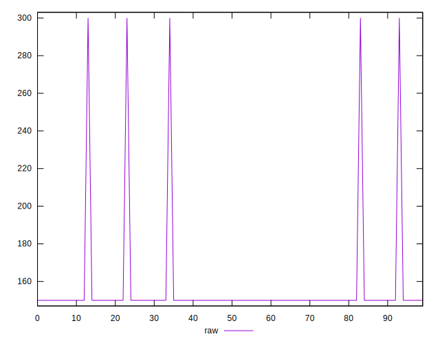
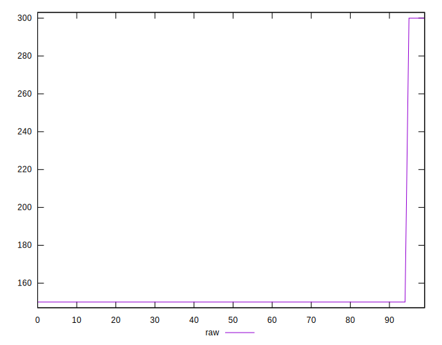
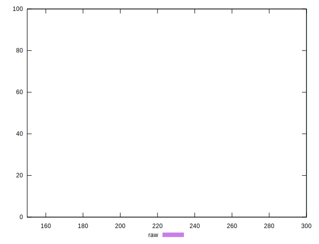
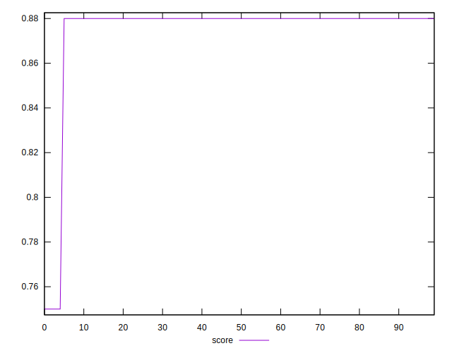
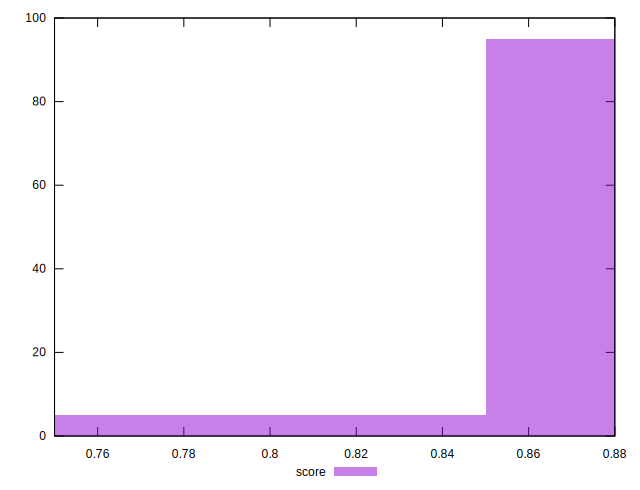
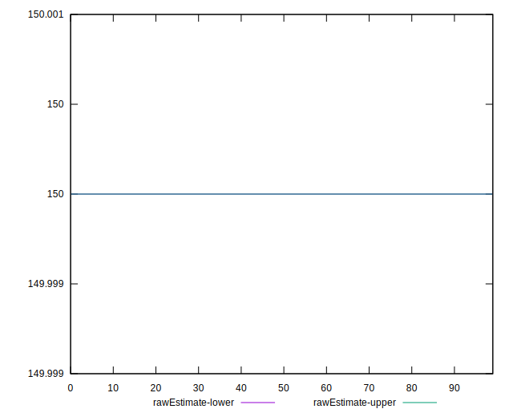
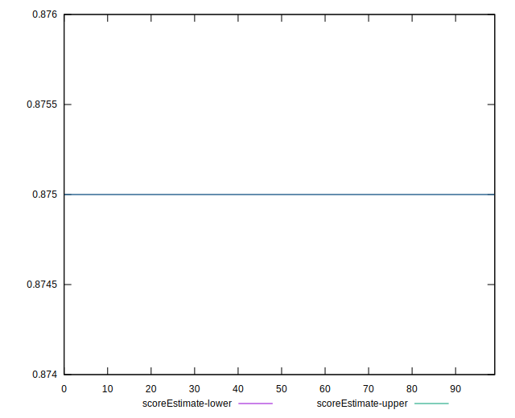
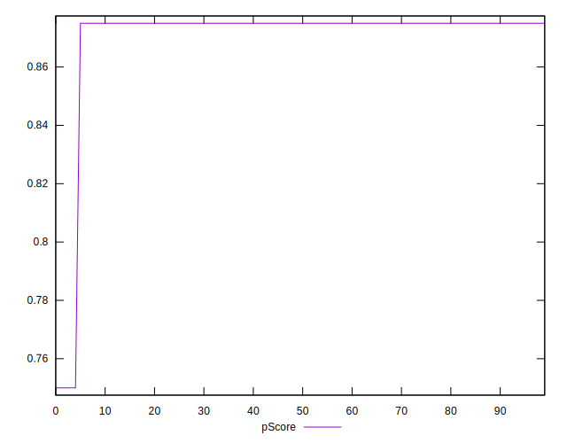
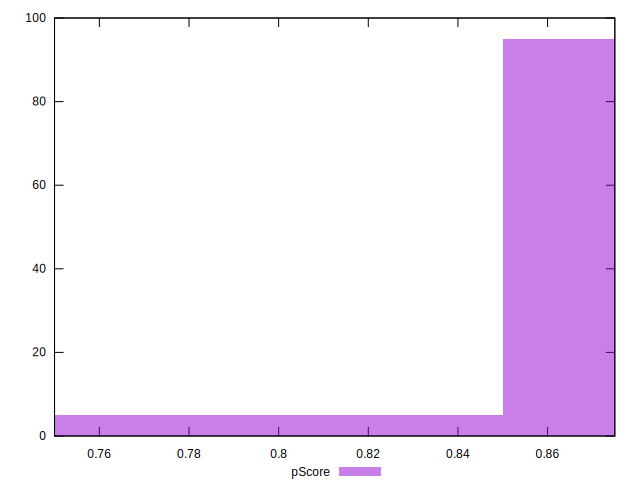
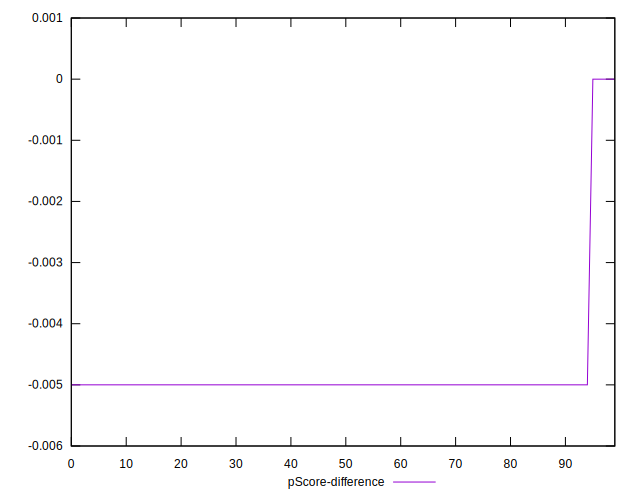

# //unused-css-rules/samples/pages+cached+noadtech+nomedia

[→ Parent](../..)


## Raw


```yaml
p90min: 150
p90max: 150
p90range: 0
p90mean: 150
p90median: 150
p90stdev: 0
p90skewness: .nan
p90eccentricity: .nan
p90discretization: 91
outlandishness: 1.1025
confidence: 12.814927412384122
p90confidence: 0

```


## Score


```yaml
p90min: 0.88
p90max: 0.88
p90range: 0
p90mean: 0.88
p90median: 0.88
p90stdev: 0
p90skewness: .nan
p90eccentricity: .nan
p90discretization: 91
outlandishness: 0.985281831095041
confidence: 0.011106270424066311
p90confidence: 0

```


## Raw Estimate


## Score Estimate


## P Score


```yaml
p90min: 0.875
p90max: 0.875
p90range: 0
p90mean: 0.875
p90median: 0.875
p90stdev: 0
p90skewness: .nan
p90eccentricity: .nan
p90discretization: 91
outlandishness: 0.9857653061224491
confidence: 0.010679106176986863
p90confidence: 0

```


## Score Difference


```yaml
p90min: 0
p90max: 0
p90range: 0
p90mean: 0
p90median: 0
p90stdev: 0
p90skewness: .nan
p90eccentricity: .nan
p90discretization: 91
outlandishness: .nan
confidence: 0
p90confidence: 0

```


## P Score Difference


```yaml
p90min: -0.0050000000000000044
p90max: -0.0050000000000000044
p90range: 0
p90mean: -0.0050000000000000044
p90median: -0.0050000000000000044
p90stdev: 0
p90skewness: .nan
p90eccentricity: .nan
p90discretization: 91
outlandishness: 0.9025
confidence: 0.00042716424707947044
p90confidence: 0

```

