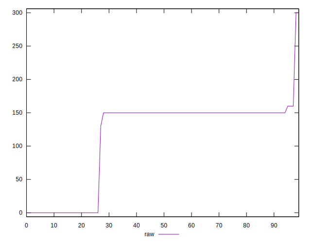
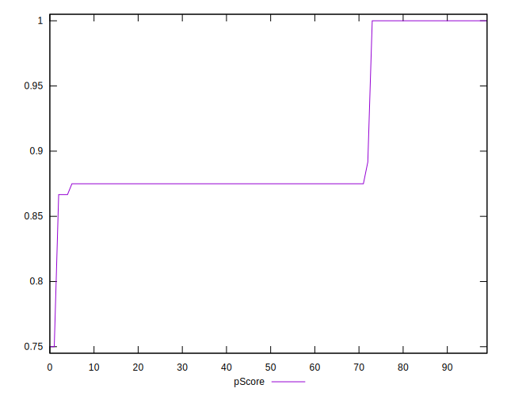

# //unused-css-rules/samples/pages+cached

[→ Parent](../..)


## Raw


```yaml
p90min: 0
p90max: 160
p90range: 160
p90mean: 117.14285714285714
p90median: 150
p90stdev: 62.23468017120804
p90skewness: -1.3464663243326156
p90eccentricity: 1.0000000000000016
p90discretization: 22.75
outlandishness: 0.9239429506246282
confidence: 28.084964003352354
p90confidence: 25.57348131699706

```


## Score


```yaml
p90min: 0.87
p90max: 1
p90range: 0.13
p90mean: 0.906153846153846
p90median: 0.88
p90stdev: 0.04985185152621434
p90skewness: 1.3469391342027917
p90eccentricity: 1.0000000000000002
p90discretization: 22.75
outlandishness: 1.0076205752894742
confidence: 0.02270122309585698
p90confidence: 0.020485128068725267

```


## Raw Estimate


## Score Estimate


## P Score


```yaml
p90min: 0.8666666666666667
p90max: 1
p90range: 0.1333333333333333
p90mean: 0.9023809523809523
p90median: 0.875
p90stdev: 0.05186223347600676
p90skewness: 1.3464663243326156
p90eccentricity: 0.9999999999999992
p90discretization: 22.75
outlandishness: 1.0084081014473583
confidence: 0.023404136669460396
p90confidence: 0.021311234430830828

```


## Score Difference


```yaml
p90min: 0
p90max: 0
p90range: 0
p90mean: 0
p90median: 0
p90stdev: 0
p90skewness: .nan
p90eccentricity: .nan
p90discretization: 91
outlandishness: .nan
confidence: 0
p90confidence: 0

```


## P Score Difference


```yaml
p90min: -0.0050000000000000044
p90max: 0
p90range: 0.0050000000000000044
p90mean: -0.0037912087912087933
p90median: -0.0050000000000000044
p90stdev: 0.0020975294215707582
p90skewness: 1.2220838796451594
p90eccentricity: 0.9999999999999983
p90discretization: 30.333333333333332
outlandishness: 0.8201183598216999
confidence: 0.0009044194997638744
p90confidence: 0.0008619170103682438

```

