# //unused-css-rules/samples/pages

[→ Parent](../..)


## Raw


```yaml
p90min: 0
p90max: 300
p90range: 300
p90mean: 165.05494505494505
p90median: 150
p90stdev: 83.4209980466961
p90skewness: 0.0889434127387609
p90eccentricity: 1.0000000000000009
p90discretization: 8.272727272727273
outlandishness: 1.4202069681170777
confidence: 58.61322679175737
p90confidence: 34.279365285135725

```

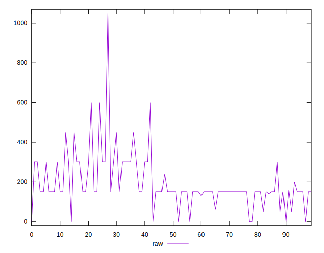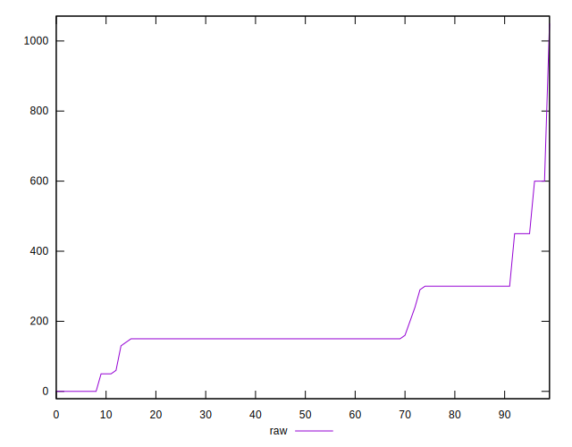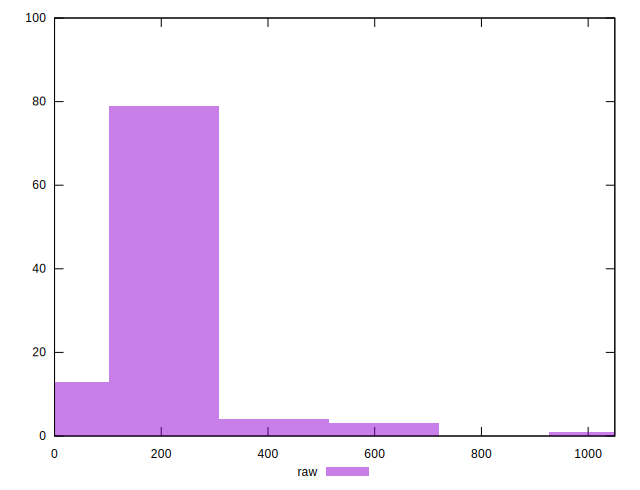
## Score


```yaml
p90min: 0.75
p90max: 1
p90range: 0.25
p90mean: 0.8654945054945057
p90median: 0.88
p90stdev: 0.0701531094180379
p90skewness: -0.20501715775003665
p90eccentricity: 1.0000000000000002
p90discretization: 9.1
outlandishness: 0.9563628093241063
confidence: 0.03902846906958746
p90confidence: 0.028827323095354185

```

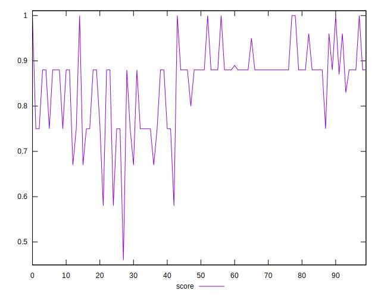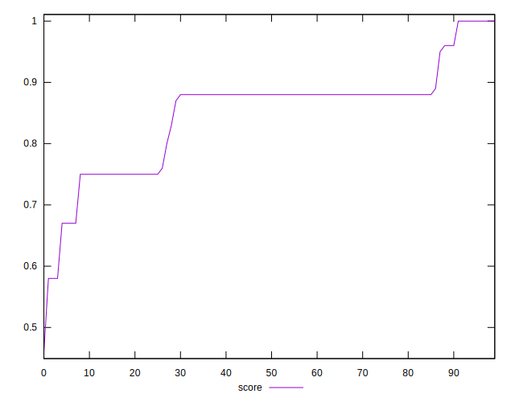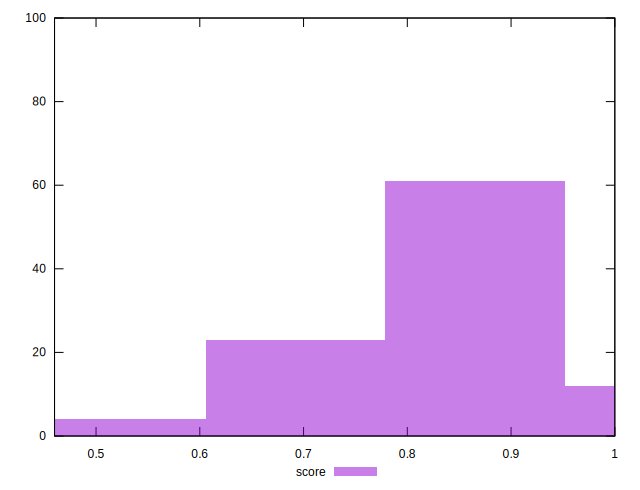
## Raw Estimate

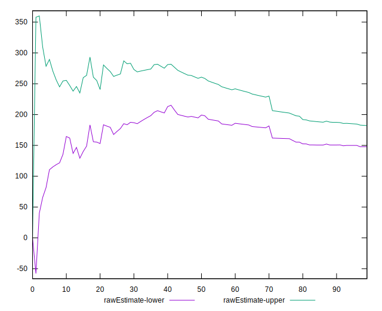
## Score Estimate

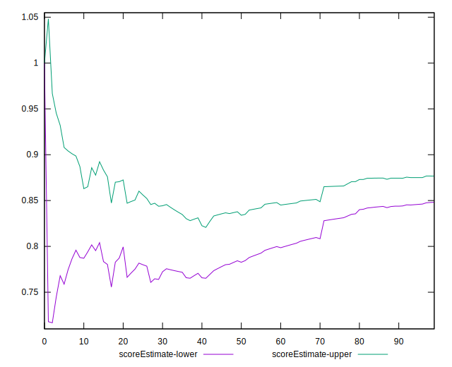
## P Score


```yaml
p90min: 0.75
p90max: 1
p90range: 0.25
p90mean: 0.8624542124542123
p90median: 0.875
p90stdev: 0.06951749837224673
p90skewness: -0.08894341273876293
p90eccentricity: 1.0000000000000004
p90discretization: 8.272727272727273
outlandishness: 0.9568624194435909
confidence: 0.03857858877771303
p90confidence: 0.028566137737613184

```

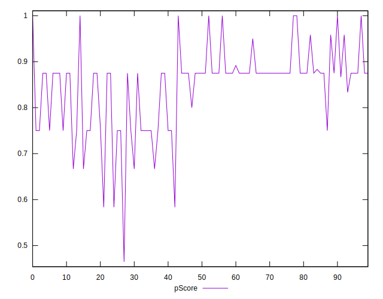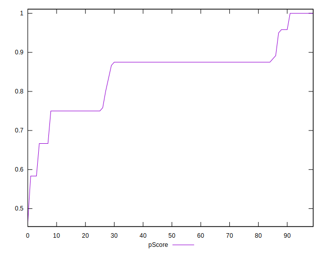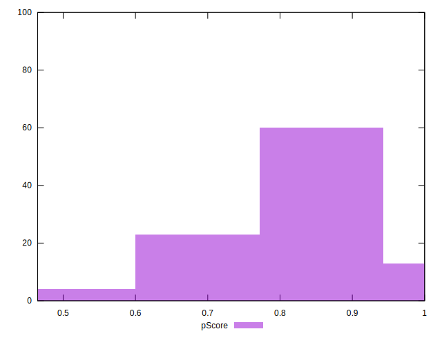
## Score Difference


```yaml
p90min: 0
p90max: 0
p90range: 0
p90mean: 0
p90median: 0
p90stdev: 0
p90skewness: .nan
p90eccentricity: .nan
p90discretization: 91
outlandishness: .inf
confidence: 6.092792000602806e-18
p90confidence: 0

```

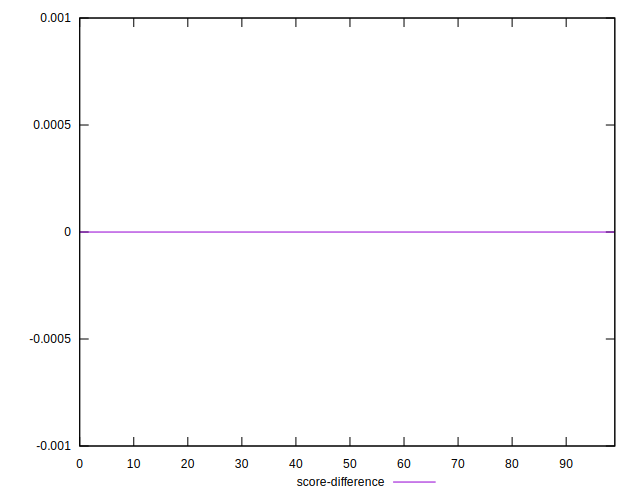
## P Score Difference


```yaml
p90min: -0.0050000000000000044
p90max: 0
p90range: 0.0050000000000000044
p90mean: -0.003278388278388282
p90median: -0.0050000000000000044
p90stdev: 0.0022571356048357383
p90skewness: 0.6569453132786246
p90eccentricity: 1.0000000000000013
p90discretization: 15.166666666666666
outlandishness: 0.7051363233244946
confidence: 0.0010836859173422283
p90confidence: 0.0009275023999705595

```

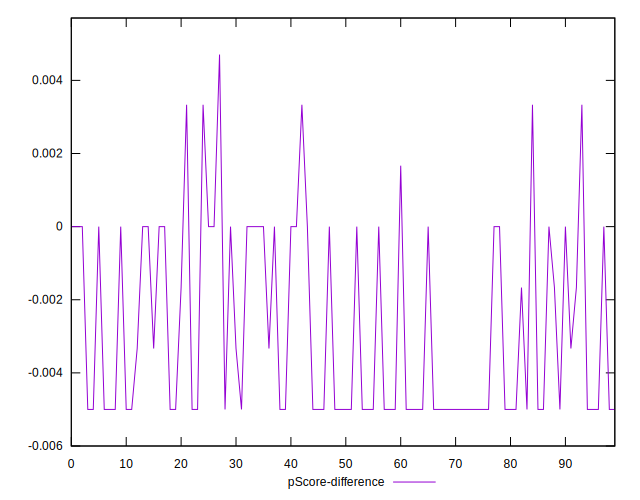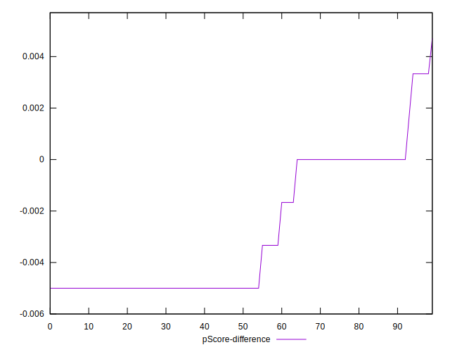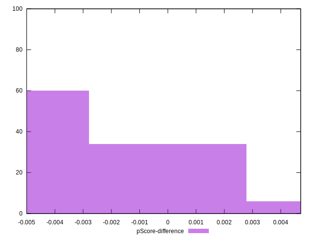