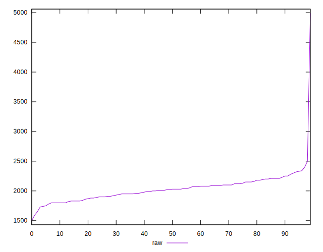
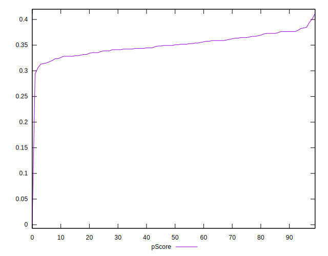

# //unused-javascript/samples/pages+cached

[→ Parent](../..)


## Raw


```yaml
p90min: 1750
p90max: 2330
p90range: 580
p90mean: 2022.6373626373627
p90median: 2030
p90stdev: 141.60644398352676
p90skewness: 0.07638044640785155
p90eccentricity: 1
p90discretization: 2.0681818181818183
outlandishness: 1.022234593724186
confidence: 134.7434970418617
p90confidence: 58.18893484495629

```


## Score


```yaml
p90min: 0.32
p90max: 0.38
p90range: 0.06
p90mean: 0.3507692307692306
p90median: 0.35
p90stdev: 0.016656237931947492
p90skewness: 0.10629629699337624
p90eccentricity: 0.9999999999999992
p90discretization: 13
outlandishness: 0.9797526623576497
confidence: 0.015875272721247558
p90confidence: 0.006844383041614499

```


## Raw Estimate


## Score Estimate


## P Score


```yaml
p90min: 0.3129411764705882
p90max: 0.37882352941176467
p90range: 0.06588235294117645
p90mean: 0.3495151906916612
p90median: 0.3494117647058823
p90stdev: 0.016762260315981988
p90skewness: -0.1368134827666909
p90eccentricity: 1
p90discretization: 2.0681818181818183
outlandishness: 0.989338721709239
confidence: 0.015852176122571948
p90confidence: 0.006887949770805202

```


## Score Difference


```yaml
p90min: 0
p90max: 5.551115123125783e-17
p90range: 5.551115123125783e-17
p90mean: 4.8801012071435456e-18
p90median: 0
p90stdev: 1.571892643731195e-17
p90skewness: 2.9105644713987613
p90eccentricity: 1.000000000000003
p90discretization: 45.5
outlandishness: 3.7393890625000004
confidence: 8.17375898381914e-18
p90confidence: 6.4592229037247025e-18

```


## P Score Difference


```yaml
p90min: -0.003529411764705892
p90max: 0.004705882352941226
p90range: 0.008235294117647118
p90mean: 0.0008338720103425917
p90median: 0.0011764705882352788
p90stdev: 0.002564897329021546
p90skewness: -0.14634852417742986
p90eccentricity: 0.9999999999999991
p90discretization: 3.9565217391304346
outlandishness: 0.28742897662399824
confidence: 0.0011263833599336344
p90confidence: 0.0010539678800196362

```

