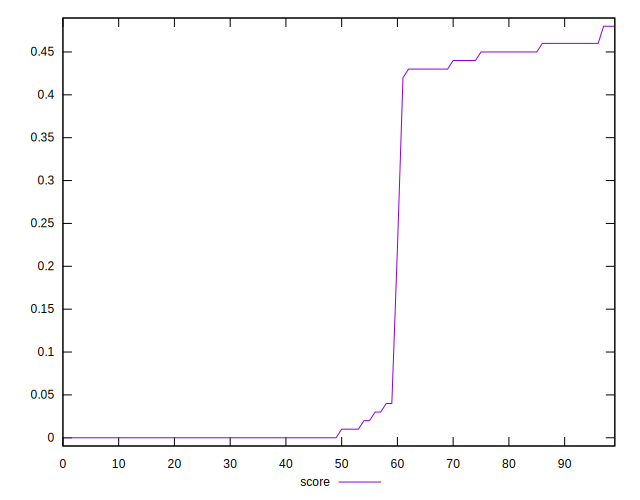
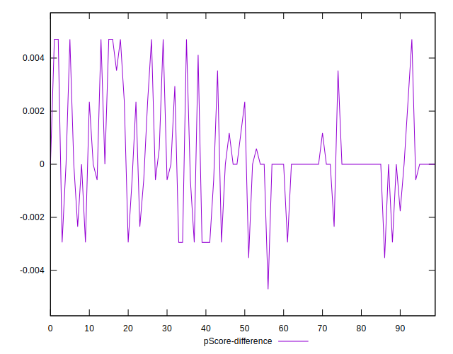

# //unused-javascript/samples/pages

[→ Parent](../..)


## Raw


```yaml
p90min: 1050
p90max: 6170
p90range: 5120
p90mean: 3613.6263736263736
p90median: 4940
p90stdev: 1932.0139901681687
p90skewness: -0.4068463575048599
p90eccentricity: 1.000000000000001
p90discretization: 1.8571428571428572
outlandishness: 1.024429733587096
confidence: 797.9119779773591
p90confidence: 793.9033919001431

```


## Score


```yaml
p90min: 0
p90max: 0.46
p90range: 0.46
p90mean: 0.151098901098901
p90median: 0
p90stdev: 0.20665015587187283
p90skewness: 0.6979451182005731
p90eccentricity: 1.000000000000002
p90discretization: 8.272727272727273
outlandishness: 1.4112576013223155
confidence: 0.08500438592882986
p90confidence: 0.084916703770397

```


## Raw Estimate


## Score Estimate


## P Score


```yaml
p90min: 0
p90max: 0.4647058823529412
p90range: 0.4647058823529412
p90mean: 0.15101486748545578
p90median: 0.0011764705882352788
p90stdev: 0.20668477971715601
p90skewness: 0.6985146054773136
p90eccentricity: 0.9999999999999974
p90discretization: 3.5
outlandishness: 1.4171841557181086
confidence: 0.08520264870396022
p90confidence: 0.08493093140453983

```


## Score Difference


```yaml
p90min: 0
p90max: 0
p90range: 0
p90mean: 0
p90median: 0
p90stdev: 0
p90skewness: .nan
p90eccentricity: .nan
p90discretization: 91
outlandishness: .nan
confidence: 0
p90confidence: 0

```


## P Score Difference


```yaml
p90min: -0.003529411764705913
p90max: 0.004705882352941171
p90range: 0.008235294117647084
p90mean: -0.00005817711700064573
p90median: 0
p90stdev: 0.0018704677813155554
p90skewness: 0.4019766670230987
p90eccentricity: 1.0000000000000009
p90discretization: 4.136363636363637
outlandishness: 22.583616049383235
confidence: 0.0008855476306341715
p90confidence: 0.0007686128172897433

```

