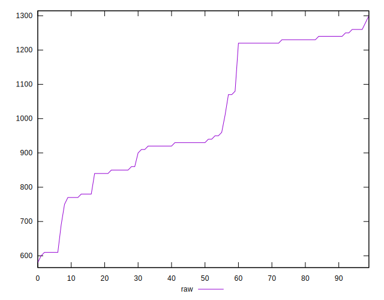
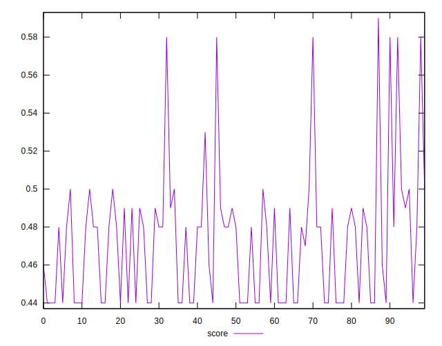

# //uses-http2/samples/pages+cached+noadtech+nomedia+nocss

[→ Parent](../..)


## Raw


```yaml
p90min: 750
p90max: 1280
p90range: 530
p90mean: 1037.9120879120878
p90median: 950
p90stdev: 179.78324240453213
p90skewness: 0.008005673358505846
p90eccentricity: 1
p90discretization: 4.136363636363637
outlandishness: 0.9407603333993777
confidence: 81.76232139894
p90confidence: 73.87654886460723

```


## Score


```yaml
p90min: 0.44
p90max: 0.5
p90range: 0.06
p90mean: 0.4654945054945054
p90median: 0.48
p90stdev: 0.02331173058777967
p90skewness: -0.0054214190964600156
p90eccentricity: 0.9999999999999991
p90discretization: 15.166666666666666
outlandishness: 1.0368777736760586
confidence: 0.014729752007172525
p90confidence: 0.009579258783260491

```


## Raw Estimate


## Score Estimate


## P Score


```yaml
p90min: 0.4376470588235294
p90max: 0.5
p90range: 0.06235294117647061
p90mean: 0.46612798965740176
p90median: 0.4764705882352941
p90stdev: 0.02115096969465084
p90skewness: -0.008005673358521608
p90eccentricity: 0.9999999999999996
p90discretization: 4.136363636363637
outlandishness: 1.0363725641523527
confidence: 0.014222887966806819
p90confidence: 0.008691358689953854

```


## Score Difference


```yaml
p90min: 0
p90max: 0
p90range: 0
p90mean: 0
p90median: 0
p90stdev: 0
p90skewness: .nan
p90eccentricity: .nan
p90discretization: 91
outlandishness: .inf
confidence: 2.1650898205369663e-18
p90confidence: 0

```


## P Score Difference


```yaml
p90min: -0.003529411764705892
p90max: 0.004705882352941171
p90range: 0.008235294117647063
p90mean: 0.0003232062055591523
p90median: 0
p90stdev: 0.0024813032481589385
p90skewness: 0.26230539440126316
p90eccentricity: 0.9999999999999997
p90discretization: 5.055555555555555
outlandishness: 2.6830439999999567
confidence: 0.0010670999607903615
p90confidence: 0.0010196173915255943

```

