# //uses-http2/samples/pages+cached+noadtech+nomedia

[→ Parent](../..)


## Raw


```yaml
p90min: 520
p90max: 590
p90range: 70
p90mean: 564.065934065934
p90median: 570
p90stdev: 16.573381410571244
p90skewness: -0.40073271916043374
p90eccentricity: 0.9999999999999988
p90discretization: 11.375
outlandishness: 1.0261733417150933
confidence: 20.443993397221448
p90confidence: 6.810335631142152

```

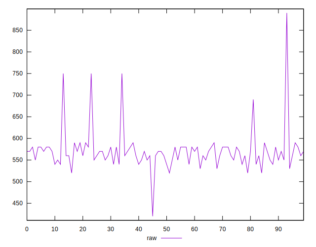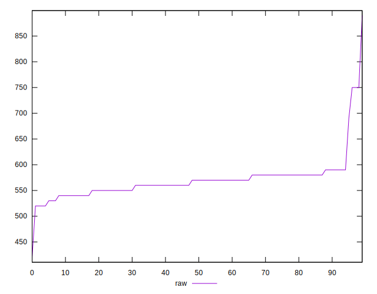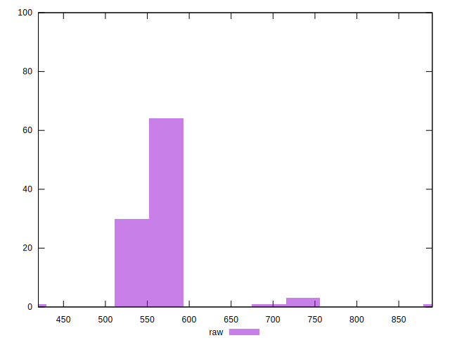
## Score


```yaml
p90min: 0.59
p90max: 0.63
p90range: 0.040000000000000036
p90mean: 0.6032967032967036
p90median: 0.6
p90stdev: 0.010999994510982169
p90skewness: 0.16380035332122753
p90eccentricity: 0.9999999999999993
p90discretization: 18.2
outlandishness: 0.9884416081034905
confidence: 0.01040044874304158
p90confidence: 0.004520118900583903

```

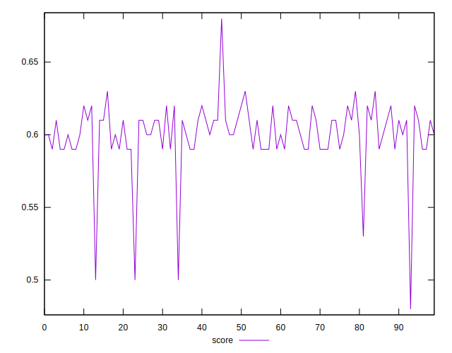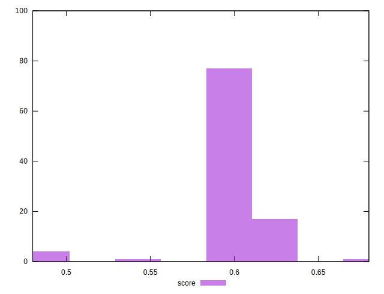
## Raw Estimate

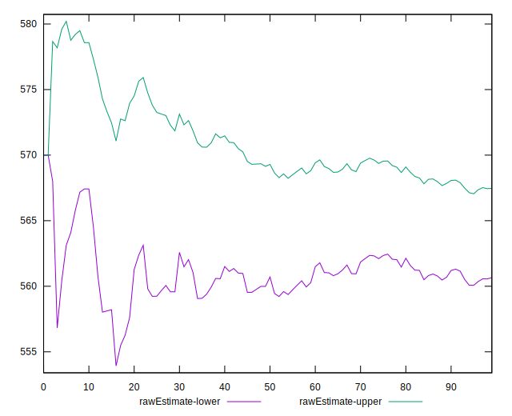
## Score Estimate

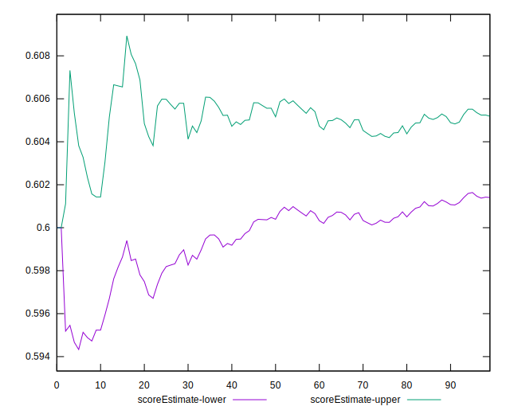
## P Score


```yaml
p90min: 0.5888888888888889
p90max: 0.6277777777777778
p90range: 0.03888888888888886
p90mean: 0.6032967032967032
p90median: 0.6
p90stdev: 0.009207434116984032
p90skewness: 0.40073271916045783
p90eccentricity: 1.0000000000000002
p90discretization: 11.375
outlandishness: 0.9885579375493374
confidence: 0.010068195346648157
p90confidence: 0.003783519795078849

```

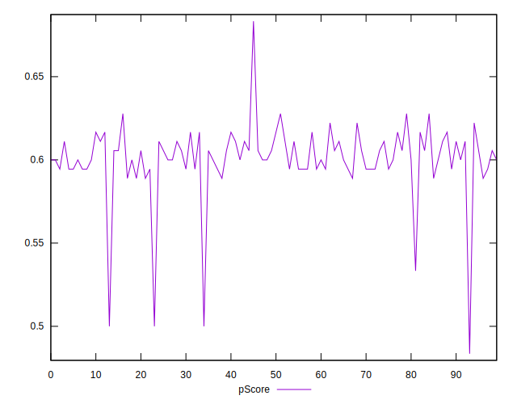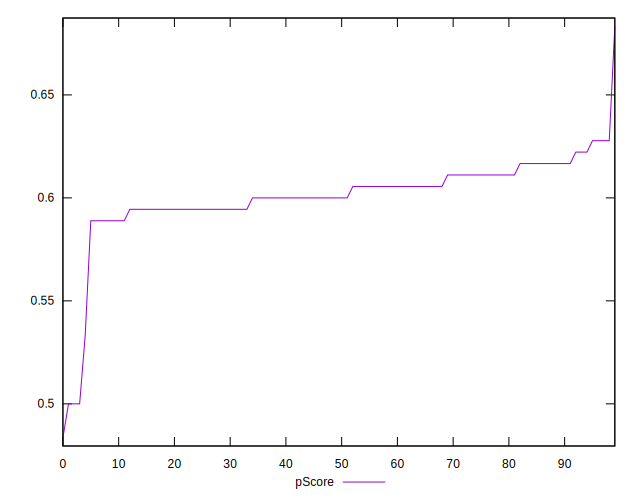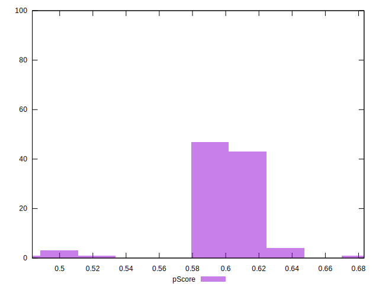
## Score Difference


```yaml
p90min: 0
p90max: 0
p90range: 0
p90mean: 0
p90median: 0
p90stdev: 0
p90skewness: .nan
p90eccentricity: .nan
p90discretization: 91
outlandishness: .nan
confidence: 0
p90confidence: 0

```


## P Score Difference


```yaml
p90min: -0.004444444444444362
p90max: 0.004444444444444473
p90range: 0.008888888888888835
p90mean: 0.00047834518422756693
p90median: 0
p90stdev: 0.0029217258336904374
p90skewness: -0.0664057427831043
p90eccentricity: 0.9999999999999992
p90discretization: 9.1
outlandishness: 0.005444046749462125
confidence: 0.0012241823605083249
p90confidence: 0.0012005958866618811

```

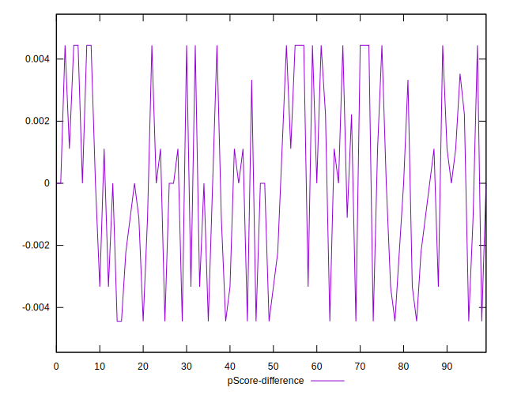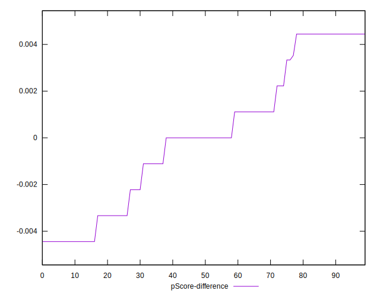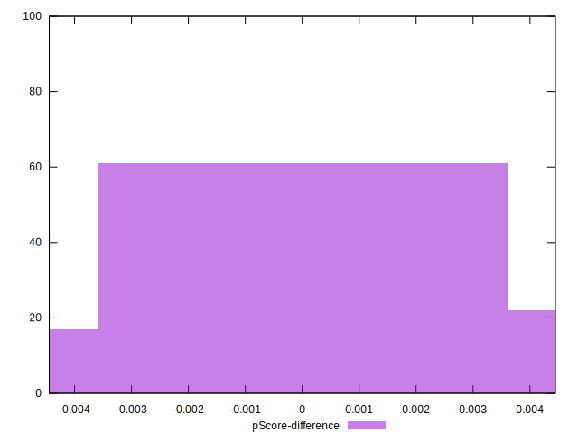