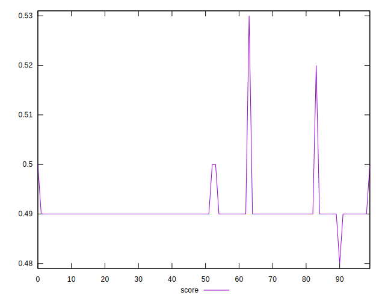
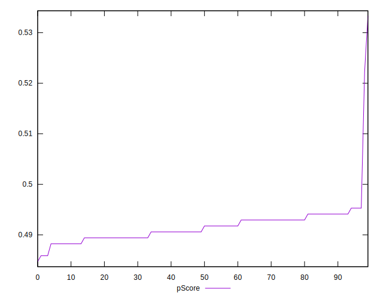

# //uses-http2/samples/pages+cached+noadtech

[→ Parent](../..)


## Raw


```yaml
p90min: 790
p90max: 850
p90range: 60
p90mean: 824.065934065934
p90median: 830
p90stdev: 16.639554488569413
p90skewness: -0.044002509735987724
p90eccentricity: 0.9999999999999983
p90discretization: 13
outlandishness: 0.9962031042286282
confidence: 10.287477363772041
p90confidence: 6.837527479308164

```


## Score


```yaml
p90min: 0.49
p90max: 0.49
p90range: 0
p90mean: 0.49000000000000005
p90median: 0.49
p90stdev: 5.551115123125783e-17
p90skewness: -1
p90eccentricity: 1
p90discretization: 91
outlandishness: 1.0040857975843402
confidence: 0.002110945814559284
p90confidence: 0

```


## Raw Estimate


## Score Estimate


## P Score


```yaml
p90min: 0.48823529411764705
p90max: 0.49529411764705883
p90range: 0.007058823529411784
p90mean: 0.49151906916612803
p90median: 0.49176470588235294
p90stdev: 0.002000163372288421
p90skewness: 0.07286613683003633
p90eccentricity: 1
p90discretization: 13
outlandishness: 1.0015852155526896
confidence: 0.0022223250722774868
p90confidence: 0.0008219073431636748

```


## Score Difference


```yaml
p90min: 0
p90max: 0
p90range: 0
p90mean: 0
p90median: 0
p90stdev: 0
p90skewness: .nan
p90eccentricity: .nan
p90discretization: 91
outlandishness: .nan
confidence: 0
p90confidence: 0

```


## P Score Difference


```yaml
p90min: -0.001764705882352946
p90max: 0.004117647058823559
p90range: 0.005882352941176505
p90mean: 0.0012439847733965509
p90median: 0.0005882352941176672
p90stdev: 0.0019030118223471277
p90skewness: -0.009138594100331758
p90eccentricity: 0.9999999999999992
p90discretization: 11.375
outlandishness: 0.5333552935105568
confidence: 0.0009328973348103767
p90confidence: 0.0007819858180509094

```

