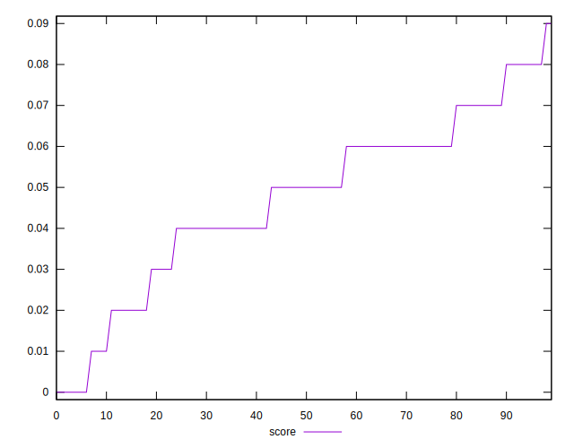
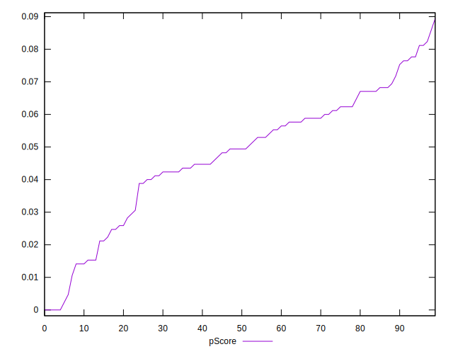

# //uses-http2/samples/pages+cached

[→ Parent](../..)


## Raw


```yaml
p90min: 4300
p90max: 4910
p90range: 610
p90mean: 4577.3626373626375
p90median: 4570
p90stdev: 149.9291786278886
p90skewness: 0.3906821326116048
p90eccentricity: 0.9999999999999999
p90discretization: 2.2195121951219514
outlandishness: 1.0118044501787633
confidence: 76.45619284291934
p90confidence: 61.608913839760135

```


## Score


```yaml
p90min: 0.01
p90max: 0.08
p90range: 0.07
p90mean: 0.04967032967032966
p90median: 0.05
p90stdev: 0.01842421659214238
p90skewness: -0.3205723465340924
p90eccentricity: 0.9999999999999997
p90discretization: 11.375
outlandishness: 0.8953681278878526
confidence: 0.008826368725794148
p90confidence: 0.007570881018481412

```


## Raw Estimate


## Score Estimate


## P Score


```yaml
p90min: 0.01058823529411762
p90max: 0.08235294117647057
p90range: 0.07176470588235295
p90mean: 0.04972204266321913
p90median: 0.050588235294117656
p90stdev: 0.01763872689739866
p90skewness: -0.39068213261160833
p90eccentricity: 0.9999999999999999
p90discretization: 2.2195121951219514
outlandishness: 0.8961925464293667
confidence: 0.008509391841408837
p90confidence: 0.007248107510560098

```


## Score Difference


```yaml
p90min: 0
p90max: 0
p90range: 0
p90mean: 0
p90median: 0
p90stdev: 0
p90skewness: .nan
p90eccentricity: .nan
p90discretization: 91
outlandishness: .nan
confidence: 0
p90confidence: 0

```


## P Score Difference


```yaml
p90min: -0.0041176470588235314
p90max: 0.004705882352941171
p90range: 0.008823529411764702
p90mean: 0.00023270846800257222
p90median: 0
p90stdev: 0.002519748413024352
p90skewness: 0.10802817756978268
p90eccentricity: 0.9999999999999997
p90discretization: 2.4594594594594597
outlandishness: 0.0920111111110871
confidence: 0.0010958345311195663
p90confidence: 0.0010354152827127877

```

