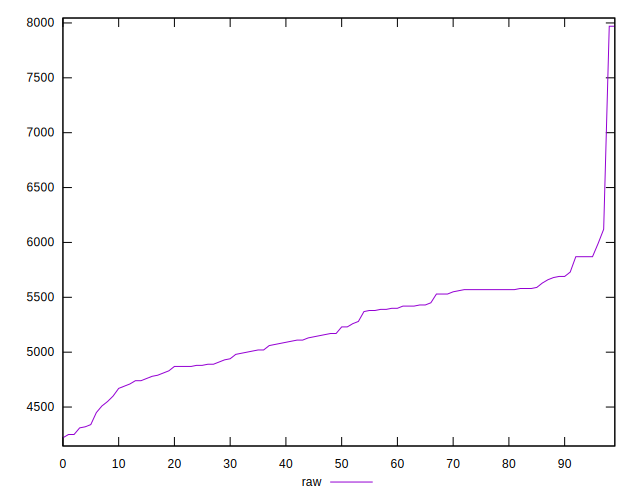
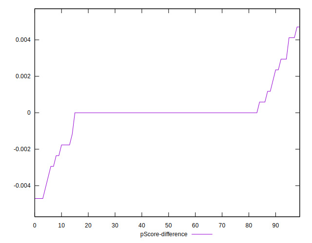

# //uses-http2/samples/pages

[→ Parent](../..)


## Raw


```yaml
p90min: 4450
p90max: 5990
p90range: 1540
p90mean: 5236.813186813187
p90median: 5230
p90stdev: 363.67138626615287
p90skewness: -0.10977179682512966
p90eccentricity: 1.0000000000000002
p90discretization: 1.5689655172413792
outlandishness: 1.002364211798814
confidence: 225.9915817483652
p90confidence: 149.43988426739816

```


## Score


```yaml
p90min: 0
p90max: 0.05
p90range: 0.05
p90mean: 0.005384615384615385
p90median: 0
p90stdev: 0.011025215086755191
p90skewness: 2.116393174227238
p90eccentricity: 0.999999999999997
p90discretization: 15.166666666666666
outlandishness: 4.721308163265308
confidence: 0.009042297613061741
p90confidence: 0.004530482542231327

```


## Raw Estimate


## Score Estimate


## P Score


```yaml
p90min: 0
p90max: 0.047058823529411764
p90range: 0.047058823529411764
p90mean: 0.005313510019392368
p90median: 0
p90stdev: 0.010690965601827192
p90skewness: 2.0614351732895484
p90eccentricity: 1.0000000000000038
p90discretization: 4.7894736842105265
outlandishness: 4.814447440519533
confidence: 0.008998827018799964
p90confidence: 0.004393132708754129

```


## Score Difference


```yaml
p90min: 0
p90max: 0
p90range: 0
p90mean: 0
p90median: 0
p90stdev: 0
p90skewness: .nan
p90eccentricity: .nan
p90discretization: 91
outlandishness: .nan
confidence: 0
p90confidence: 0

```


## P Score Difference


```yaml
p90min: -0.0041176470588235314
p90max: 0.0029411764705882335
p90range: 0.007058823529411765
p90mean: -0.00007756948933419945
p90median: 0
p90stdev: 0.0011242745398142298
p90skewness: -0.5859638256602784
p90eccentricity: 0.9999999999999978
p90discretization: 4.333333333333333
outlandishness: 0.2817840277778212
confidence: 0.0006779757745494227
p90confidence: 0.00046198701206495805

```

