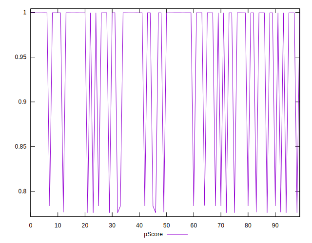

# //uses-long-cache-ttl/samples/pages+cached+noadtech+nomedia+nocss

[→ Parent](../..)


## Raw


```yaml
p90min: 2440
p90max: 53269
p90range: 50829
p90mean: 11241.791208791208
p90median: 2562
p90stdev: 18896.725550709132
p90skewness: 1.7040821161424522
p90eccentricity: 1.0000000000000009
p90discretization: 15.166666666666666
outlandishness: 1.786133824886471
confidence: 8494.650522231295
p90confidence: 7765.044449397719

```


## Score


```yaml
p90min: 0.78
p90max: 1
p90range: 0.21999999999999997
p90mean: 0.9613186813186815
p90median: 1
p90stdev: 0.08374751157475882
p90skewness: -1.703183294109405
p90eccentricity: 1.000000000000002
p90discretization: 45.5
outlandishness: 0.96633754381954
confidence: 0.03734232922451364
p90confidence: 0.03441353625840482

```


## Raw Estimate


## Score Estimate


## P Score


```yaml
p90min: 0.7761429257345126
p90max: 0.9996090852968826
p90range: 0.22346615956237004
p90mean: 0.9612234489712208
p90median: 0.9995466956021494
p90stdev: 0.08303592654183363
p90skewness: -1.7042761085604337
p90eccentricity: 1.0000000000000018
p90discretization: 15.166666666666666
outlandishness: 0.9656418731625203
confidence: 0.037352381217992114
p90confidence: 0.03412113166188546

```


## Score Difference


```yaml
p90min: 0
p90max: 0
p90range: 0
p90mean: 0
p90median: 0
p90stdev: 0
p90skewness: .nan
p90eccentricity: .nan
p90discretization: 91
outlandishness: .nan
confidence: 0
p90confidence: 0

```


## P Score Difference


```yaml
p90min: -0.0038570742654874257
p90max: 0.0036284452541361922
p90range: 0.007485519519623618
p90mean: -0.0008419741484144315
p90median: -0.00045330439785062904
p90stdev: 0.0013566655825488934
p90skewness: -0.6512139828609118
p90eccentricity: 0.9999999999999992
p90discretization: 18.2
outlandishness: 0.26544699702417446
confidence: 0.0007188031310497445
p90confidence: 0.0005574811637704545

```

