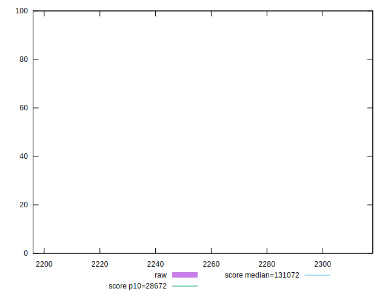
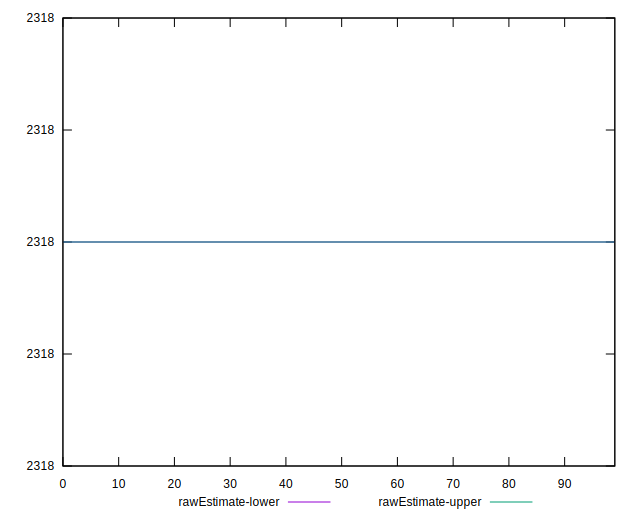
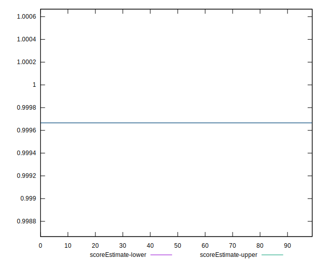
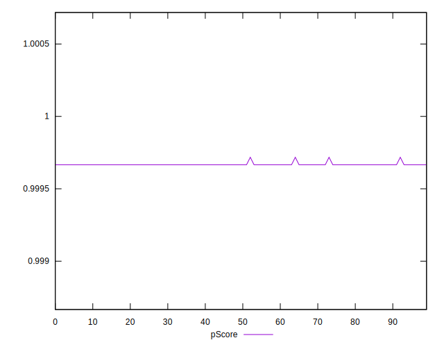
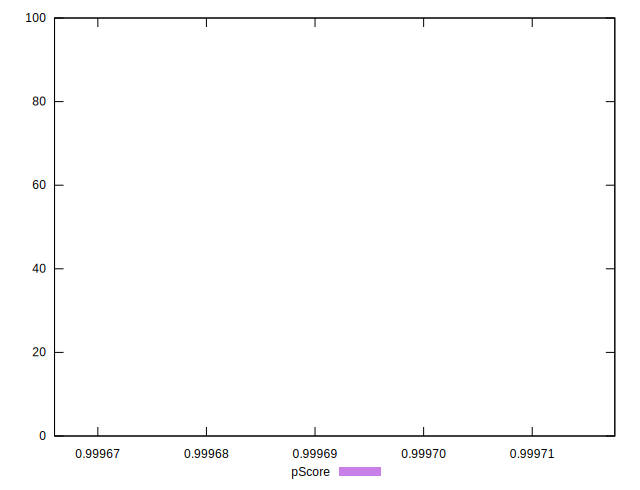
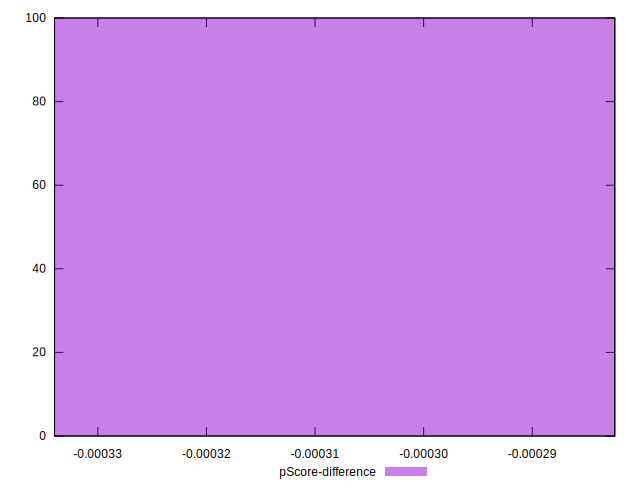

# //uses-long-cache-ttl/samples/pages+cached+noadtech+nomedia

[→ Parent](../..)


## Raw


```yaml
p90min: 2318
p90max: 2318
p90range: 0
p90mean: 2318
p90median: 2318
p90stdev: 0
p90skewness: .nan
p90eccentricity: .nan
p90discretization: 91
outlandishness: 0.9957939058171743
confidence: 9.37137959224583
p90confidence: 0

```


## Score


```yaml
p90min: 1
p90max: 1
p90range: 0
p90mean: 1
p90median: 1
p90stdev: 0
p90skewness: .nan
p90eccentricity: .nan
p90discretization: 91
outlandishness: 1
confidence: 0
p90confidence: 0

```


## Raw Estimate


## Score Estimate


## P Score


```yaml
p90min: 0.9996660123158774
p90max: 0.9996660123158774
p90range: 0
p90mean: 0.9996660123158755
p90median: 0.9996660123158774
p90stdev: 1.887379141862766e-15
p90skewness: 1
p90eccentricity: 1
p90discretization: 91
outlandishness: 1.0000041288749202
confidence: 0.000003963144587837419
p90confidence: 6.661338147750939e-16

```


## Score Difference


```yaml
p90min: 0
p90max: 0
p90range: 0
p90mean: 0
p90median: 0
p90stdev: 0
p90skewness: .nan
p90eccentricity: .nan
p90discretization: 91
outlandishness: .nan
confidence: 0
p90confidence: 0

```


## P Score Difference


```yaml
p90min: -0.00033398768412262747
p90max: -0.00033398768412262747
p90range: 0
p90mean: -0.00033398768412262747
p90median: -0.00033398768412262747
p90stdev: 0
p90skewness: .nan
p90eccentricity: .nan
p90discretization: 91
outlandishness: 0.9876799661928136
confidence: 0.000003963144587743636
p90confidence: 0

```

