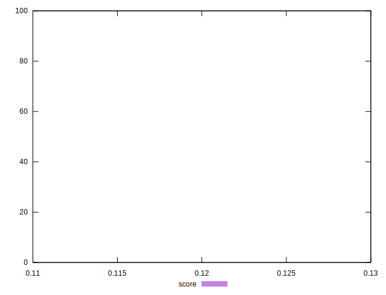

# //uses-long-cache-ttl/samples/pages+cached

[→ Parent](../..)


## Raw


```yaml
p90min: 519228.8942695221
p90max: 519232.09203488525
p90range: 3.1977653631474823
p90mean: 519231.1746673363
p90median: 519231.5934315333
p90stdev: 0.8607430823235646
p90skewness: -1.2676281150982116
p90eccentricity: 1.0000000000000009
p90discretization: 6.066666666666666
outlandishness: 1.0000087464099117
confidence: 7.86498863005545
p90confidence: 0.35369663790334016

```


## Score


```yaml
p90min: 0.12
p90max: 0.12
p90range: 0
p90mean: 0.11999999999999986
p90median: 0.12
p90stdev: 1.3877787807814457e-16
p90skewness: 1
p90eccentricity: 1
p90discretization: 91
outlandishness: 0.9999999999999991
confidence: 8.326672684688674e-17
p90confidence: 5.551115123125783e-17

```


## Raw Estimate


## Score Estimate


## P Score


```yaml
p90min: 0.12286495732719871
p90max: 0.12286601353967608
p90range: 0.0000010562124773683124
p90mean: 0.12286526033014675
p90median: 0.1228651220135697
p90stdev: 2.843007566339813e-7
p90skewness: 1.2676324728104158
p90eccentricity: 0.9999999999999993
p90discretization: 6.066666666666666
outlandishness: 0.9999877956549191
confidence: 0.000002596791302295065
p90confidence: 1.1682489678421781e-7

```


## Score Difference


```yaml
p90min: 0
p90max: 0
p90range: 0
p90mean: 0
p90median: 0
p90stdev: 0
p90skewness: .nan
p90eccentricity: .nan
p90discretization: 91
outlandishness: .nan
confidence: 0
p90confidence: 0

```


## P Score Difference


```yaml
p90min: 0.002864957327198714
p90max: 0.002866013539676082
p90range: 0.0000010562124773683124
p90mean: 0.002865260330146677
p90median: 0.0028651220135696986
p90stdev: 2.843007566339812e-7
p90skewness: 1.26763247403686
p90eccentricity: 1.0000000000000004
p90discretization: 6.066666666666666
outlandishness: 0.9994767322152617
confidence: 0.0000025967913022863914
p90confidence: 1.1682489679722824e-7

```

