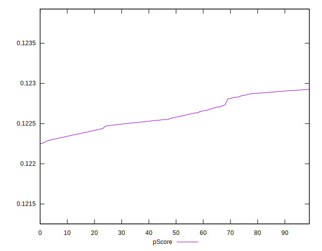

# //uses-long-cache-ttl/samples/pages

[→ Parent](../..)


## Raw


```yaml
p90min: 519068.3640519165
p90max: 520909.8120017536
p90range: 1841.4479498370783
p90mean: 519950.82894404756
p90median: 520072.64621809433
p90stdev: 581.263117916546
p90skewness: -0.16325773430547477
p90eccentricity: 0.9999999999999993
p90discretization: 1
outlandishness: 1.0001410585876256
confidence: 247.29828100430313
p90confidence: 238.85270150669385

```


## Score


```yaml
p90min: 0.12
p90max: 0.12
p90range: 0
p90mean: 0.11999999999999986
p90median: 0.12
p90stdev: 1.3877787807814457e-16
p90skewness: 1
p90eccentricity: 1
p90discretization: 91
outlandishness: 0.9999999999999991
confidence: 8.326672684688674e-17
p90confidence: 5.551115123125783e-17

```


## Raw Estimate


## Score Estimate


## P Score


```yaml
p90min: 0.12231258129278327
p90max: 0.12291905274430265
p90range: 0.0006064714515193748
p90mean: 0.12262809873361631
p90median: 0.1225877704957472
p90stdev: 0.00019149842200808927
p90skewness: 0.16549027482342288
p90eccentricity: 0.9999999999999992
p90discretization: 1
outlandishness: 0.9998036360448818
confidence: 0.00008145568607037523
p90confidence: 0.00007869055169859585

```


## Score Difference


```yaml
p90min: 0
p90max: 0
p90range: 0
p90mean: 0
p90median: 0
p90stdev: 0
p90skewness: .nan
p90eccentricity: .nan
p90discretization: 91
outlandishness: .nan
confidence: 0
p90confidence: 0

```


## P Score Difference


```yaml
p90min: 0.002312581292783278
p90max: 0.0029190527443026526
p90range: 0.0006064714515193748
p90mean: 0.0026280987336162586
p90median: 0.0025877704957472103
p90stdev: 0.00019149842200808922
p90skewness: 0.16549027482345016
p90eccentricity: 1
p90discretization: 1
outlandishness: 0.9908581219529685
confidence: 0.00008145568607038477
p90confidence: 0.00007869055169860018

```

