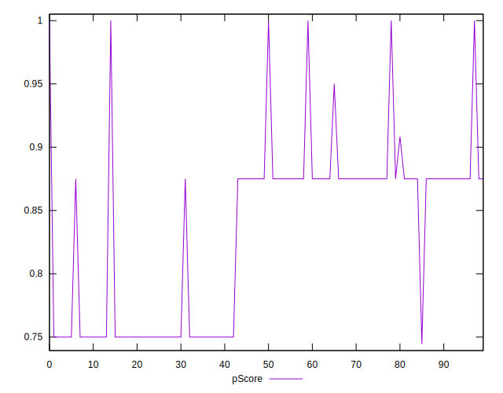
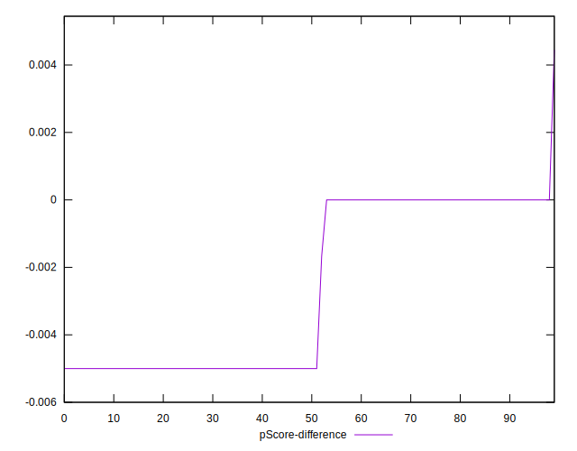

# //uses-optimized-images/samples/pages

[→ Parent](../..)


## Raw


```yaml
p90min: 110
p90max: 300
p90range: 190
p90mean: 212.1978021978022
p90median: 150
p90stdev: 74.46220662154658
p90skewness: 0.32318447808720374
p90eccentricity: 0.9999999999999997
p90discretization: 30.333333333333332
outlandishness: 0.8865621884588475
confidence: 35.05643107309061
p90confidence: 30.598017771118464

```


## Score


```yaml
p90min: 0.75
p90max: 0.91
p90range: 0.16000000000000003
p90mean: 0.8260439560439564
p90median: 0.88
p90stdev: 0.06446532624323266
p90skewness: -0.32610242561414593
p90eccentricity: 1.0000000000000013
p90discretization: 30.333333333333332
outlandishness: 1.0244956789814832
confidence: 0.02980638065575958
p90confidence: 0.02649009863536067

```


## Raw Estimate


## Score Estimate


## P Score


```yaml
p90min: 0.75
p90max: 0.9083333333333333
p90range: 0.15833333333333333
p90mean: 0.8231684981684981
p90median: 0.875
p90stdev: 0.06205183885128879
p90skewness: -0.32318447808720346
p90eccentricity: 0.9999999999999999
p90discretization: 30.333333333333332
outlandishness: 1.0253276541492162
confidence: 0.029200473090041035
p90confidence: 0.02549834814259877

```


## Score Difference


```yaml
p90min: 0
p90max: 0
p90range: 0
p90mean: 0
p90median: 0
p90stdev: 0
p90skewness: .nan
p90eccentricity: .nan
p90discretization: 91
outlandishness: .inf
confidence: 4.330179641073933e-18
p90confidence: 0

```


## P Score Difference


```yaml
p90min: -0.0050000000000000044
p90max: 0
p90range: 0.0050000000000000044
p90mean: -0.0028754578754578786
p90median: -0.0050000000000000044
p90stdev: 0.0024592643864998764
p90skewness: 0.3003800116916823
p90eccentricity: 0.9999999999999984
p90discretization: 30.333333333333332
outlandishness: 0.8002081170748416
confidence: 0.0010077327067797544
p90confidence: 0.0010105611801763045

```

