# //uses-rel-preconnect/samples/pages+cached

[→ Parent](../..)


## Raw


```yaml
p90min: 263.89800003170967
p90max: 305.01
p90range: 41.11199996829032
p90mean: 294.8952307693461
p90median: 300.594
p90stdev: 10.640016527958954
p90skewness: -1.4274298395301959
p90eccentricity: 0.9999999999999999
p90discretization: 1.0340909090909092
outlandishness: 0.933593081200219
confidence: 15.533939698743211
p90confidence: 4.372196709965351

```

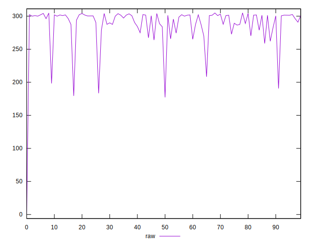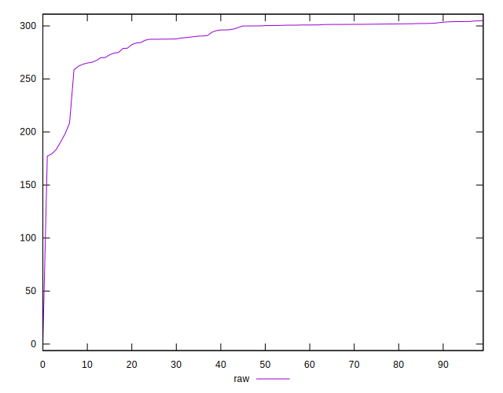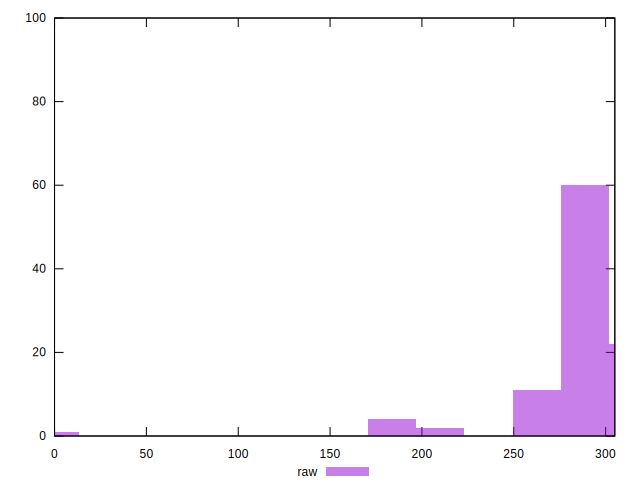
## Score


```yaml
p90min: 0.75
p90max: 0.78
p90range: 0.030000000000000027
p90mean: 0.754835164835165
p90median: 0.75
p90stdev: 0.00816890880881134
p90skewness: 1.6858532294003425
p90eccentricity: 1.0000000000000018
p90discretization: 22.75
outlandishness: 1.0217504268101074
confidence: 0.012792425327574408
p90confidence: 0.0033567688662925477

```

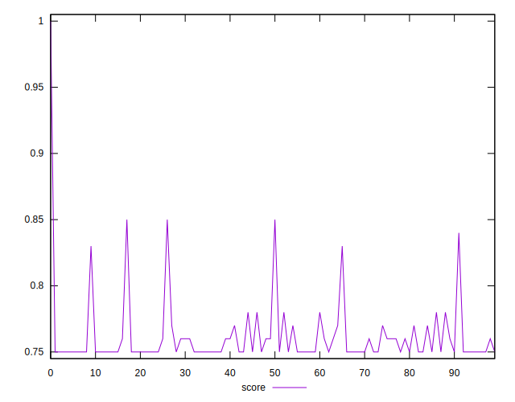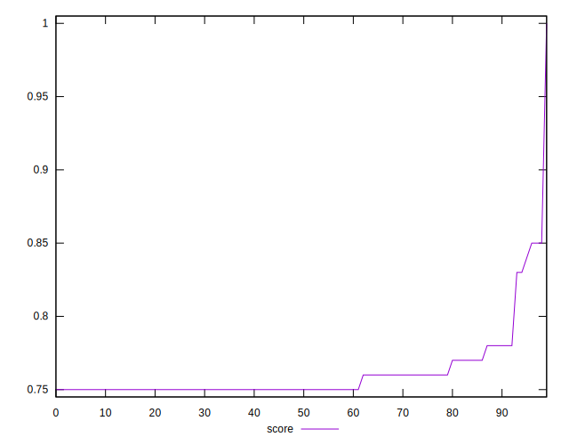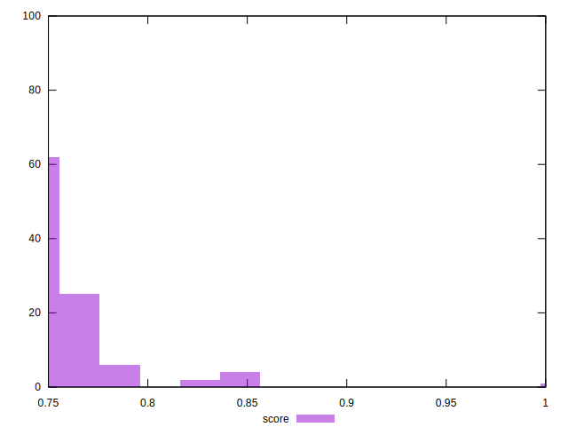
## Raw Estimate

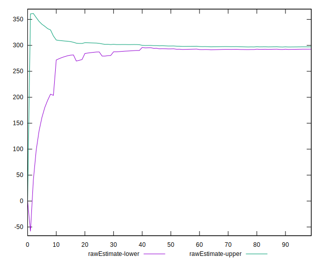
## Score Estimate

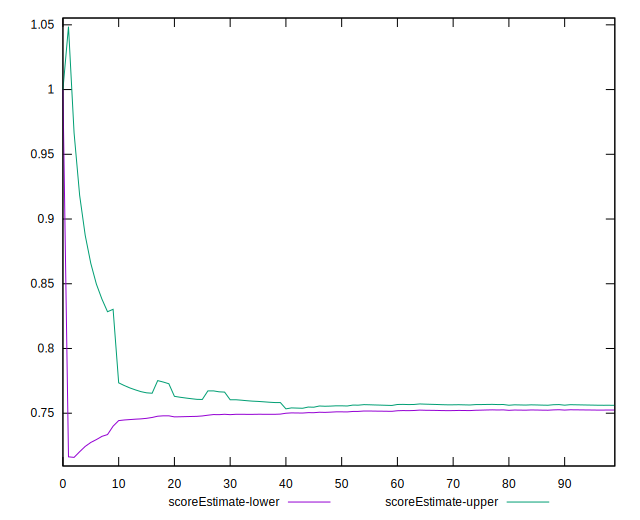
## P Score


```yaml
p90min: 0.7472166666666666
p90max: 0.7800849999735753
p90range: 0.03286833330690864
p90mean: 0.7545608150181818
p90median: 0.7496700000000001
p90stdev: 0.008643818016912039
p90skewness: 1.4904261157067755
p90eccentricity: 0.9999999999999997
p90discretization: 1.0340909090909092
outlandishness: 1.0220459455800155
confidence: 0.012896318363328385
p90confidence: 0.003551918607999749

```

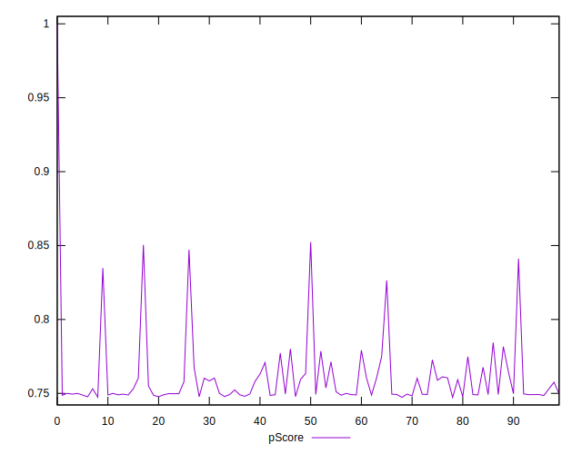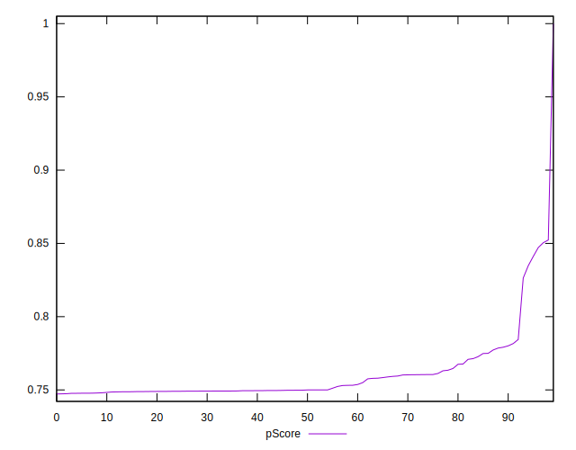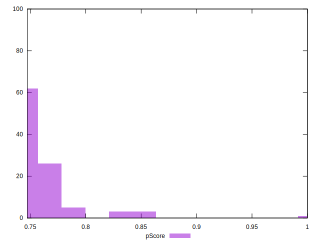
## Score Difference


```yaml
p90min: 0
p90max: 0
p90range: 0
p90mean: 0
p90median: 0
p90stdev: 0
p90skewness: .nan
p90eccentricity: .nan
p90discretization: 91
outlandishness: .inf
confidence: 6.092792000602807e-18
p90confidence: 0

```


## P Score Difference


```yaml
p90min: -0.002824166665474581
p90max: 0.0031599999964236902
p90range: 0.005984166661898271
p90mean: -0.0005361355313822458
p90median: -0.0007722222222221742
p90stdev: 0.0013956713953878015
p90skewness: 0.7818780035562567
p90eccentricity: 1.0000000000000002
p90discretization: 1.0459770114942528
outlandishness: 0.09705407601891508
confidence: 0.0007597263890518904
p90confidence: 0.0005735094364818418

```

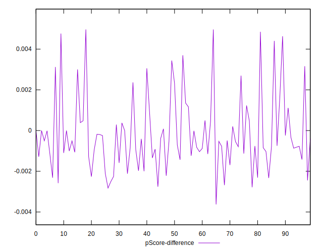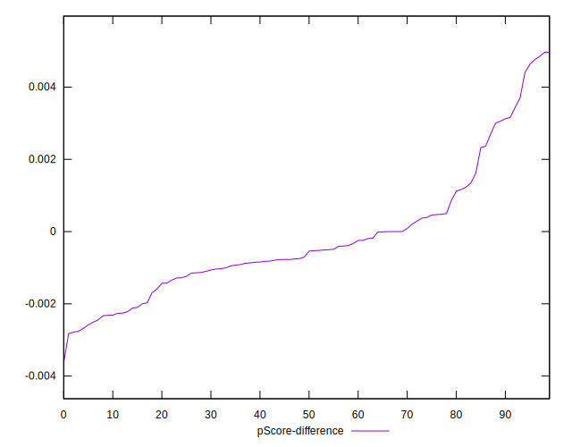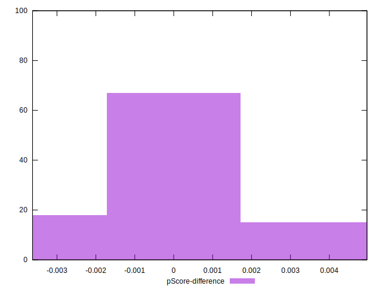