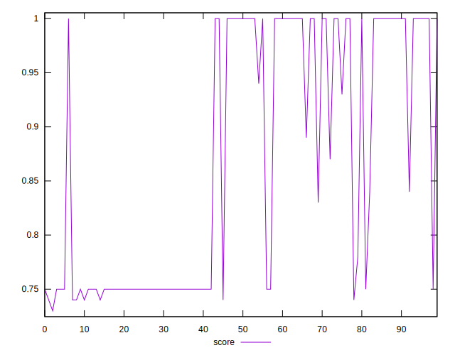
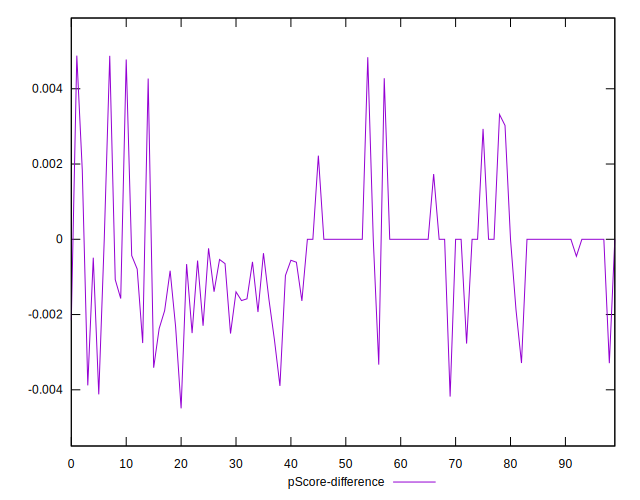

# //uses-rel-preconnect/samples/pages

[→ Parent](../..)


## Raw


```yaml
p90min: 0
p90max: 313.998
p90range: 313.998
p90mean: 167.91557142895655
p90median: 294.8630000054836
p90stdev: 145.53814874154946
p90skewness: -0.21301725766312882
p90eccentricity: 0.9999999999999983
p90discretization: 1.6545454545454545
outlandishness: 0.9003484196476683
confidence: 57.71439868905878
p90confidence: 59.804551377356404

```


## Score


```yaml
p90min: 0.74
p90max: 1
p90range: 0.26
p90mean: 0.8582417582417582
p90median: 0.75
p90stdev: 0.12000543400327841
p90skewness: 0.2587224862498242
p90eccentricity: 0.9999999999999974
p90discretization: 9.1
outlandishness: 1.0235765293338426
confidence: 0.047649477686558805
p90confidence: 0.0493126455535442

```


## Raw Estimate


## Score Estimate


## P Score


```yaml
p90min: 0.7389288888888889
p90max: 1
p90range: 0.26107111111111114
p90mean: 0.8577864865686655
p90median: 0.74976
p90stdev: 0.12048182462987511
p90skewness: 0.2590023237598299
p90eccentricity: 1.0000000000000004
p90discretization: 1.625
outlandishness: 1.023728917937463
confidence: 0.047822648398600176
p90confidence: 0.049508404039895426

```


## Score Difference


```yaml
p90min: 0
p90max: 0
p90range: 0
p90mean: 0
p90median: 0
p90stdev: 0
p90skewness: .nan
p90eccentricity: .nan
p90discretization: 91
outlandishness: .inf
confidence: 6.092792000602807e-18
p90confidence: 0

```


## P Score Difference


```yaml
p90min: -0.0038966666666666594
p90max: 0.0033166666666667455
p90range: 0.007213333333333405
p90mean: -0.0006014194139587151
p90median: 0
p90stdev: 0.0013748474071419588
p90skewness: -0.06848294633412887
p90eccentricity: 1.0000000000000013
p90discretization: 1.8958333333333333
outlandishness: 0.43356454915271864
confidence: 0.0007583711576520675
p90confidence: 0.000564952441043199

```

