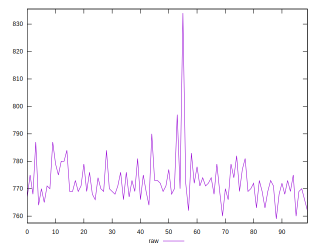
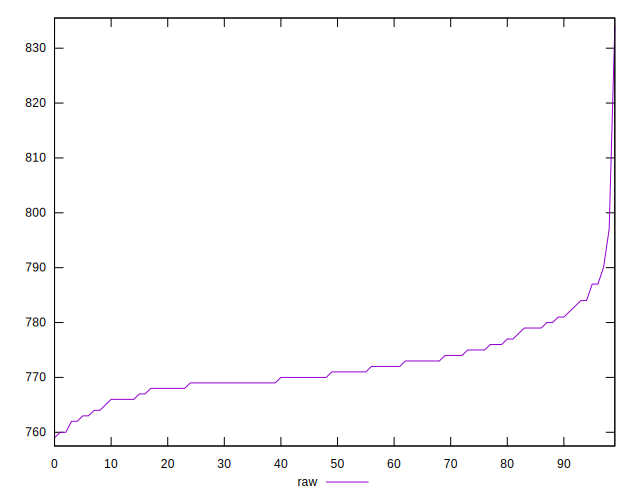
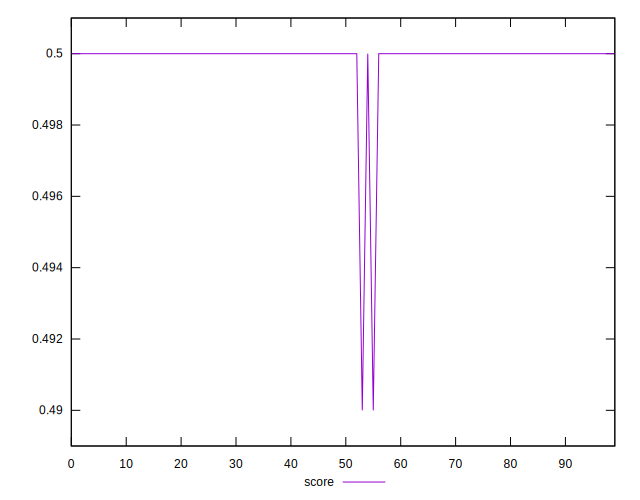
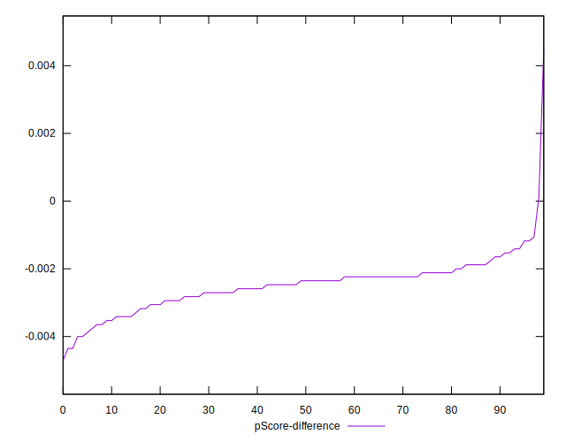

# //uses-rel-preload/samples/pages+cached+noadtech+nomedia+nocss

[→ Parent](../..)


## Raw


```yaml
p90min: 762
p90max: 784
p90range: 22
p90mean: 771.4285714285714
p90median: 770
p90stdev: 4.783540592129043
p90skewness: 0.5211092757265707
p90eccentricity: 1.000000000000002
p90discretization: 3.9565217391304346
outlandishness: 1.0029874130178327
confidence: 3.4890353797411535
p90confidence: 1.9656530028814814

```


## Score


```yaml
p90min: 0.5
p90max: 0.5
p90range: 0
p90mean: 0.5
p90median: 0.5
p90stdev: 0
p90skewness: .nan
p90eccentricity: .nan
p90discretization: 91
outlandishness: 0.9992001599999999
confidence: 0.0005487899156711995
p90confidence: 0

```


## Raw Estimate


## Score Estimate


## P Score


```yaml
p90min: 0.496
p90max: 0.49858823529411767
p90range: 0.002588235294117669
p90mean: 0.49747899159663866
p90median: 0.4976470588235294
p90stdev: 0.0005627694814269457
p90skewness: -0.5211092757280775
p90eccentricity: 0.9999999999999997
p90discretization: 3.9565217391304346
outlandishness: 0.9994554795512238
confidence: 0.0004104747505577766
p90confidence: 0.00023125329445661258

```


## Score Difference


```yaml
p90min: 0
p90max: 0
p90range: 0
p90mean: 0
p90median: 0
p90stdev: 0
p90skewness: .nan
p90eccentricity: .nan
p90discretization: 91
outlandishness: .nan
confidence: 0
p90confidence: 0

```


## P Score Difference


```yaml
p90min: -0.003764705882352948
p90max: -0.0011764705882352788
p90range: 0.002588235294117669
p90mean: -0.0024602456367162273
p90median: -0.002352941176470613
p90stdev: 0.0005552889549923677
p90skewness: -0.1904881207077466
p90eccentricity: 1.0000000000000002
p90discretization: 4.136363636363637
outlandishness: 0.9969335157669293
confidence: 0.0003991317759617233
p90confidence: 0.00022817939574793378

```

