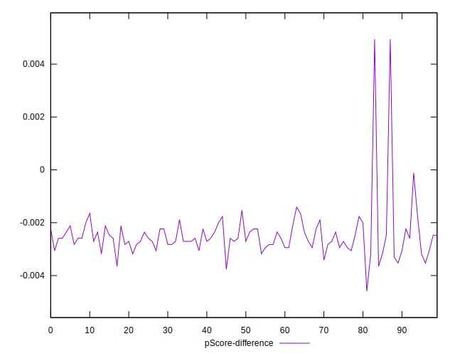

# //uses-rel-preload/samples/pages+cached+noadtech+nomedia

[→ Parent](../..)


## Raw


```yaml
p90min: 765
p90max: 782
p90range: 17
p90mean: 772.5054945054945
p90median: 773
p90stdev: 3.7043889216626273
p90skewness: 0.2309937159625963
p90eccentricity: 1.0000000000000036
p90discretization: 5.055555555555555
outlandishness: 1.0088856219409696
confidence: 9.082440959877204
p90confidence: 1.5222078850315484

```


## Score


```yaml
p90min: 0.5
p90max: 0.5
p90range: 0
p90mean: 0.5
p90median: 0.5
p90stdev: 0
p90skewness: .nan
p90eccentricity: .nan
p90discretization: 91
outlandishness: 0.9976014399999998
confidence: 0.0012170729317750872
p90confidence: 0

```


## Raw Estimate


## Score Estimate


## P Score


```yaml
p90min: 0.49623529411764705
p90max: 0.49823529411764705
p90range: 0.0020000000000000018
p90mean: 0.49735229476405934
p90median: 0.49729411764705883
p90stdev: 0.0004358104613720711
p90skewness: -0.2309937159617608
p90eccentricity: 1.0000000000000002
p90discretization: 5.055555555555555
outlandishness: 0.9983805450390673
confidence: 0.0010685224658678605
p90confidence: 0.00017908328059190737

```


## Score Difference


```yaml
p90min: 0
p90max: 0
p90range: 0
p90mean: 0
p90median: 0
p90stdev: 0
p90skewness: .nan
p90eccentricity: .nan
p90discretization: 91
outlandishness: .nan
confidence: 0
p90confidence: 0

```


## P Score Difference


```yaml
p90min: -0.0034117647058823364
p90max: -0.0014117647058823346
p90range: 0.0020000000000000018
p90mean: -0.0025507433742727906
p90median: -0.002588235294117669
p90stdev: 0.0004268201971602809
p90skewness: 0.4715169484728175
p90eccentricity: 0.9999999999999997
p90discretization: 4.7894736842105265
outlandishness: 0.9230115892732319
confidence: 0.00046989624437869266
p90confidence: 0.0001753890002771357

```

