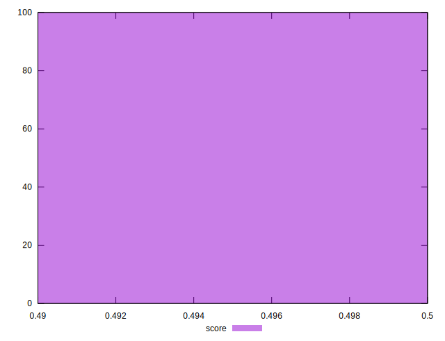

# //uses-rel-preload/samples/pages+cached+noadtech

[→ Parent](../..)


## Raw


```yaml
p90min: 771
p90max: 788
p90range: 17
p90mean: 778.4725274725274
p90median: 779
p90stdev: 3.531150730288143
p90skewness: -0.011257412756702487
p90eccentricity: 1.0000000000000002
p90discretization: 5.352941176470588
outlandishness: 1.0006358910658446
confidence: 1.9331882976409815
p90confidence: 1.451020829224035

```


## Score


```yaml
p90min: 0.5
p90max: 0.5
p90range: 0
p90mean: 0.5
p90median: 0.5
p90stdev: 0
p90skewness: .nan
p90eccentricity: .nan
p90discretization: 91
outlandishness: 0.9992001600000001
confidence: 0.0005487899156711995
p90confidence: 0

```


## Raw Estimate


## Score Estimate


## P Score


```yaml
p90min: 0.4955294117647059
p90max: 0.4975294117647059
p90range: 0.0020000000000000018
p90mean: 0.4966502908855851
p90median: 0.49658823529411766
p90stdev: 0.0004154294976809542
p90skewness: 0.011257412757251166
p90eccentricity: 1.0000000000000002
p90discretization: 5.352941176470588
outlandishness: 0.9998827603158003
confidence: 0.0002274339173695683
p90confidence: 0.0001707083328499337

```


## Score Difference


```yaml
p90min: 0
p90max: 0
p90range: 0
p90mean: 0
p90median: 0
p90stdev: 0
p90skewness: .nan
p90eccentricity: .nan
p90discretization: 91
outlandishness: .nan
confidence: 0
p90confidence: 0

```


## P Score Difference


```yaml
p90min: -0.004117647058823504
p90max: -0.0022352941176470575
p90range: 0.0018823529411764461
p90mean: -0.003301874595992241
p90median: -0.0032941176470588363
p90stdev: 0.00041559844177909604
p90skewness: 0.45833121014237266
p90eccentricity: 0.9999999999999993
p90discretization: 5.6875
outlandishness: 0.9268547674690281
confidence: 0.0004923486202912178
p90confidence: 0.0001707777553764606

```

