# //uses-rel-preload/samples/pages+cached

[→ Parent](../..)


## Raw


```yaml
p90min: 1245
p90max: 1405
p90range: 160
p90mean: 1327.7142857142858
p90median: 1381
p90stdev: 68.66886392566461
p90skewness: -0.19507087447828497
p90eccentricity: 1.0000000000000007
p90discretization: 2.275
outlandishness: 0.986976188807123
confidence: 59.00443290840849
p90confidence: 28.21741678162971

```

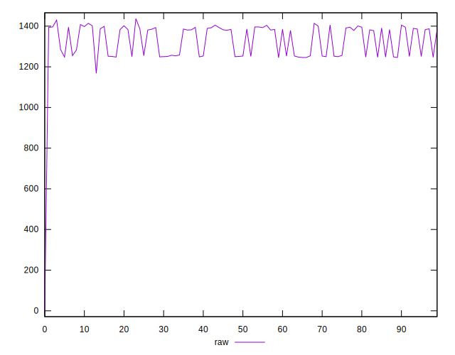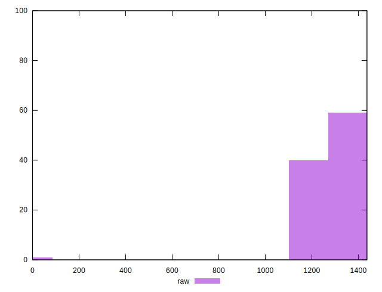
## Score


```yaml
p90min: 0.42
p90max: 0.45
p90range: 0.030000000000000027
p90mean: 0.4320879120879123
p90median: 0.43
p90stdev: 0.008453685523919528
p90skewness: -0.3012763458603439
p90eccentricity: 0.9999999999999996
p90discretization: 22.75
outlandishness: 1.0219297108835963
confidence: 0.022449109542928225
p90confidence: 0.003473789343995781

```

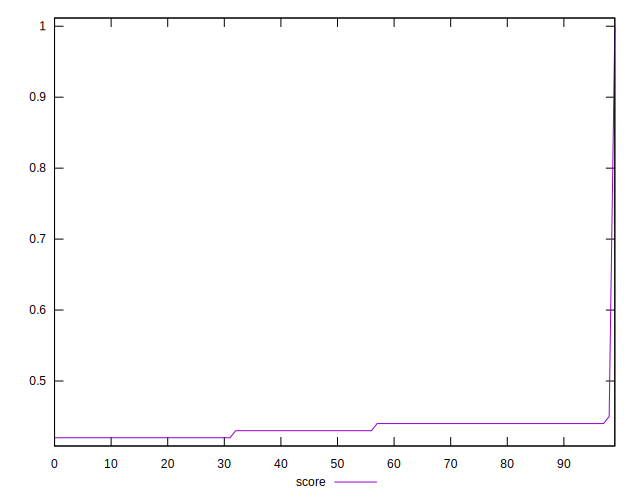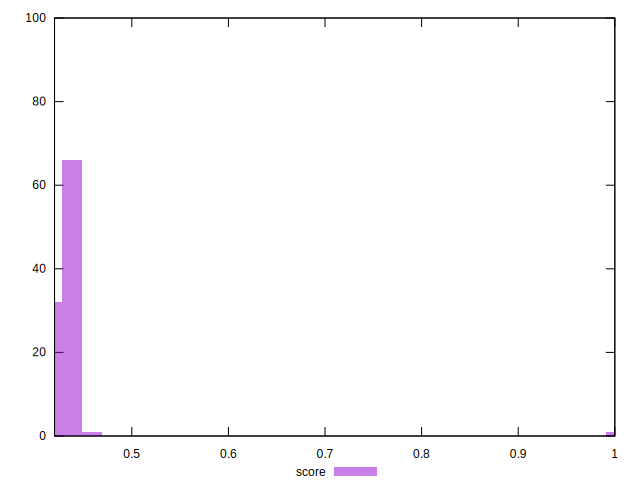
## Raw Estimate

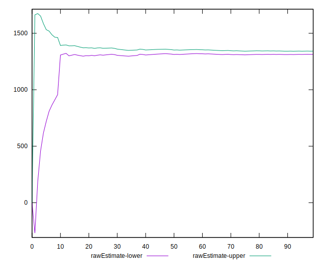
## Score Estimate

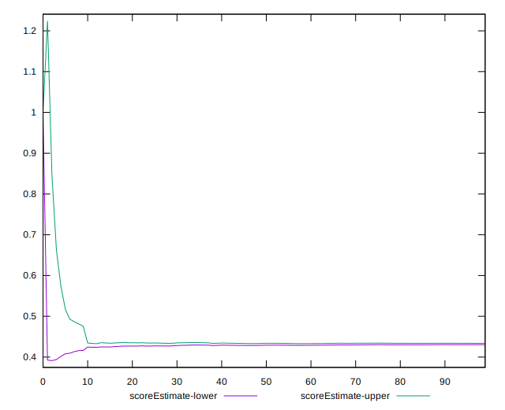
## P Score


```yaml
p90min: 0.42305882352941176
p90max: 0.45082352941176473
p90range: 0.02776470588235297
p90mean: 0.43234001292824825
p90median: 0.4258823529411765
p90stdev: 0.008254856266404374
p90skewness: 0.2157277044606274
p90eccentricity: 1.0000000000000009
p90discretization: 2.275
outlandishness: 1.0224765277933474
confidence: 0.022416055109482524
p90confidence: 0.003392086404600092

```

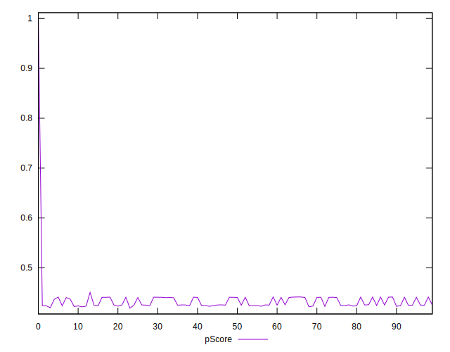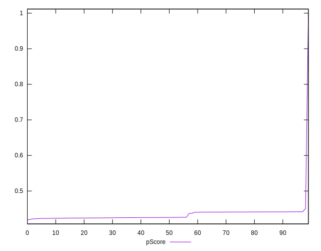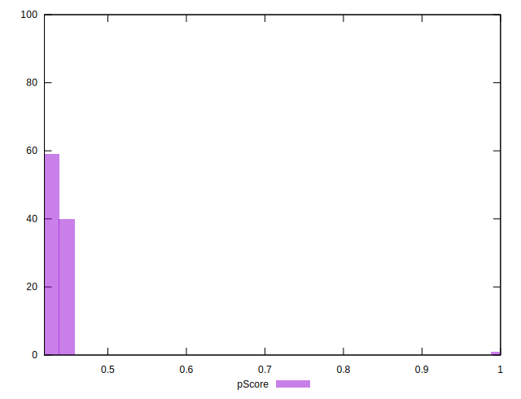
## Score Difference


```yaml
p90min: 0
p90max: 0
p90range: 0
p90mean: 0
p90median: 0
p90stdev: 0
p90skewness: .nan
p90eccentricity: .nan
p90discretization: 91
outlandishness: .nan
confidence: 0
p90confidence: 0

```


## P Score Difference


```yaml
p90min: -0.004588235294117615
p90max: 0.0048235294117647265
p90range: 0.009411764705882342
p90mean: 0.0008842921784098323
p90median: 0.0011764705882352788
p90stdev: 0.002839234636548608
p90skewness: -0.7209340927505213
p90eccentricity: 1.0000000000000002
p90discretization: 2.1666666666666665
outlandishness: 0.17674402722205443
confidence: 0.001239156260857259
p90confidence: 0.001166698595262298

```

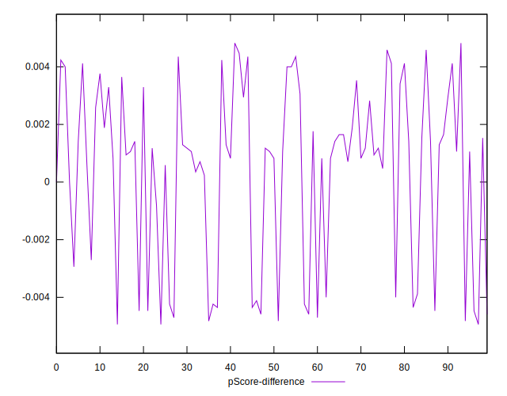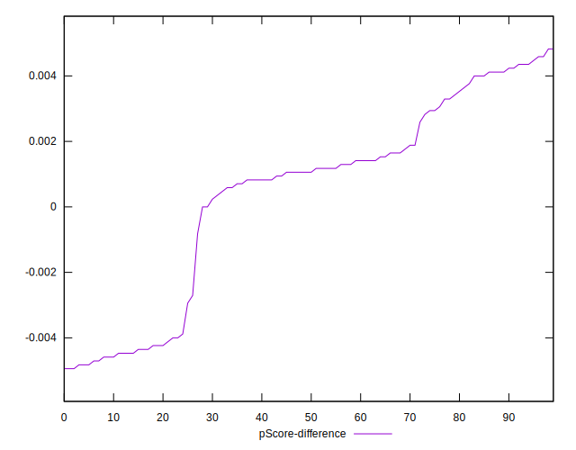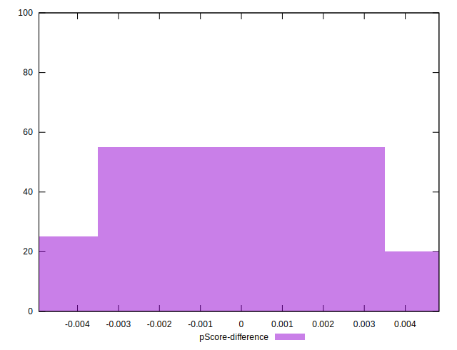