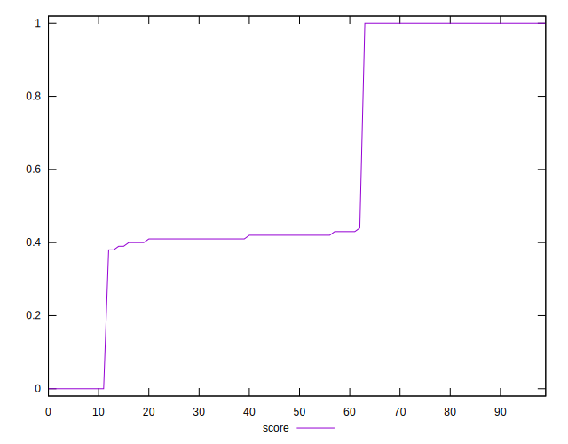

# //uses-rel-preload/samples/pages

[→ Parent](../..)


## Raw


```yaml
p90min: 0
p90max: 11821
p90range: 11821
p90mean: 1219.142857142857
p90median: 1458
p90stdev: 2065.015007110562
p90skewness: 4.218170789598516
p90eccentricity: 1.0000000000000013
p90discretization: 2.116279069767442
outlandishness: 3.3462543778826714
confidence: 1477.9777605218524
p90confidence: 848.5561837609014

```


## Score


```yaml
p90min: 0
p90max: 1
p90range: 1
p90mean: 0.6381318681318682
p90median: 0.42
p90stdev: 0.30840929023475183
p90skewness: 0.14534422928055543
p90eccentricity: 1.0000000000000022
p90discretization: 10.11111111111111
outlandishness: 0.8281000000000003
confidence: 0.1357373818073928
p90confidence: 0.12673157795796963

```


## Raw Estimate


## Score Estimate


## P Score


```yaml
p90min: 0
p90max: 1
p90range: 1
p90mean: 0.6381745313510022
p90median: 0.41670588235294115
p90stdev: 0.3083514455519175
p90skewness: 0.145616754159193
p90eccentricity: 1.0000000000000002
p90discretization: 2.2195121951219514
outlandishness: 0.8280999999999998
confidence: 0.1357215291700622
p90confidence: 0.12670780841481966

```


## Score Difference


```yaml
p90min: 0
p90max: 5.551115123125783e-17
p90range: 5.551115123125783e-17
p90mean: 6.710139159822375e-18
p90median: 0
p90stdev: 1.8095899594645848e-17
p90skewness: 2.325989525498186
p90eccentricity: 1.0000000000000007
p90discretization: 45.5
outlandishness: 2.7375206611570246
confidence: 8.703988572289728e-18
p90confidence: 7.435968963363077e-18

```


## P Score Difference


```yaml
p90min: -0.004470588235294115
p90max: 0.004470588235294171
p90range: 0.008941176470588286
p90mean: 0.00008791208791208982
p90median: 0
p90stdev: 0.0022259590332556734
p90skewness: -0.09404911924071926
p90eccentricity: 1.0000000000000009
p90discretization: 2.757575757575758
outlandishness: 0.19502614619379435
confidence: 0.0010026571783926569
p90confidence: 0.0009146913199001316

```

