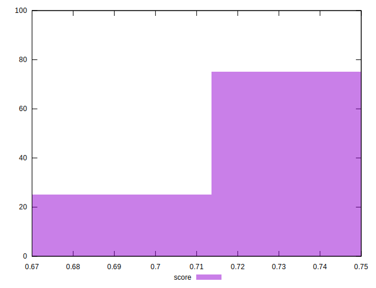
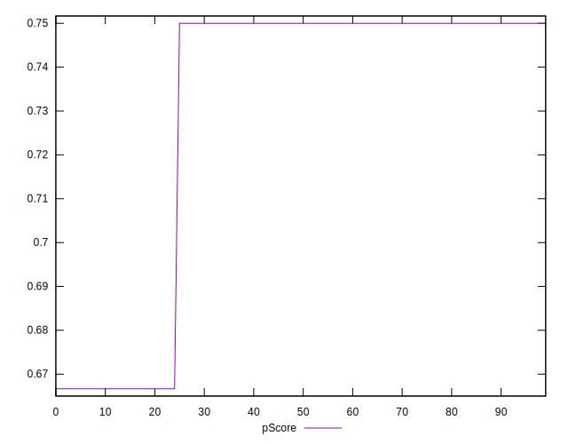

# //uses-text-compression/samples/pages+cached+noadtech+nomedia+nocss

[→ Parent](../..)


## Raw


```yaml
p90min: 300
p90max: 450
p90range: 150
p90mean: 326.3736263736264
p90median: 300
p90stdev: 57.10057607369931
p90skewness: 1.7031832941093896
p90eccentricity: 0.9999999999999983
p90discretization: 45.5
outlandishness: 1.0693440082644625
confidence: 25.460679016713925
p90confidence: 23.463774721639652

```


## Score


```yaml
p90min: 0.67
p90max: 0.75
p90range: 0.07999999999999996
p90mean: 0.7359340659340662
p90median: 0.75
p90stdev: 0.03045364057263963
p90skewness: -1.703183294109402
p90eccentricity: 0.9999999999999961
p90discretization: 45.5
outlandishness: 0.983938393137862
confidence: 0.013579028808914151
p90confidence: 0.01251401318487444

```


## Raw Estimate


## Score Estimate


## P Score


```yaml
p90min: 0.6666666666666666
p90max: 0.75
p90range: 0.08333333333333337
p90mean: 0.7353479853479851
p90median: 0.75
p90stdev: 0.03172254226316622
p90skewness: -1.703183294109398
p90eccentricity: 1.0000000000000029
p90discretization: 45.5
outlandishness: 0.9832587052910252
confidence: 0.014144821675952102
p90confidence: 0.013035430400910819

```


## Score Difference


```yaml
p90min: 0
p90max: 0
p90range: 0
p90mean: 0
p90median: 0
p90stdev: 0
p90skewness: .nan
p90eccentricity: .nan
p90discretization: 91
outlandishness: .nan
confidence: 0
p90confidence: 0

```


## P Score Difference


```yaml
p90min: -0.0033333333333334103
p90max: 0
p90range: 0.0033333333333334103
p90mean: -0.0005860805860805996
p90median: 0
p90stdev: 0.0012689016905266795
p90skewness: -1.7031832941093952
p90eccentricity: 1.0000000000000002
p90discretization: 45.5
outlandishness: 2.021728515625
confidence: 0.0005657928670380987
p90confidence: 0.0005214172160364482

```

