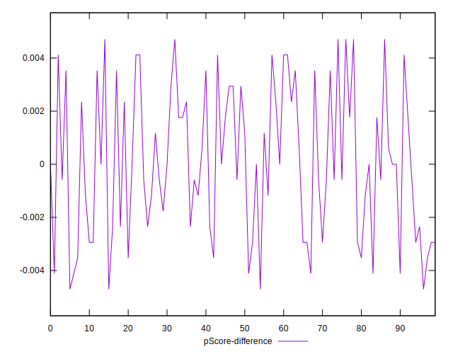

# //uses-text-compression/samples/pages+cached

[→ Parent](../..)


## Raw


```yaml
p90min: 3730
p90max: 4280
p90range: 550
p90mean: 3958.5714285714284
p90median: 3970
p90stdev: 121.19887777897226
p90skewness: 0.14398055496449327
p90eccentricity: 1
p90discretization: 2.2195121951219514
outlandishness: 1.0154835098557113
confidence: 175.08005792777294
p90confidence: 49.80305559528642

```


## Score


```yaml
p90min: 0.09
p90max: 0.15
p90range: 0.06
p90mean: 0.12340659340659338
p90median: 0.12
p90stdev: 0.014390150799886462
p90skewness: 0.01040463825274262
p90eccentricity: 1.000000000000001
p90discretization: 13
outlandishness: 0.9853611823215551
confidence: 0.009364854770707698
p90confidence: 0.005913202279135665

```


## Raw Estimate


## Score Estimate


## P Score


```yaml
p90min: 0.08588235294117647
p90max: 0.15411764705882353
p90range: 0.06823529411764706
p90mean: 0.12328377504848088
p90median: 0.12117647058823527
p90stdev: 0.014070721931247743
p90skewness: 0.025123483719382583
p90eccentricity: 0.9999999999999999
p90discretization: 2.2195121951219514
outlandishness: 0.9883687511656636
confidence: 0.009289846689110232
p90confidence: 0.005781942534861778

```


## Score Difference


```yaml
p90min: 0
p90max: 0
p90range: 0
p90mean: 0
p90median: 0
p90stdev: 0
p90skewness: .nan
p90eccentricity: .nan
p90discretization: 91
outlandishness: .nan
confidence: 0
p90confidence: 0

```


## P Score Difference


```yaml
p90min: -0.004117647058823559
p90max: 0.004705882352941143
p90range: 0.008823529411764702
p90mean: 0.00001939237233353757
p90median: 0
p90stdev: 0.002628427644612934
p90skewness: 0.09204932768058886
p90eccentricity: 0.9999999999999999
p90discretization: 2.4594594594594597
outlandishness: 11.133344444453378
confidence: 0.0011276924899711977
p90confidence: 0.0010800737639796683

```

