# //uses-text-compression/samples/pages

[→ Parent](../..)


## Raw


```yaml
p90min: 2550
p90max: 9450
p90range: 6900
p90mean: 6491.978021978022
p90median: 8170
p90stdev: 2618.5833011404225
p90skewness: -0.662648799722983
p90eccentricity: 1.0000000000000002
p90discretization: 1.5423728813559323
outlandishness: 0.8893259076329618
confidence: 1082.414924972154
p90confidence: 1076.028525325275

```

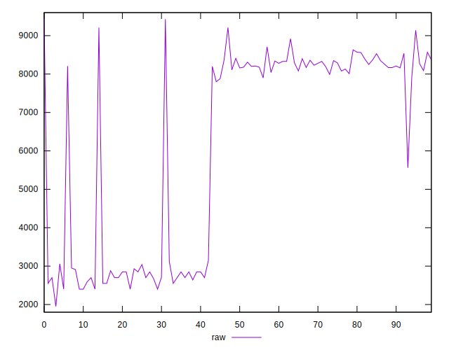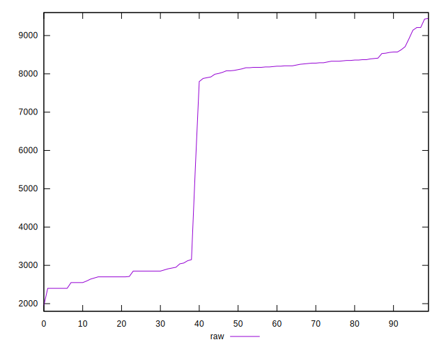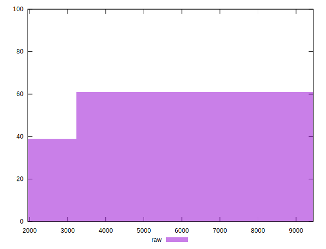
## Score


```yaml
p90min: 0
p90max: 0.29
p90range: 0.29
p90mean: 0.08483516483516483
p90median: 0
p90stdev: 0.12143249956353346
p90skewness: 0.7484963657985503
p90eccentricity: 0.9999999999999972
p90discretization: 11.375
outlandishness: 1.5377285000939622
confidence: 0.05207010168332496
p90confidence: 0.04989905548355289

```

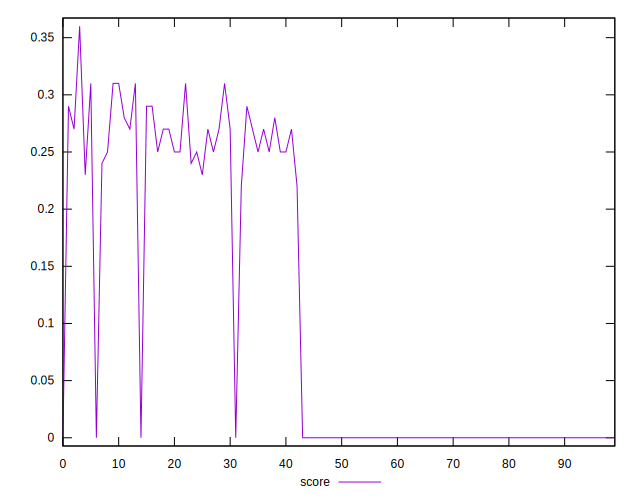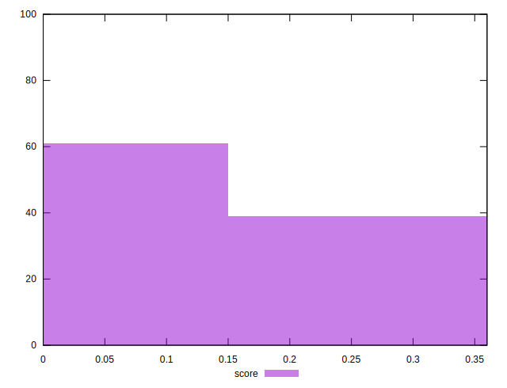
## Raw Estimate

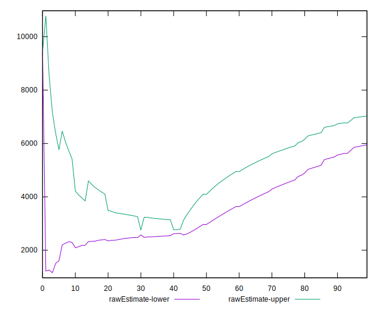
## Score Estimate

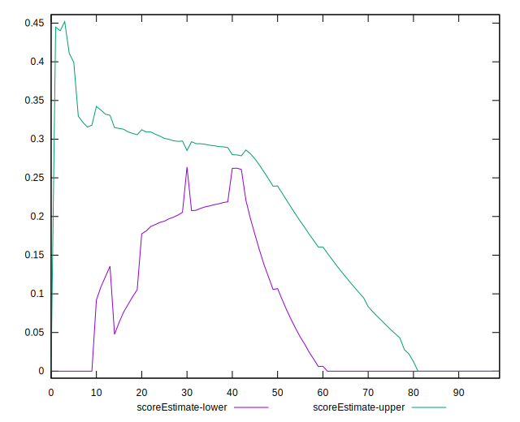
## P Score


```yaml
p90min: 0
p90max: 0.28823529411764703
p90range: 0.28823529411764703
p90mean: 0.08513251454427925
p90median: 0
p90stdev: 0.12184925868216724
p90skewness: 0.7478367301928812
p90eccentricity: 0.999999999999998
p90discretization: 5.6875
outlandishness: 1.5263223499255405
confidence: 0.052014271287026126
p90confidence: 0.05007031018438446

```

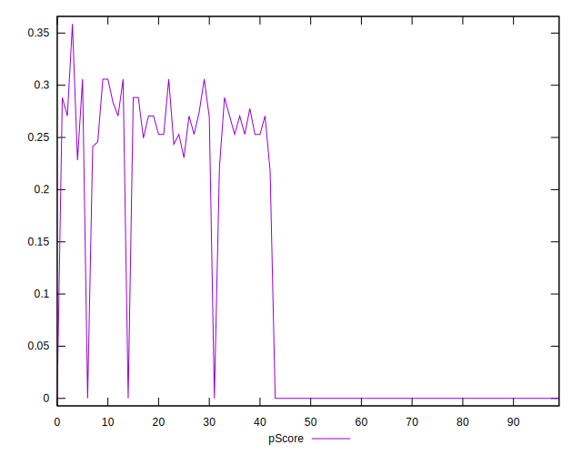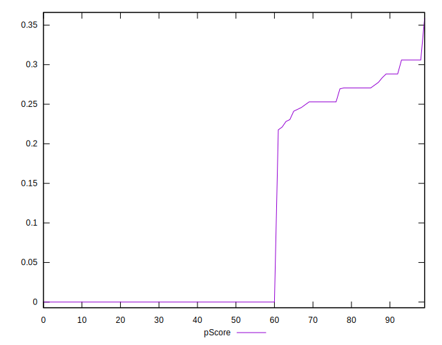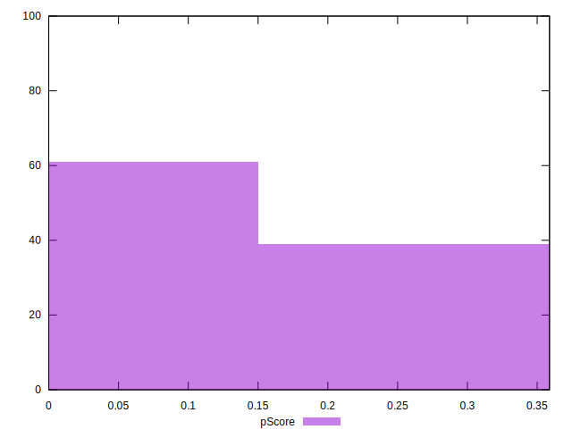
## Score Difference


```yaml
p90min: 0
p90max: 0
p90range: 0
p90mean: 0
p90median: 0
p90stdev: 0
p90skewness: .nan
p90eccentricity: .nan
p90discretization: 91
outlandishness: .nan
confidence: 0
p90confidence: 0

```


## P Score Difference


```yaml
p90min: -0.002352941176470613
p90max: 0.0035294117647058365
p90range: 0.00588235294117645
p90mean: 0.00020685197155784817
p90median: 0
p90stdev: 0.001111227870559495
p90skewness: 1.0130022129096115
p90eccentricity: 1.000000000000005
p90discretization: 7
outlandishness: 0.012939062500005264
confidence: 0.0006372801099133789
p90confidence: 0.0004566258733635598

```

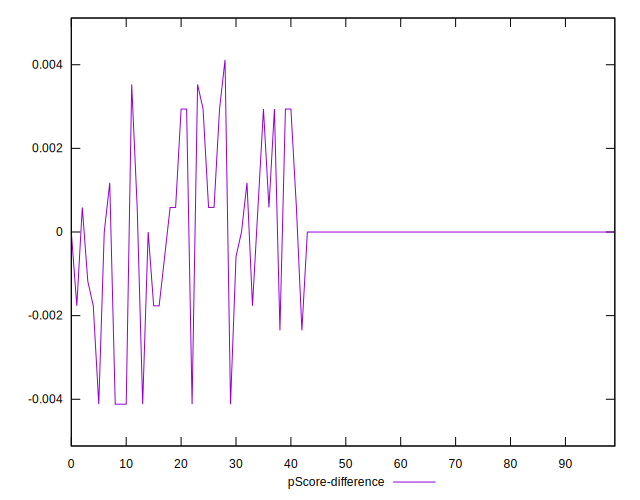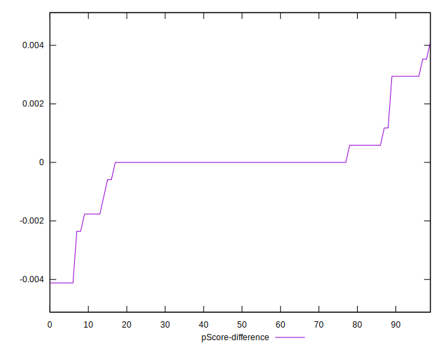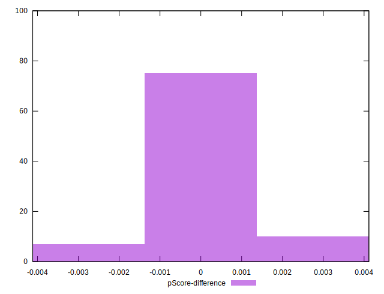