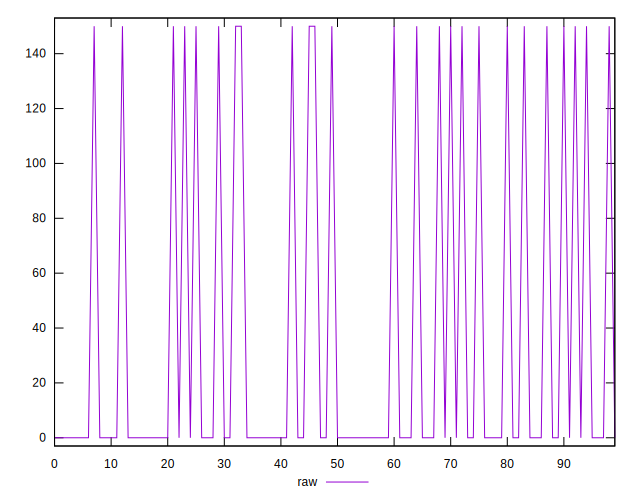
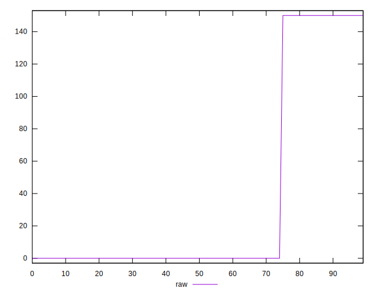
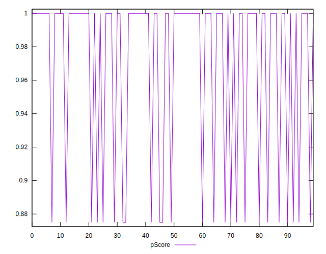

# //uses-webp-images/samples/pages+cached+noadtech+nomedia+nocss

[→ Parent](../..)


## Raw


```yaml
p90min: 0
p90max: 150
p90range: 150
p90mean: 26.373626373626372
p90median: 0
p90stdev: 57.10057607369932
p90skewness: 1.7031832941093896
p90eccentricity: 0.9999999999999977
p90discretization: 45.5
outlandishness: 2.021728515625
confidence: 25.460679016713875
p90confidence: 23.463774721639655

```


## Score


```yaml
p90min: 0.88
p90max: 1
p90range: 0.12
p90mean: 0.9789010989010988
p90median: 1
p90stdev: 0.04568046085895942
p90skewness: -1.703183294109401
p90eccentricity: 1
p90discretization: 45.5
outlandishness: 0.9818967814282361
confidence: 0.020368543213371115
p90confidence: 0.01877101977731166

```


## Raw Estimate


## Score Estimate


## P Score


```yaml
p90min: 0.875
p90max: 1
p90range: 0.125
p90mean: 0.978021978021978
p90median: 1
p90stdev: 0.0475838133947494
p90skewness: -1.7031832941093905
p90eccentricity: 0.9999999999999989
p90discretization: 45.5
outlandishness: 0.9811292026338214
confidence: 0.021217232513928153
p90confidence: 0.01955314560136645

```


## Score Difference


```yaml
p90min: 0
p90max: 0
p90range: 0
p90mean: 0
p90median: 0
p90stdev: 0
p90skewness: .nan
p90eccentricity: .nan
p90discretization: 91
outlandishness: .nan
confidence: 0
p90confidence: 0

```


## P Score Difference


```yaml
p90min: -0.0050000000000000044
p90max: 0
p90range: 0.0050000000000000044
p90mean: -0.0008791208791208799
p90median: 0
p90stdev: 0.0019033525357899778
p90skewness: -1.7031832941093934
p90eccentricity: 0.9999999999999997
p90discretization: 45.5
outlandishness: 2.021728515625
confidence: 0.0008486893005571292
p90confidence: 0.0007821258240546553

```

