# //uses-webp-images/samples/pages+cached

[→ Parent](../..)


## Raw


```yaml
p90min: 1500
p90max: 1650
p90range: 150
p90mean: 1636.8131868131868
p90median: 1650
p90stdev: 42.47505074744552
p90skewness: -2.910564471398737
p90eccentricity: 0.9999999999999978
p90discretization: 45.5
outlandishness: 0.9850112731720229
confidence: 22.086802748246555
p90confidence: 17.453852317390556

```

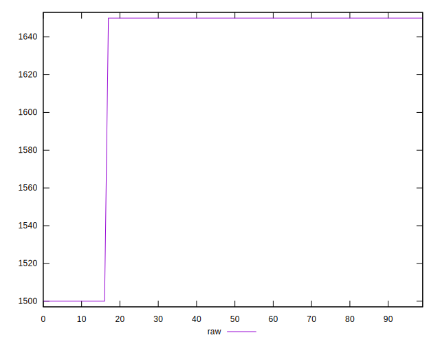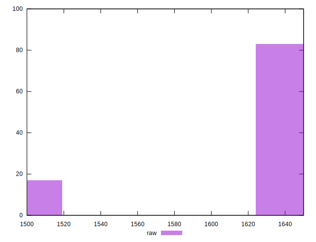
## Score


```yaml
p90min: 0.39
p90max: 0.41
p90range: 0.019999999999999962
p90mean: 0.39175824175824203
p90median: 0.39
p90stdev: 0.005663340099659387
p90skewness: 2.910564471398549
p90eccentricity: 0.9999999999999996
p90discretization: 45.5
outlandishness: 1.008399049005742
confidence: 0.0029449070330995752
p90confidence: 0.002327180308985377

```

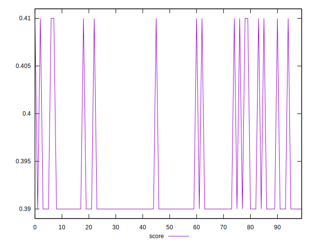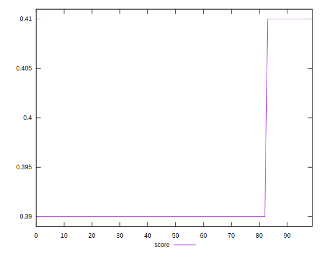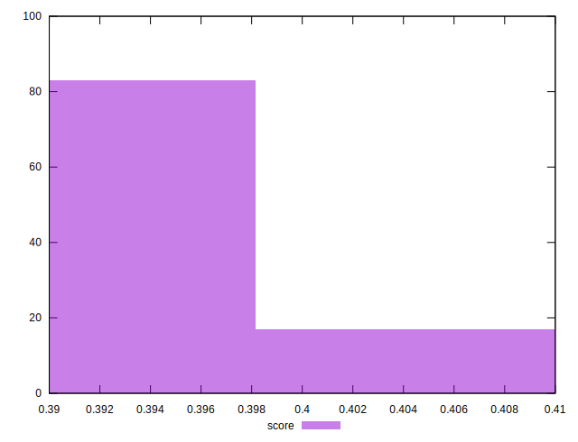
## Raw Estimate

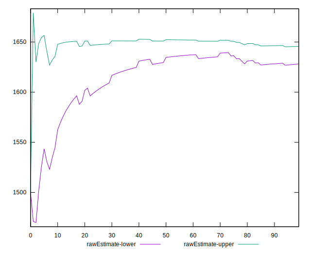
## Score Estimate

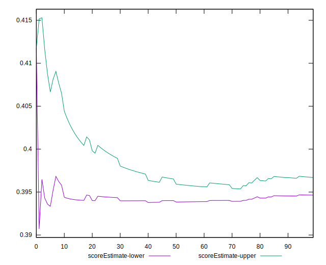
## P Score


```yaml
p90min: 0.3941176470588235
p90max: 0.4117647058823529
p90range: 0.017647058823529405
p90mean: 0.3956690368455073
p90median: 0.3941176470588235
p90stdev: 0.004997064793817108
p90skewness: 2.9105644713988235
p90eccentricity: 1.0000000000000018
p90discretization: 45.5
outlandishness: 1.0073357370920966
confidence: 0.0025984473821466514
p90confidence: 0.0020533943902812934

```

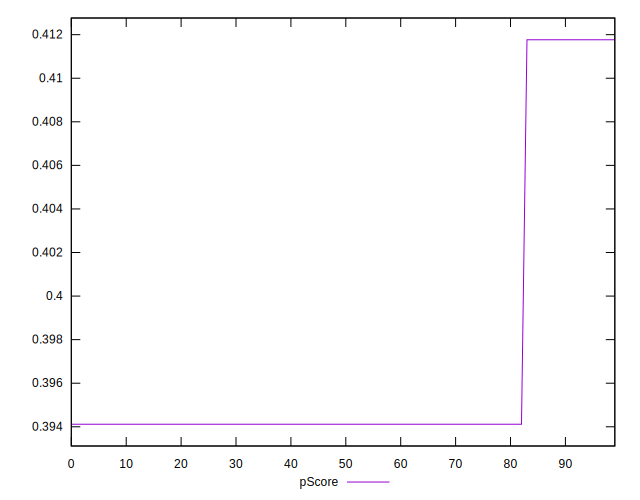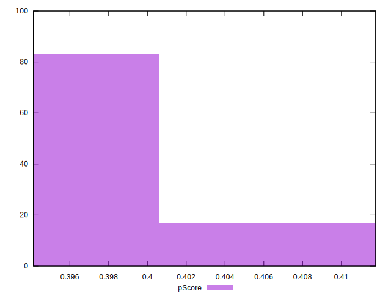
## Score Difference


```yaml
p90min: 0
p90max: 5.551115123125783e-17
p90range: 5.551115123125783e-17
p90mean: 4.8801012071435456e-18
p90median: 0
p90stdev: 1.5718926437311948e-17
p90skewness: 2.910564471398763
p90eccentricity: 1.0000000000000036
p90discretization: 45.5
outlandishness: 3.7393890625000004
confidence: 8.173758983819138e-18
p90confidence: 6.459222903724702e-18

```


## P Score Difference


```yaml
p90min: 0.001764705882352946
p90max: 0.004117647058823504
p90range: 0.0023529411764705577
p90mean: 0.003910795087265652
p90median: 0.004117647058823504
p90stdev: 0.0006662753058422741
p90skewness: -2.9105644713987355
p90eccentricity: 0.9999999999999978
p90discretization: 45.5
outlandishness: 0.9036623574892433
confidence: 0.00034645965095288136
p90confidence: 0.00027378591870416257

```

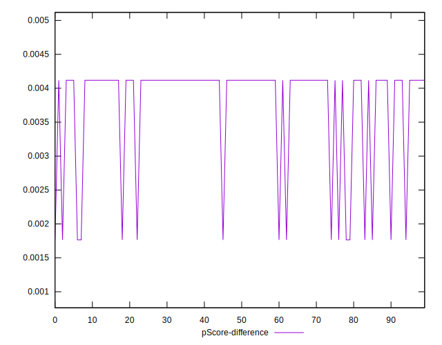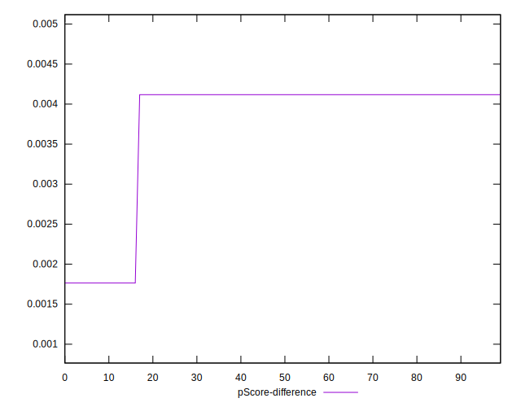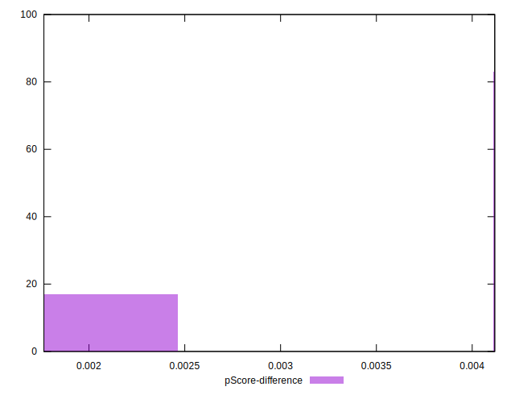