# //uses-webp-images/samples/pages

[→ Parent](../..)


## Raw


```yaml
p90min: 1350
p90max: 1650
p90range: 300
p90mean: 1558.5714285714287
p90median: 1510
p90stdev: 90.43936015359763
p90skewness: -0.43902074153607223
p90eccentricity: 1.0000000000000027
p90discretization: 15.166666666666666
outlandishness: 0.9826606070331291
confidence: 43.88744071708925
p90confidence: 37.16335137975375

```

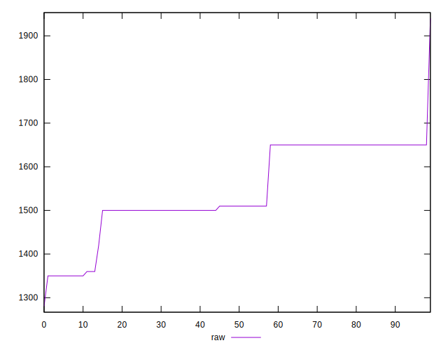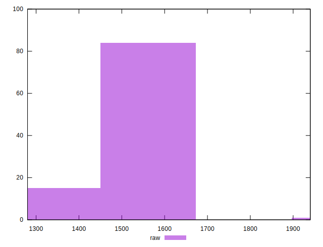
## Score


```yaml
p90min: 0.39
p90max: 0.43
p90range: 0.03999999999999998
p90mean: 0.40241758241758224
p90median: 0.41
p90stdev: 0.012255580414576533
p90skewness: 0.4273313778554505
p90eccentricity: 1.0000000000000002
p90discretization: 22.75
outlandishness: 1.0093774249670615
confidence: 0.005794470353396863
p90confidence: 0.005036064392054618

```

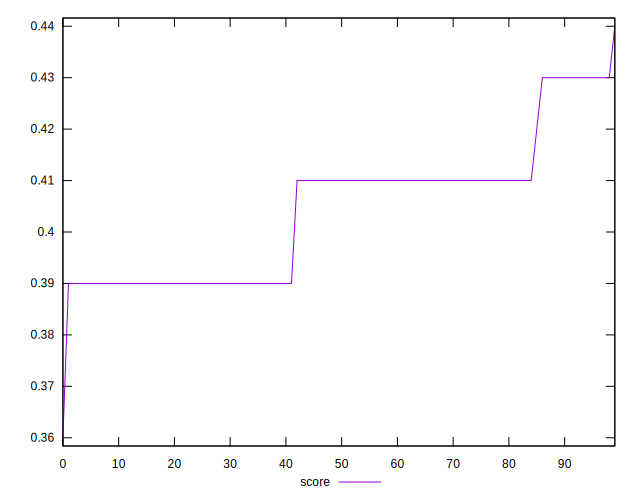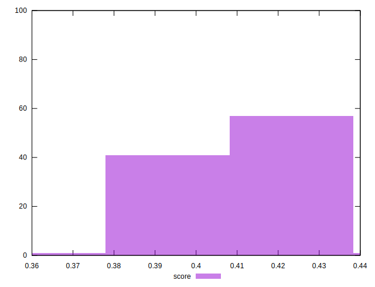
## Raw Estimate

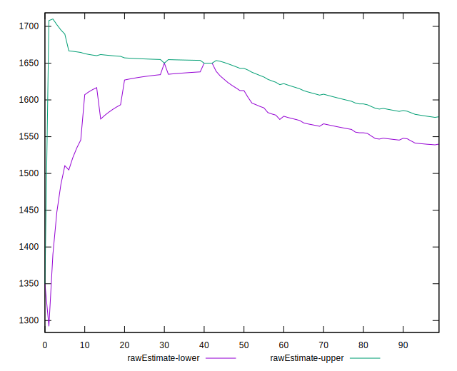
## Score Estimate

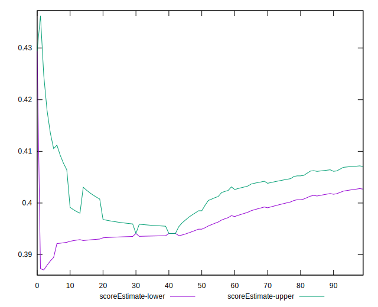
## P Score


```yaml
p90min: 0.3941176470588235
p90max: 0.4294117647058824
p90range: 0.035294117647058865
p90mean: 0.40487394957983186
p90median: 0.41058823529411764
p90stdev: 0.010639924723952667
p90skewness: 0.4390207415361493
p90eccentricity: 1
p90discretization: 15.166666666666666
outlandishness: 1.0079026416263497
confidence: 0.005163228319657542
p90confidence: 0.004372158985853414

```

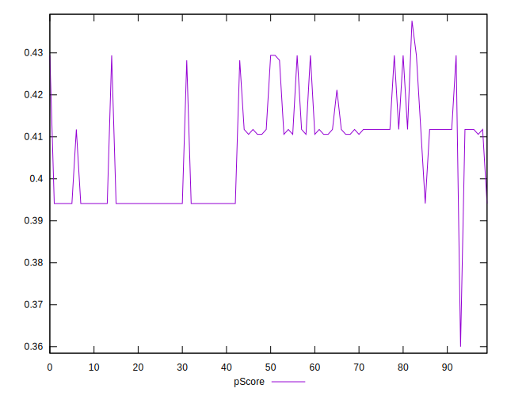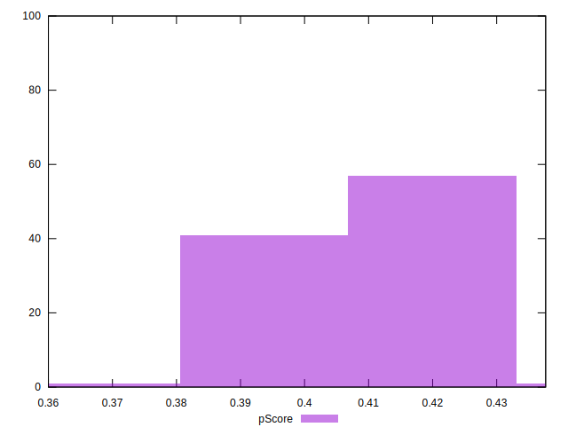
## Score Difference


```yaml
p90min: 0
p90max: 5.551115123125783e-17
p90range: 5.551115123125783e-17
p90mean: 2.0740430130360068e-17
p90median: 0
p90stdev: 2.685441698446286e-17
p90skewness: 0.5224574779878922
p90eccentricity: 0.9999999999999984
p90discretization: 45.5
outlandishness: 1.3245301903114186
confidence: 1.0772834214765465e-17
p90confidence: 1.1035019849732105e-17

```

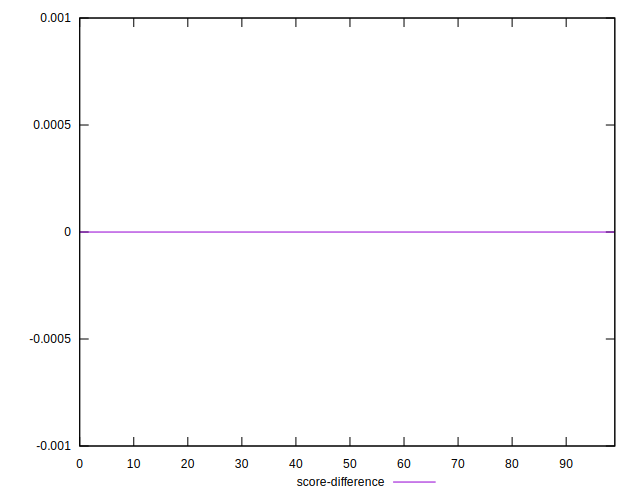
## P Score Difference


```yaml
p90min: -0.0005882352941176117
p90max: 0.004117647058823504
p90range: 0.004705882352941115
p90mean: 0.0025016160310277905
p90median: 0.001764705882352946
p90stdev: 0.001578385041454766
p90skewness: -0.2669228992111678
p90eccentricity: 1.0000000000000004
p90discretization: 15.166666666666666
outlandishness: 0.7528588967009203
confidence: 0.0007245586199658358
p90confidence: 0.0006485901471274093

```

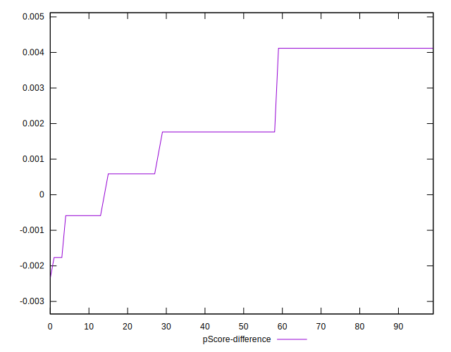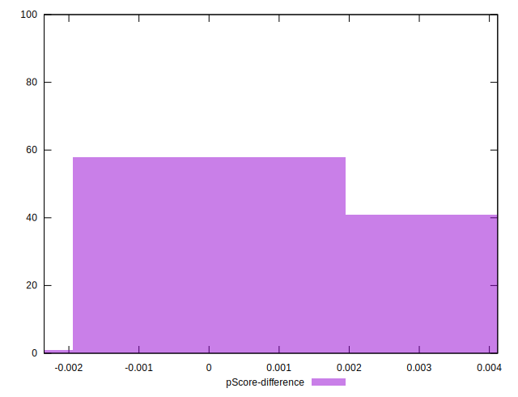