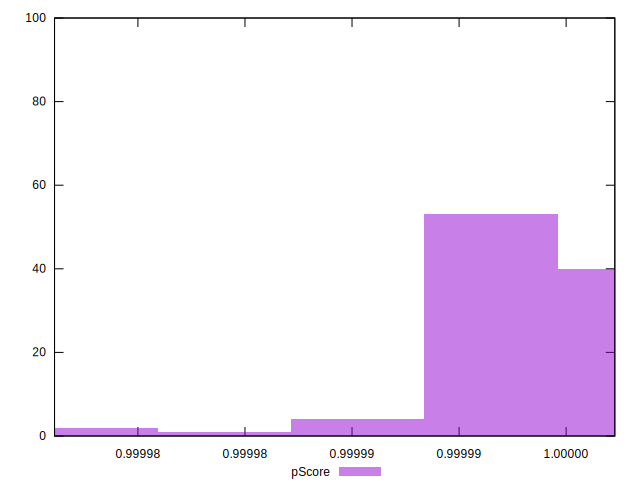

# //bootup-time/samples/pages+cached+noadtech+nomedia

[→ Parent](../..)


## Raw


```yaml
p90min: 102.612
p90max: 134.504
p90range: 31.891999999999996
p90mean: 113.86936170212768
p90median: 112.91199999999998
p90stdev: 6.8406132499308185
p90skewness: 0.7925746225575818
p90eccentricity: 0.9999999999999994
p90discretization: 1
outlandishness: 1.010766008492254
confidence: 3.5974579093893264
p90confidence: 2.7657262848165116

```


## Score


```yaml
p90min: 1
p90max: 1
p90range: 0
p90mean: 1
p90median: 1
p90stdev: 0
p90skewness: .nan
p90eccentricity: .nan
p90discretization: 94
outlandishness: 1
confidence: 0
p90confidence: 0

```


## Raw Estimate


## Score Estimate


## P Score


```yaml
p90min: 0.9999839680935656
p90max: 0.999996658891719
p90range: 0.000012690798153358607
p90mean: 0.9999934936686966
p90median: 0.9999941076743781
p90stdev: 0.0000025264143503845045
p90skewness: -1.6351502399288864
p90eccentricity: 1.0000000000000004
p90discretization: 1.010752688172043
outlandishness: 0.9999989774405321
confidence: 0.0000017127423572204094
p90confidence: 0.000001021453825834507

```


## Score Difference


```yaml
p90min: 0
p90max: 0
p90range: 0
p90mean: 0
p90median: 0
p90stdev: 0
p90skewness: .nan
p90eccentricity: .nan
p90discretization: 94
outlandishness: .nan
confidence: 0
p90confidence: 0

```


## P Score Difference


```yaml
p90min: -0.000016031906434399446
p90max: -0.000003341108281040839
p90range: 0.000012690798153358607
p90mean: -0.0000065063313028286465
p90median: -0.0000058923256218701425
p90stdev: 0.0000025264143503845045
p90skewness: -1.635150239805467
p90eccentricity: 1.0000000000000002
p90discretization: 1.010752688172043
outlandishness: 1.163337808574735
confidence: 0.0000017127423572204094
p90confidence: 0.000001021453825834507

```

