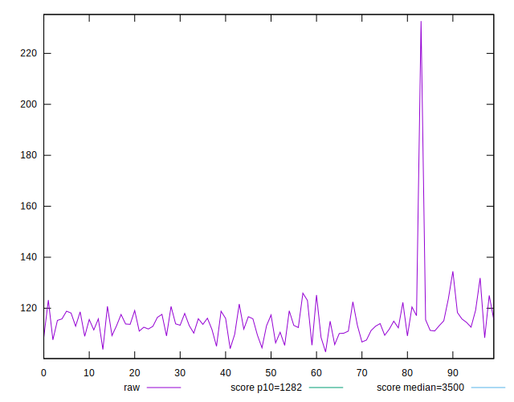
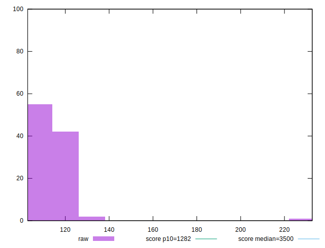
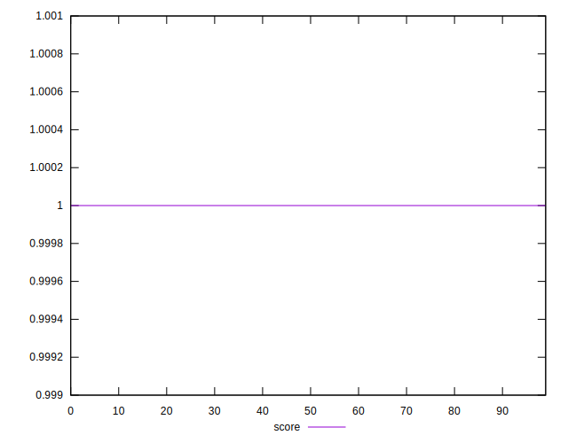
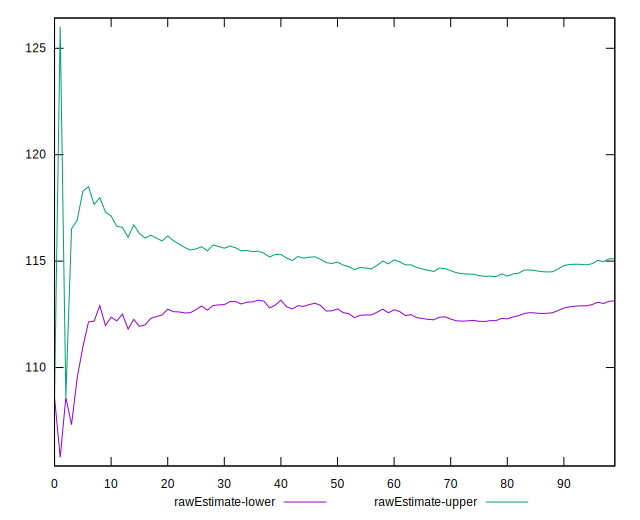
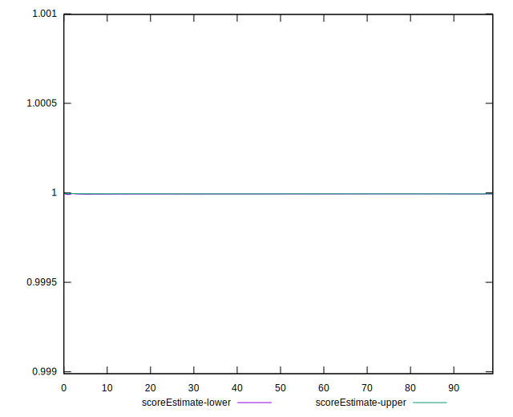
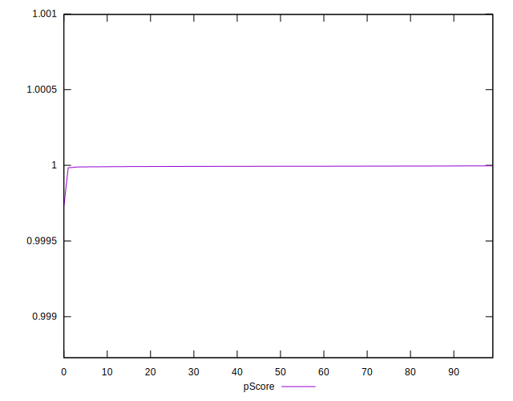
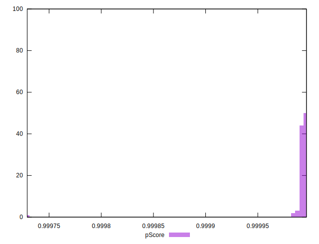
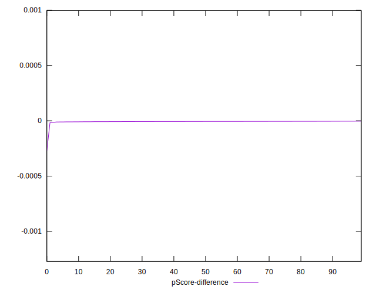
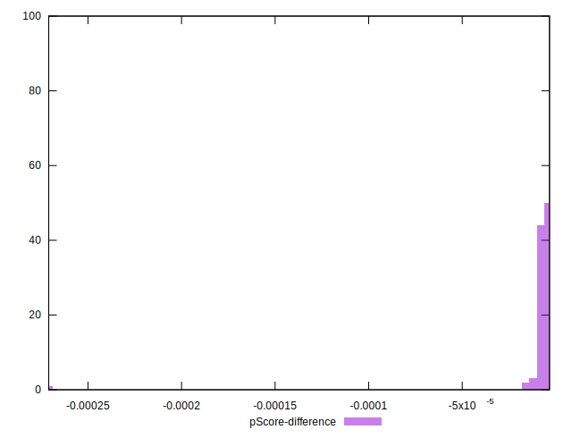

# //bootup-time/samples/pages+cached+noadtech

[→ Parent](../..)


## Raw


```yaml
p90min: 104.45999999999998
p90max: 125.92399999999996
p90range: 21.463999999999984
p90mean: 114.12361702127654
p90median: 113.49199999999998
p90stdev: 4.880205230046155
p90skewness: 0.30448959458637387
p90eccentricity: 1.0000000000000007
p90discretization: 1
outlandishness: 1.0220356593513251
confidence: 5.140543966514519
p90confidence: 1.9731143081615035

```


## Score


```yaml
p90min: 1
p90max: 1
p90range: 0
p90mean: 1
p90median: 1
p90stdev: 0
p90skewness: .nan
p90eccentricity: .nan
p90discretization: 94
outlandishness: 1
confidence: 0
p90confidence: 0

```


## Raw Estimate


## Score Estimate


## P Score


```yaml
p90min: 0.9999889421738348
p90max: 0.9999962817391371
p90range: 0.000007339565302300066
p90mean: 0.9999935725727788
p90median: 0.9999939281647694
p90stdev: 0.0000016439462284931335
p90skewness: -0.7639436675937206
p90eccentricity: 1
p90discretization: 1
outlandishness: 0.9999945321394136
confidence: 0.000010346606487437222
p90confidence: 6.646634049972658e-7

```


## Score Difference


```yaml
p90min: 0
p90max: 0
p90range: 0
p90mean: 0
p90median: 0
p90stdev: 0
p90skewness: .nan
p90eccentricity: .nan
p90discretization: 94
outlandishness: .nan
confidence: 0
p90confidence: 0

```


## P Score Difference


```yaml
p90min: -0.000011057826165172813
p90max: -0.0000037182608628727465
p90range: 0.000007339565302300066
p90mean: -0.000006427427221232725
p90median: -0.000006071835230547773
p90stdev: 0.0000016439462284931335
p90skewness: -0.7639436682036818
p90eccentricity: 1.0000000000000002
p90discretization: 1
outlandishness: 2.0316271860646538
confidence: 0.000010346606487437219
p90confidence: 6.646634049972658e-7

```

