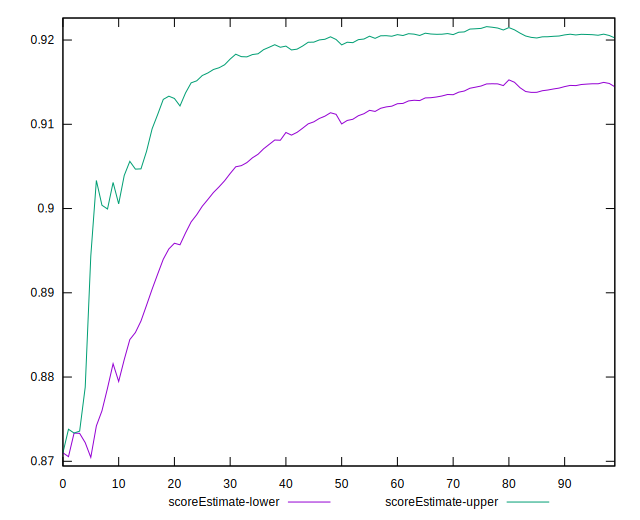
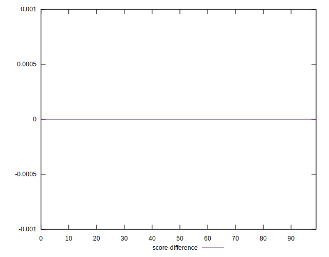

# //bootup-time/samples/pages

[→ Parent](../..)


## Raw


```yaml
p90min: 1060.1880000000008
p90max: 1429.7439999999988
p90range: 369.555999999998
p90mean: 1179.8417021276587
p90median: 1159.4519999999998
p90stdev: 86.98998787777288
p90skewness: 1.10668117063858
p90eccentricity: 1.0000000000000002
p90discretization: 1
outlandishness: 1.0071411478844787
confidence: 40.129548718525285
p90confidence: 35.17089582456066

```


## Score


```yaml
p90min: 0.87
p90max: 0.94
p90range: 0.06999999999999995
p90mean: 0.9162765957446815
p90median: 0.92
p90stdev: 0.014730489624627509
p90skewness: -1.1992179496573927
p90eccentricity: 1.000000000000001
p90discretization: 11.75
outlandishness: 0.9980875285212318
confidence: 0.006844064017527596
p90confidence: 0.005955679827895727

```


## Raw Estimate


## Score Estimate


## P Score


```yaml
p90min: 0.8733501935064204
p90max: 0.9362408765830815
p90range: 0.06289068307666112
p90mean: 0.9169746981830788
p90median: 0.920694280418805
p90stdev: 0.01470583617213986
p90skewness: -1.222499862492578
p90eccentricity: 1.0000000000000007
p90discretization: 1
outlandishness: 0.9981916156335491
confidence: 0.006829595455670951
p90confidence: 0.00594571219793839

```


## Score Difference


```yaml
p90min: 0
p90max: 1.1102230246251565e-16
p90range: 1.1102230246251565e-16
p90mean: 1.1810883240693154e-18
p90median: 0
p90stdev: 1.139000331521095e-17
p90skewness: 9.539955591519902
p90eccentricity: 1.0000000000000007
p90discretization: 47
outlandishness: 14.137600000000003
confidence: 8.528132291650267e-18
p90confidence: 4.605088813249998e-18

```


## P Score Difference


```yaml
p90min: -0.004717836454514068
p90max: 0.0045283148434364096
p90range: 0.009246151297950478
p90mean: 0.0007988281386063589
p90median: 0.0009932881862136922
p90stdev: 0.0027660116438180562
p90skewness: -0.3414048558322583
p90eccentricity: 1.0000000000000002
p90discretization: 1
outlandishness: 0.8702437305700575
confidence: 0.0011477710814966281
p90confidence: 0.0011183253354505155

```

