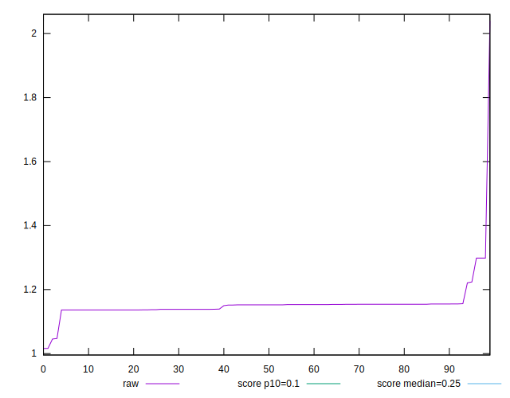
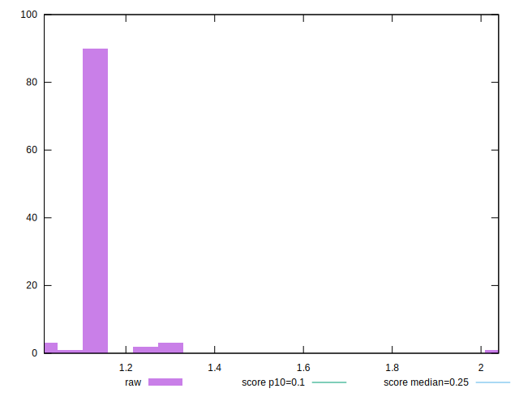
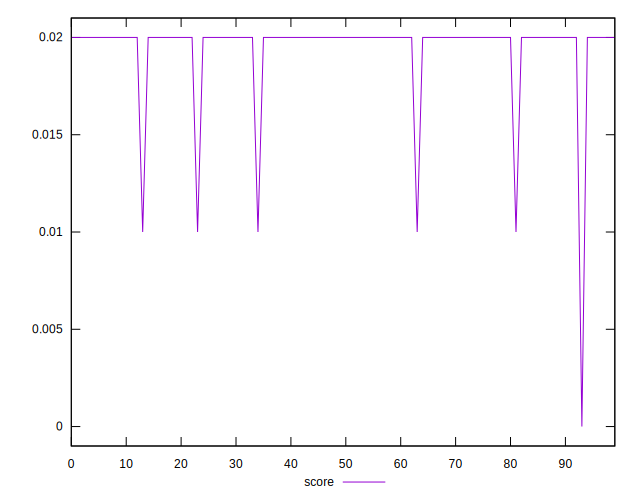
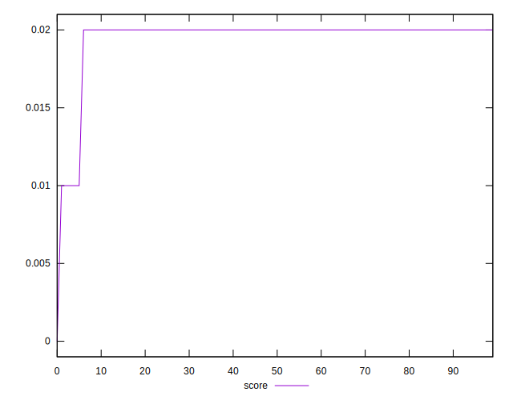
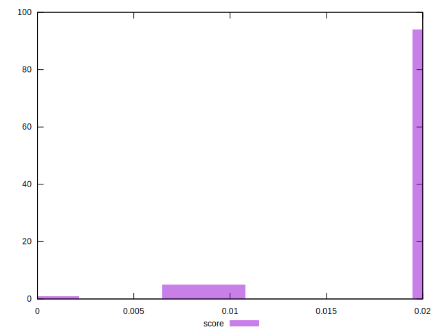
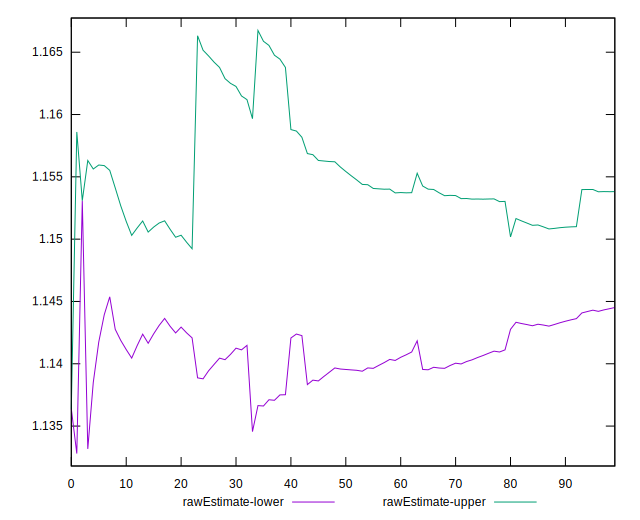
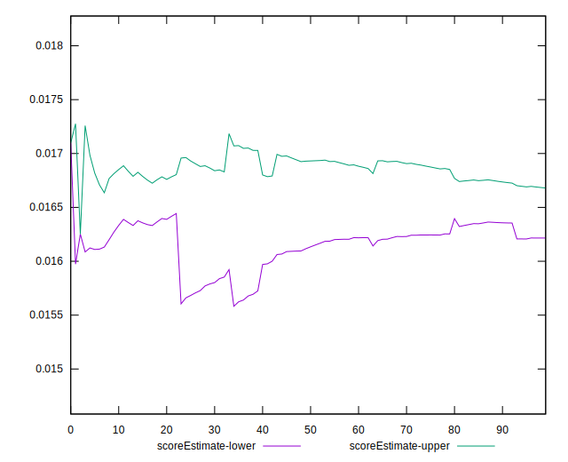
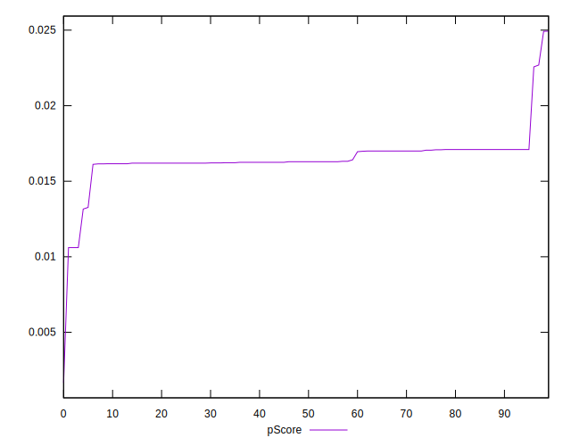
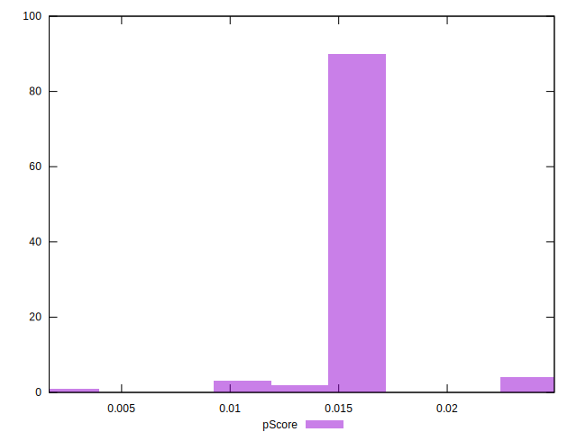
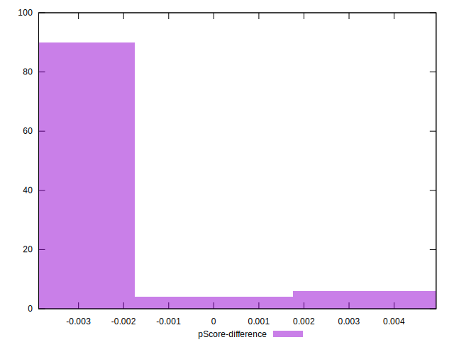

# //cumulative-layout-shift/samples/pages+cached+noadtech+nomedia

[→ Parent](../..)


## Raw


```yaml
p90min: 1.047173377143012
p90max: 1.298398189968533
p90range: 0.251224812825521
p90mean: 1.1491633987246395
p90median: 1.152278103298611
p90stdev: 0.02299033656501141
p90skewness: 2.6221326777145806
p90eccentricity: 1.0000000000000002
p90discretization: 4.7
outlandishness: 1.0143049283201928
confidence: 0.03773231558402133
p90confidence: 0.009295216059067989

```


## Score


```yaml
p90min: 0.01
p90max: 0.02
p90range: 0.01
p90mean: 0.0196808510638298
p90median: 0.02
p90stdev: 0.0017577352810487564
p90skewness: -5.326002287485494
p90eccentricity: 1.0000000000000029
p90discretization: 47
outlandishness: 0.9616717720964207
confidence: 0.0011435176354408722
p90confidence: 0.0007106694225981931

```


## Raw Estimate


## Score Estimate


## P Score


```yaml
p90min: 0.010607400130950406
p90max: 0.022568091122673106
p90range: 0.0119606909917227
p90mean: 0.016490035415313447
p90median: 0.016292603706659137
p90stdev: 0.0010737745674820184
p90skewness: -0.37697720532616014
p90eccentricity: 1.0000000000000022
p90discretization: 4.7
outlandishness: 0.9957387526338913
confidence: 0.0009424984642404645
p90confidence: 0.0004341374722920541

```


## Score Difference


```yaml
p90min: 0
p90max: 0
p90range: 0
p90mean: 0
p90median: 0
p90stdev: 0
p90skewness: .nan
p90eccentricity: .nan
p90discretization: 94
outlandishness: .nan
confidence: 0
p90confidence: 0

```


## P Score Difference


```yaml
p90min: -0.0038415506637315792
p90max: 0.0031585953539591902
p90range: 0.0070001460176907695
p90mean: -0.003043070944186896
p90median: -0.0037073962933408637
p90stdev: 0.0014290975256104946
p90skewness: 3.0421398837688765
p90eccentricity: 1
p90discretization: 4.947368421052632
outlandishness: 0.8741419327406935
confidence: 0.0007405958525125129
p90confidence: 0.0005777979905803263

```

