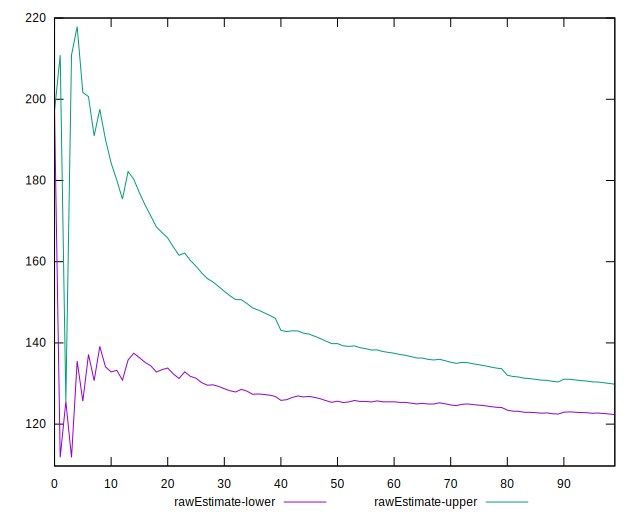
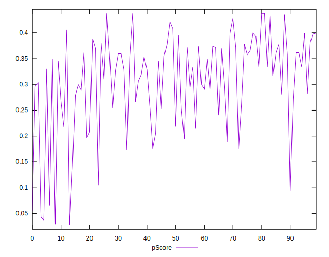
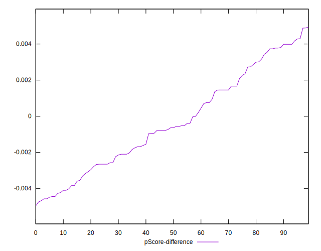

# //estimated-input-latency/samples/pages+cached

[→ Parent](../..)


## Raw


```yaml
p90min: 106.93333333333335
p90max: 207.4666666666667
p90range: 100.53333333333335
p90mean: 126.09929078014186
p90median: 120
p90stdev: 18.48913487008121
p90skewness: 2.299931253549161
p90eccentricity: 1.0000000000000004
p90discretization: 1.3823529411764706
outlandishness: 1.0362743029580255
confidence: 9.57985592007271
p90confidence: 7.475336556151346

```


## Score


```yaml
p90min: 0.04
p90max: 0.44
p90range: 0.4
p90mean: 0.3095744680851063
p90median: 0.33
p90stdev: 0.08834067150377757
p90skewness: -1.080059777107716
p90eccentricity: 1.0000000000000007
p90discretization: 2.9375
outlandishness: 0.9719385050247402
confidence: 0.0394278506797465
p90confidence: 0.03571699031498522

```


## Raw Estimate


## Score Estimate


## P Score


```yaml
p90min: 0.04299283757011996
p90max: 0.43734235988761117
p90range: 0.3943495223174912
p90mean: 0.3094064167039071
p90median: 0.3339840140442445
p90stdev: 0.08800524883905476
p90skewness: -1.0866722160091715
p90eccentricity: 1
p90discretization: 1.3823529411764706
outlandishness: 0.9711196547868826
confidence: 0.039334917842348535
p90confidence: 0.03558137567833602

```


## Score Difference


```yaml
p90min: 0
p90max: 5.551115123125783e-17
p90range: 5.551115123125783e-17
p90mean: 2.9527208101732887e-18
p90median: 0
p90stdev: 1.2457542745436651e-17
p90skewness: 3.9819818903758075
p90eccentricity: 0.999999999999997
p90discretization: 47
outlandishness: 2.262016
confidence: 5.9033322666620366e-18
p90confidence: 5.036705359074034e-18

```


## P Score Difference


```yaml
p90min: -0.004574953841826712
p90max: 0.004296649633854649
p90range: 0.008871603475681361
p90mean: -0.0003162757944206497
p90median: -0.0006367642993366229
p90stdev: 0.0026973688913871758
p90skewness: 0.17207441512440302
p90eccentricity: 0.9999999999999989
p90discretization: 1.4242424242424243
outlandishness: 0.8652632701228239
confidence: 0.0011265223227129235
p90confidence: 0.0010905724048690126

```

