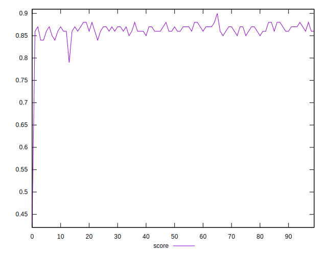
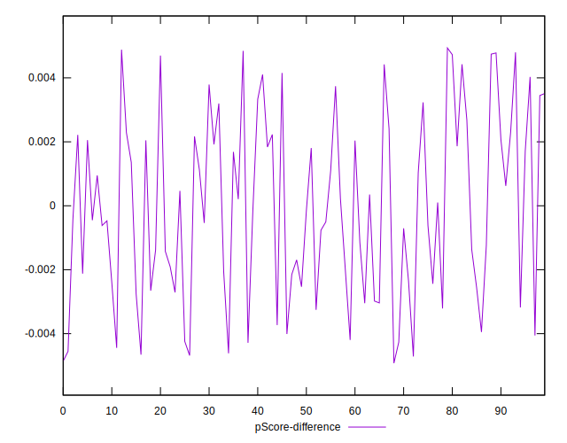

# //first-contentful-paint/samples/pages+cached

[→ Parent](../..)


## Raw


```yaml
p90min: 2441.7825
p90max: 2644.7474999999995
p90range: 202.9649999999997
p90mean: 2518.712409574468
p90median: 2518.37625
p90stdev: 43.58216929462474
p90skewness: 0.5415099408742934
p90eccentricity: 1
p90discretization: 1
outlandishness: 1.0153877638935735
confidence: 74.20753458135367
p90confidence: 17.62069375412881

```


## Score


```yaml
p90min: 0.84
p90max: 0.88
p90range: 0.040000000000000036
p90mean: 0.8646808510638293
p90median: 0.86
p90stdev: 0.009190898326151149
p90skewness: -0.31713513593610976
p90eccentricity: 0.9999999999999999
p90discretization: 18.8
outlandishness: 0.9892025330925662
confidence: 0.01764403079880139
p90confidence: 0.003715969336809004

```


## Raw Estimate


## Score Estimate


## P Score


```yaml
p90min: 0.8378775934171095
p90max: 0.8802075894289103
p90range: 0.04232999601180076
p90mean: 0.8646692309511393
p90median: 0.8648632062280025
p90stdev: 0.009023973688497097
p90skewness: -0.6211975623671993
p90eccentricity: 1
p90discretization: 1
outlandishness: 0.9890794583359299
confidence: 0.017799947581321512
p90confidence: 0.0036484800867848267

```


## Score Difference


```yaml
p90min: 0
p90max: 0
p90range: 0
p90mean: 0
p90median: 0
p90stdev: 0
p90skewness: .nan
p90eccentricity: .nan
p90discretization: 94
outlandishness: .nan
confidence: 0
p90confidence: 0

```


## P Score Difference


```yaml
p90min: -0.004683076258720331
p90max: 0.004797657402368927
p90range: 0.009480733661089258
p90mean: -0.00007097742103580122
p90median: -0.00029224497111879355
p90stdev: 0.002830992189885487
p90skewness: 0.058079981932061826
p90eccentricity: 0.9999999999999996
p90discretization: 1
outlandishness: 0.8401570419525282
confidence: 0.0011728123598239814
p90confidence: 0.0011445976004791285

```

