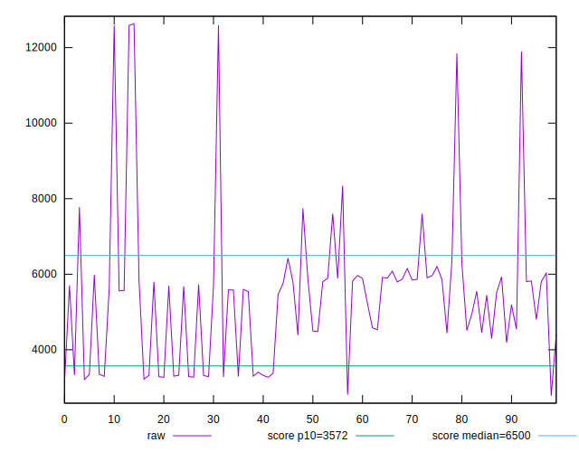
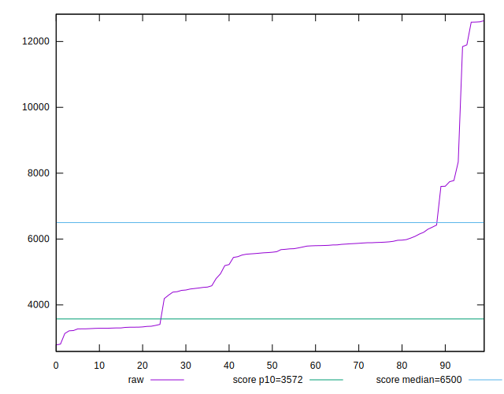
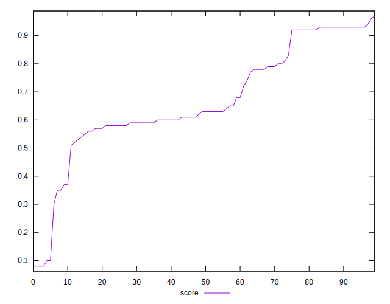
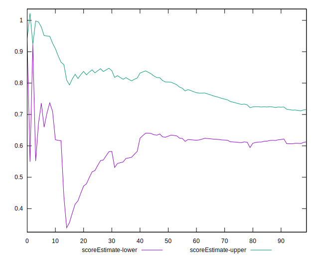
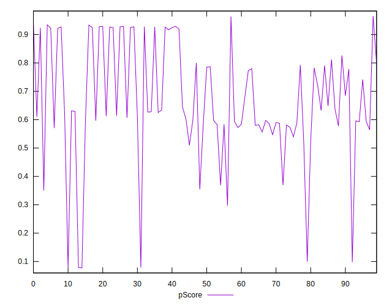
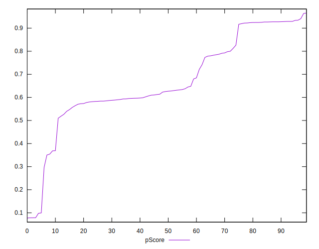

# //first-cpu-idle/samples/pages

[→ Parent](../..)


## Raw


```yaml
p90min: 3211.86
p90max: 12585.413
p90range: 9373.553
p90mean: 5331.758021276593
p90median: 5593.637999999999
p90stdev: 1738.123988926614
p90skewness: 1.6958717177153129
p90eccentricity: 0.9999999999999999
p90discretization: 1
outlandishness: 1.0553188453320113
confidence: 839.1847546636925
p90confidence: 702.7403869811052

```


## Score


```yaml
p90min: 0.08
p90max: 0.93
p90range: 0.8500000000000001
p90mean: 0.6723404255319151
p90median: 0.63
p90stdev: 0.1924778270287029
p90skewness: -0.6105146716714278
p90eccentricity: 1.0000000000000002
p90discretization: 3.032258064516129
outlandishness: 0.9727015467172726
confidence: 0.08560838197792238
p90confidence: 0.07782065233157763

```


## Raw Estimate


## Score Estimate


## P Score


```yaml
p90min: 0.07862240998080716
p90max: 0.9343568644854221
p90range: 0.8557344545046149
p90mean: 0.6722162641704948
p90median: 0.6260710309355457
p90stdev: 0.19271067940056444
p90skewness: -0.6146518572305625
p90eccentricity: 1
p90discretization: 1
outlandishness: 0.9725574715951835
confidence: 0.08574122823202411
p90confidence: 0.07791479680398233

```


## Score Difference


```yaml
p90min: 0
p90max: 1.1102230246251565e-16
p90range: 1.1102230246251565e-16
p90mean: 3.543264972207946e-18
p90median: 0
p90stdev: 1.7755650824769738e-17
p90skewness: 5.2449945466091075
p90eccentricity: 1.000000000000003
p90discretization: 31.333333333333332
outlandishness: 3.5344000000000007
confidence: 9.86665348183046e-18
p90confidence: 7.178781842488504e-18

```


## P Score Difference


```yaml
p90min: -0.0048155053694457495
p90max: 0.004584168340974082
p90range: 0.009399673710419831
p90mean: -0.00017518115118413084
p90median: -0.000488712838498051
p90stdev: 0.002676974473282657
p90skewness: 0.19778107627714767
p90eccentricity: 1.0000000000000002
p90discretization: 1
outlandishness: 0.9590449785668378
confidence: 0.0011182676048837295
p90confidence: 0.001082326743821624

```

