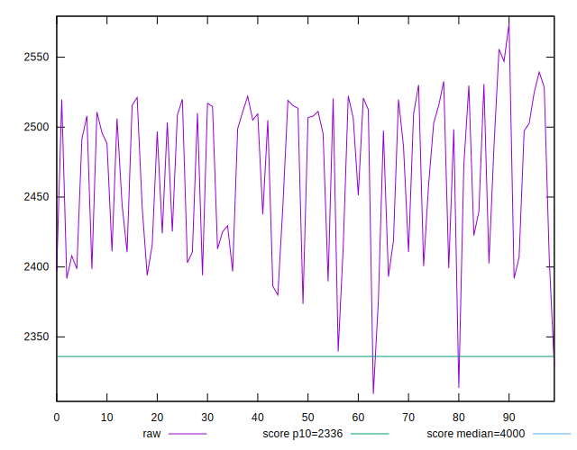
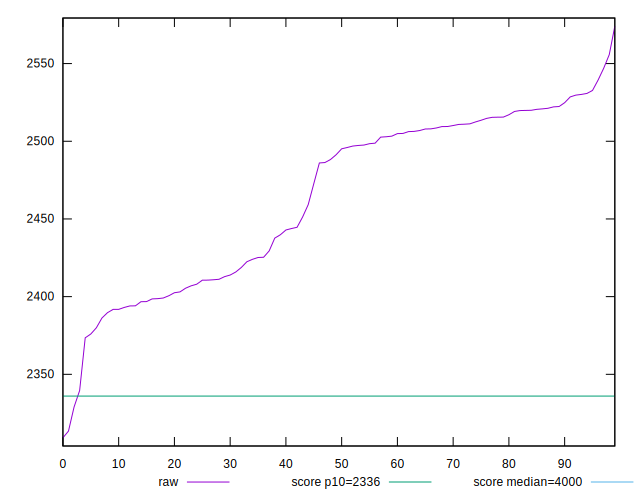
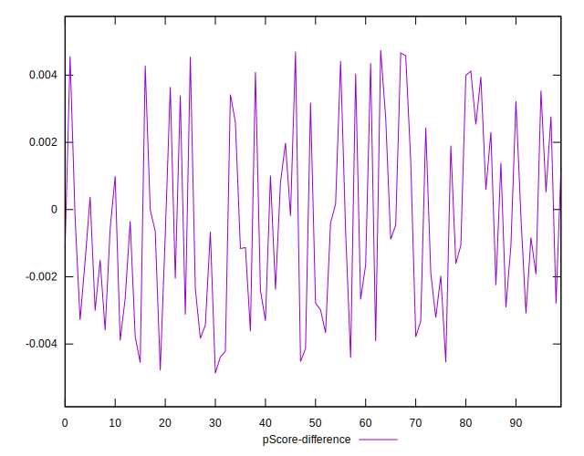

# //first-meaningful-paint/samples/pages+cached+noadtech+nomedia

[→ Parent](../..)


## Raw


```yaml
p90min: 2339.565
p90max: 2539.3975000000005
p90range: 199.83250000000044
p90mean: 2465.021091489362
p90median: 2493.2237499999997
p90stdev: 53.59015532399563
p90skewness: -0.3585626377380642
p90eccentricity: 1
p90discretization: 1
outlandishness: 0.9986876303380555
confidence: 23.59422447633005
p90confidence: 21.66701957437415

```


## Score


```yaml
p90min: 0.86
p90max: 0.9
p90range: 0.040000000000000036
p90mean: 0.8759574468085106
p90median: 0.87
p90stdev: 0.01113926818102846
p90skewness: 0.15135482407173512
p90eccentricity: 0.9999999999999999
p90discretization: 18.8
outlandishness: 1.000325506202503
confidence: 0.0047330593973412055
p90confidence: 0.004503714166592037

```


## Raw Estimate


## Score Estimate


## P Score


```yaml
p90min: 0.8605128753384825
p90max: 0.8993607699191268
p90range: 0.038847894580644304
p90mean: 0.8754352249256415
p90median: 0.8699910209702841
p90stdev: 0.010548076036414299
p90skewness: 0.3324899468838098
p90eccentricity: 0.9999999999999997
p90discretization: 1
outlandishness: 1.0006085137086462
confidence: 0.0046206875394310815
p90confidence: 0.004264689448486103

```


## Score Difference


```yaml
p90min: 0
p90max: 0
p90range: 0
p90mean: 0
p90median: 0
p90stdev: 0
p90skewness: .nan
p90eccentricity: .nan
p90discretization: 94
outlandishness: .nan
confidence: 0
p90confidence: 0

```


## P Score Difference


```yaml
p90min: -0.004545574525615326
p90max: 0.004580172659912285
p90range: 0.00912574718552761
p90mean: -0.0004227571485107244
p90median: -0.0007949652769426163
p90stdev: 0.002778661860327869
p90skewness: 0.3544673103645908
p90eccentricity: 1.0000000000000004
p90discretization: 1
outlandishness: 0.8883499575476367
confidence: 0.001149751002459427
p90confidence: 0.0011234399406812913

```

