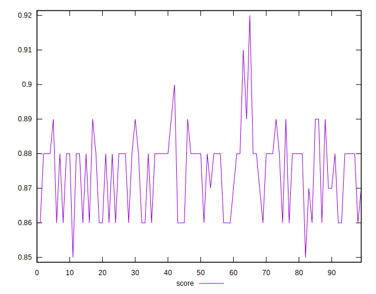
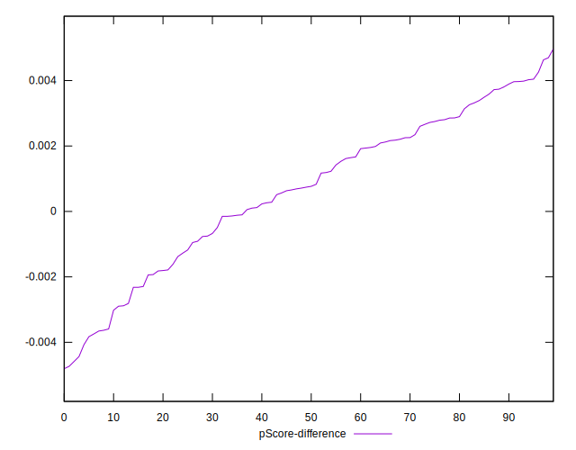

# //first-meaningful-paint/samples/pages+cached+noadtech

[→ Parent](../..)


## Raw


```yaml
p90min: 2391.3075
p90max: 2555.6224999999995
p90range: 164.3149999999996
p90mean: 2466.381063829788
p90median: 2444.37
p90stdev: 50.0035034018087
p90skewness: 0.5242397307692236
p90eccentricity: 1.0000000000000007
p90discretization: 1
outlandishness: 0.9982284891101464
confidence: 24.170126017807
p90confidence: 20.216901414897677

```


## Score


```yaml
p90min: 0.86
p90max: 0.89
p90range: 0.030000000000000027
p90mean: 0.8744680851063832
p90median: 0.88
p90stdev: 0.01037765821128273
p90skewness: -0.34344599678127663
p90eccentricity: 1.0000000000000009
p90discretization: 23.5
outlandishness: 1.000988078504152
confidence: 0.004880113534004653
p90confidence: 0.004195787868883952

```


## Raw Estimate


## Score Estimate


## P Score


```yaml
p90min: 0.8571158963447953
p90max: 0.8898621288312336
p90range: 0.032746232486438265
p90mean: 0.8751946685378924
p90median: 0.8797025715741171
p90stdev: 0.01001130092595744
p90skewness: -0.544656688053332
p90eccentricity: 0.9999999999999994
p90discretization: 1
outlandishness: 1.0007734549265286
confidence: 0.004749686272420712
p90confidence: 0.004047666065086839

```


## Score Difference


```yaml
p90min: 0
p90max: 0
p90range: 0
p90mean: 0
p90median: 0
p90stdev: 0
p90skewness: .nan
p90eccentricity: .nan
p90discretization: 94
outlandishness: .nan
confidence: 0
p90confidence: 0

```


## P Score Difference


```yaml
p90min: -0.004435786119026508
p90max: 0.004259793192859518
p90range: 0.008695579311886026
p90mean: 0.0006716490869195766
p90median: 0.0007547680786112454
p90stdev: 0.0023252032579984044
p90skewness: -0.38909312789703476
p90eccentricity: 1.0000000000000002
p90discretization: 1
outlandishness: 0.8884063519001362
confidence: 0.0009957721912173848
p90confidence: 0.0009401022296140208

```

