# //interactive/samples/pages+cached+noadtech+nomedia+nocss

[→ Parent](../..)


## Raw


```yaml
p90min: 1627.4473
p90max: 1972.5099999999998
p90range: 345.0626999999997
p90mean: 1691.8233010638307
p90median: 1644.6595
p90stdev: 100.74446413214308
p90skewness: 1.7832844822533493
p90eccentricity: 0.9999999999999999
p90discretization: 1
outlandishness: 1.01024184631878
confidence: 45.49208172158705
p90confidence: 40.731963980399016

```

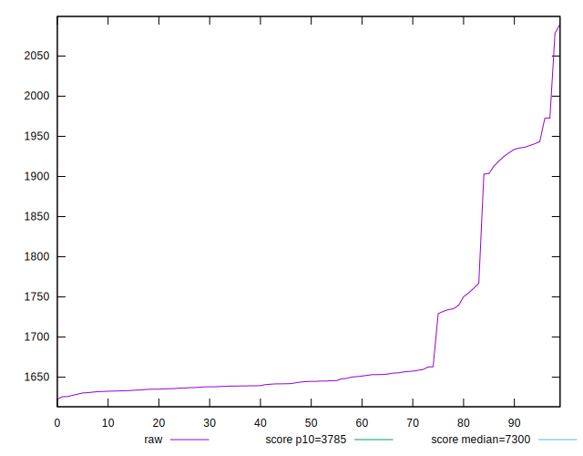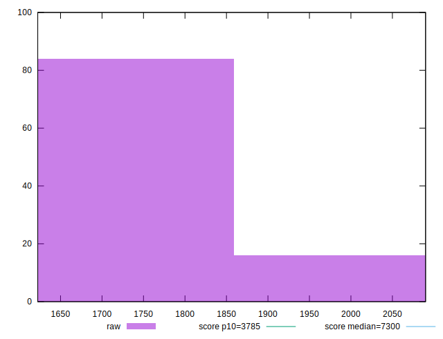
## Score


```yaml
p90min: 0.99
p90max: 1
p90range: 0.010000000000000009
p90mean: 0.9998936170212767
p90median: 1
p90stdev: 0.0010259202937226556
p90skewness: -9.539955591519758
p90eccentricity: 1.000000000000003
p90discretization: 47
outlandishness: 0.9994127897083943
confidence: 0.0007681458682168516
p90confidence: 0.0004147895252672149

```

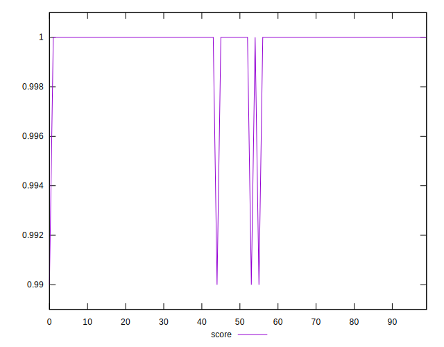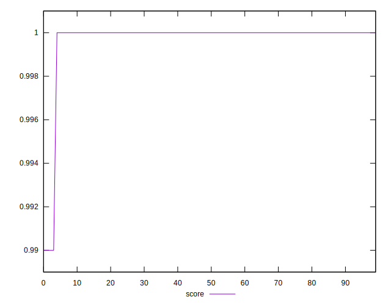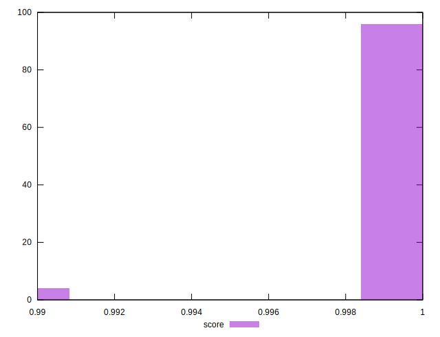
## Raw Estimate

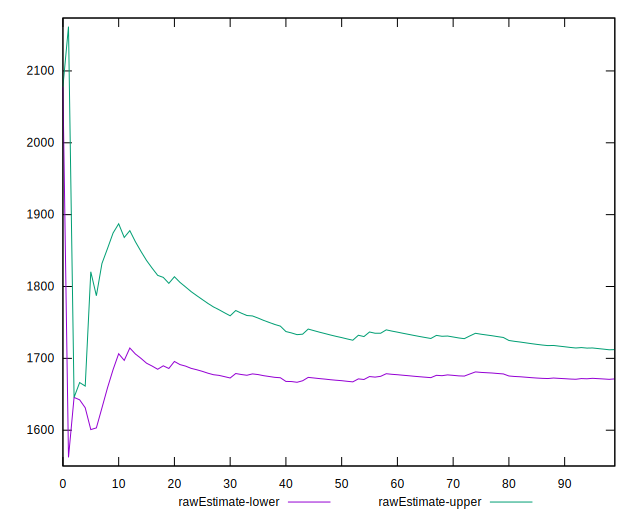
## Score Estimate

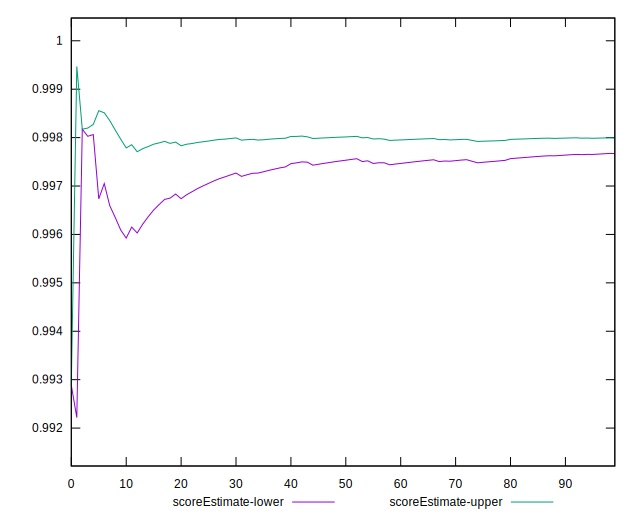
## P Score


```yaml
p90min: 0.9946626525519175
p90max: 0.9982961673159426
p90range: 0.00363351476402507
p90mean: 0.9977141598906869
p90median: 0.9981802312538824
p90stdev: 0.0010138778701813955
p90skewness: -1.9173751258485487
p90eccentricity: 1.0000000000000007
p90discretization: 1
outlandishness: 0.9997767425527804
confidence: 0.00048748188352135986
p90confidence: 0.00040992065662867687

```

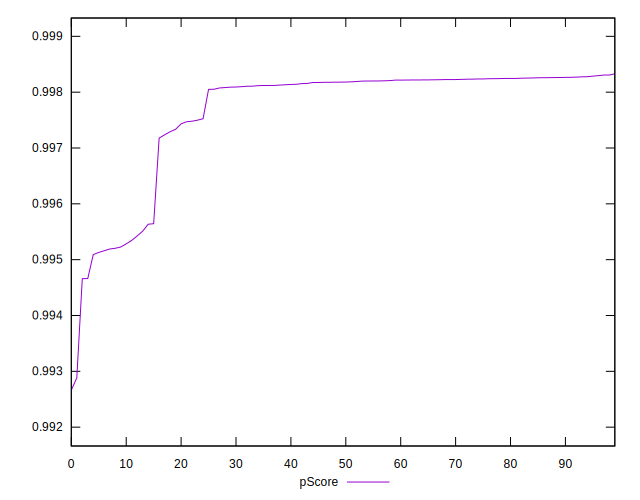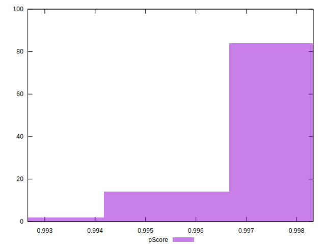
## Score Difference


```yaml
p90min: 0
p90max: 0
p90range: 0
p90mean: 0
p90median: 0
p90stdev: 0
p90skewness: .nan
p90eccentricity: .nan
p90discretization: 94
outlandishness: .nan
confidence: 0
p90confidence: 0

```


## P Score Difference


```yaml
p90min: -0.004809044880128011
p90max: 0.0026625711387691098
p90range: 0.00747161601889712
p90mean: -0.0020990260982298335
p90median: -0.0018009551831384973
p90stdev: 0.0009758837371776704
p90skewness: -0.4170110806138608
p90eccentricity: 1.0000000000000002
p90discretization: 1
outlandishness: 0.905349123991654
confidence: 0.000591616174594995
p90confidence: 0.0003945592601459449

```

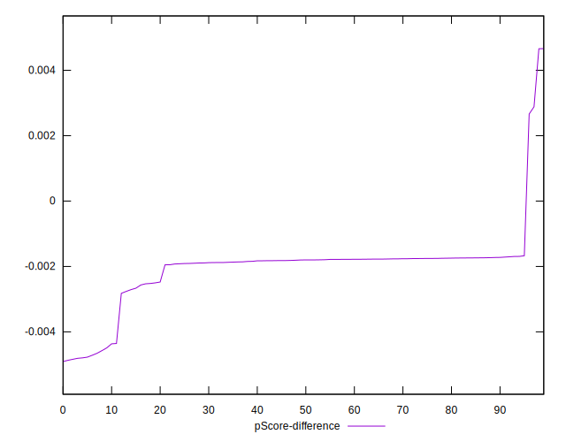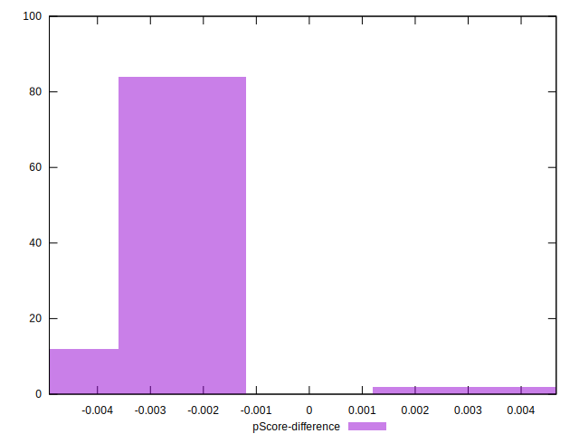