# //interactive/samples/pages+cached+noadtech

[→ Parent](../..)


## Raw


```yaml
p90min: 4814.2955
p90max: 4987.242000000002
p90range: 172.94650000000183
p90mean: 4879.884367553192
p90median: 4876.13475
p90stdev: 32.64663490230676
p90skewness: 0.7987877929210885
p90eccentricity: 1.0000000000000007
p90discretization: 1
outlandishness: 0.9715944040978458
confidence: 168.37759562404815
p90confidence: 13.199351134349113

```

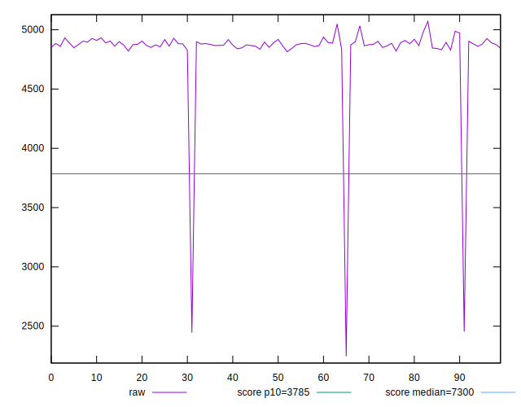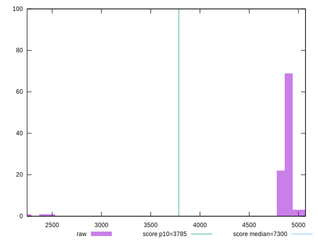
## Score


```yaml
p90min: 0.77
p90max: 0.79
p90range: 0.020000000000000018
p90mean: 0.7837234042553196
p90median: 0.78
p90stdev: 0.005454656912040116
p90skewness: -0.07166238325198201
p90eccentricity: 1.000000000000002
p90discretization: 31.333333333333332
outlandishness: 1.0137677101571296
confidence: 0.013625288448432126
p90confidence: 0.0022053706948624795

```

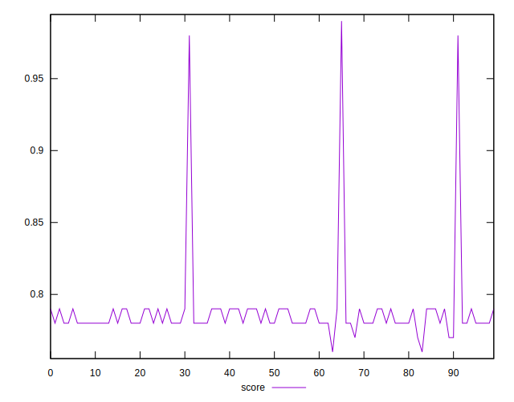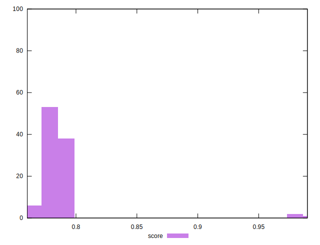
## Raw Estimate

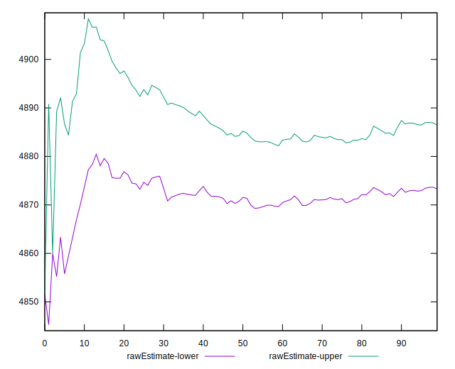
## Score Estimate

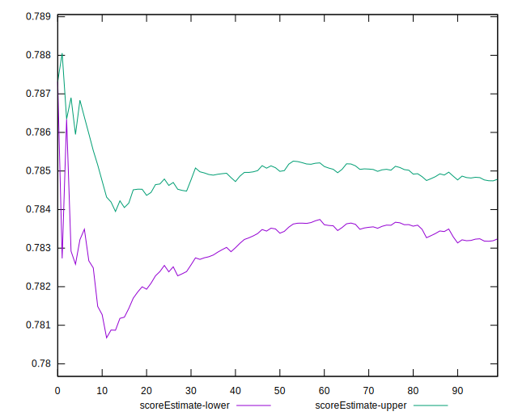
## P Score


```yaml
p90min: 0.7713681854322046
p90max: 0.7916677924602313
p90range: 0.02029960702802669
p90mean: 0.7840066673745519
p90median: 0.7844525241086369
p90stdev: 0.0038290812334517304
p90skewness: -0.8130772667275157
p90eccentricity: 0.9999999999999999
p90discretization: 1
outlandishness: 1.0139117733158873
confidence: 0.01365426789613589
p90confidence: 0.0015481346813697122

```

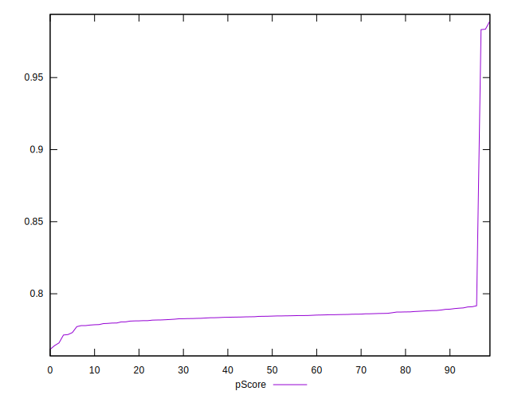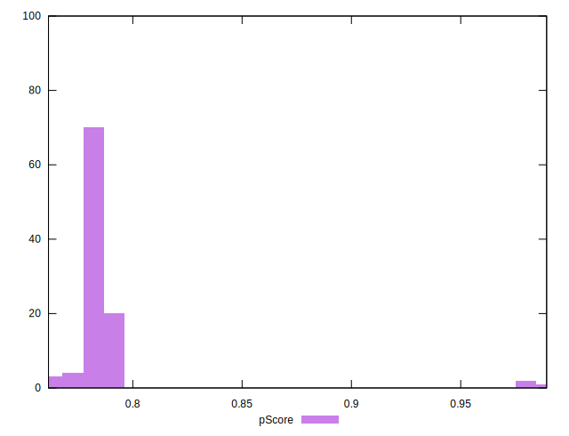
## Score Difference


```yaml
p90min: 0
p90max: 0
p90range: 0
p90mean: 0
p90median: 0
p90stdev: 0
p90skewness: .nan
p90eccentricity: .nan
p90discretization: 94
outlandishness: .nan
confidence: 0
p90confidence: 0

```


## P Score Difference


```yaml
p90min: -0.004655078599712259
p90max: 0.0047925842480617264
p90range: 0.009447662847773985
p90mean: 0.0003611766800053437
p90median: 0.0009097468795248864
p90stdev: 0.0029892322240979174
p90skewness: -0.17201222770522304
p90eccentricity: 0.9999999999999997
p90discretization: 1
outlandishness: 0.8929250242696901
confidence: 0.0012284624856731476
p90confidence: 0.0012085755810989228

```

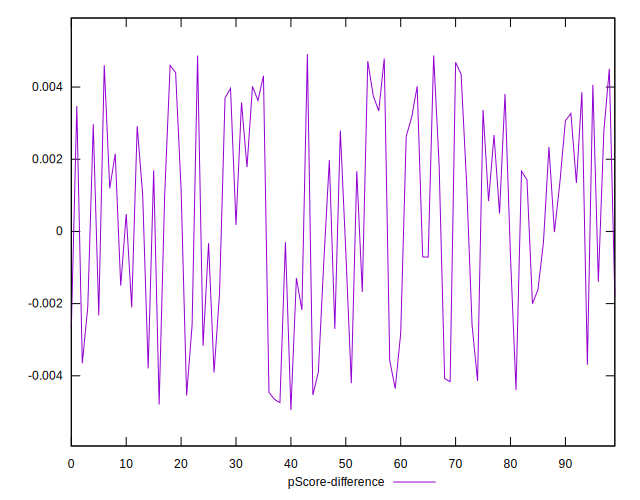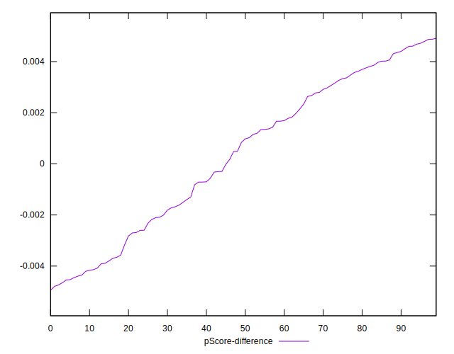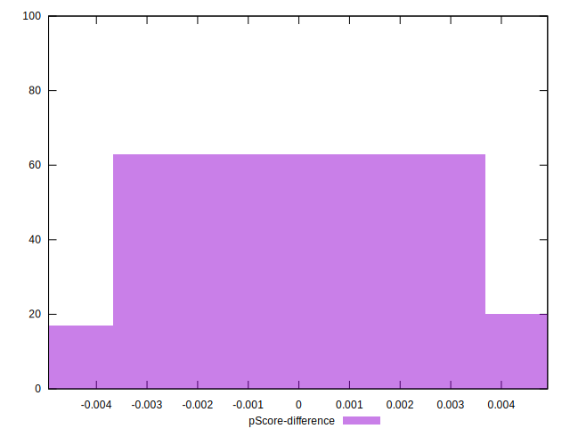