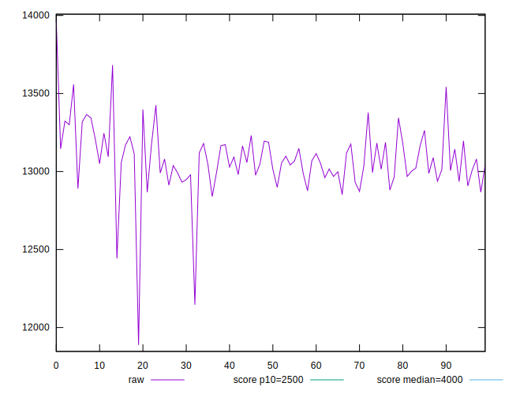
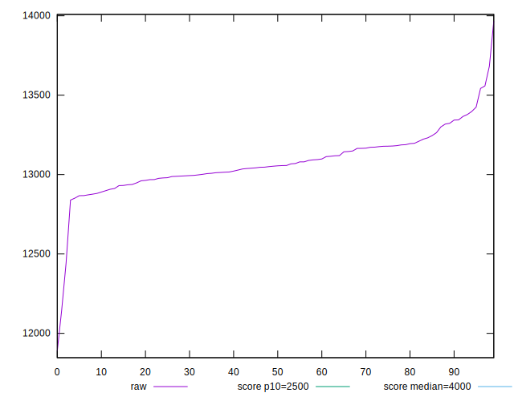
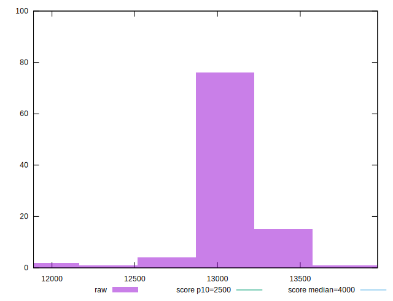
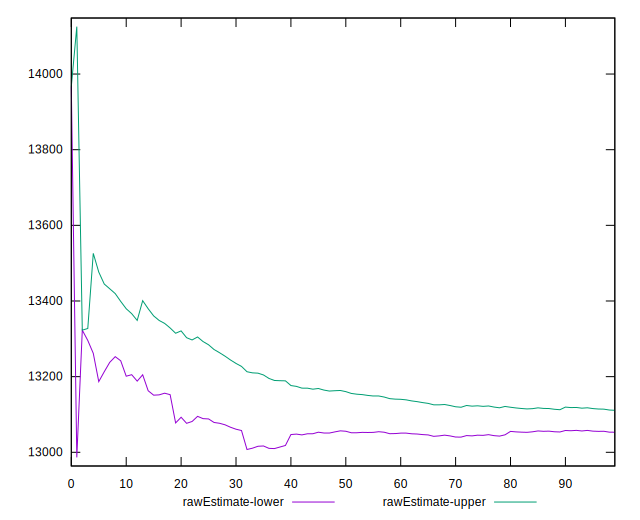
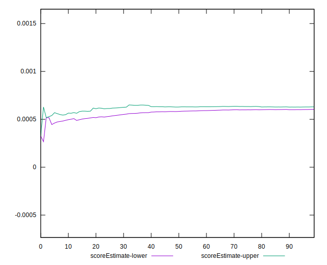
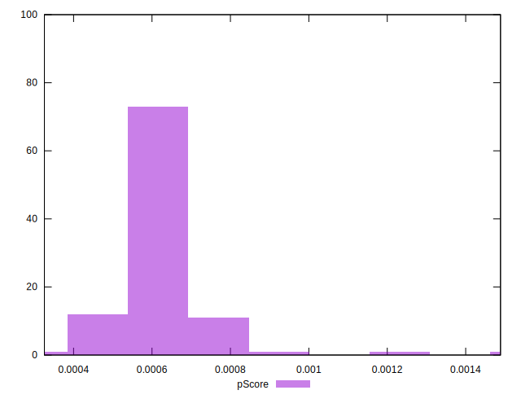
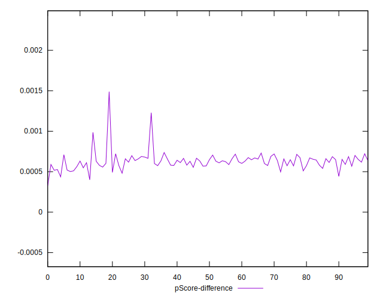
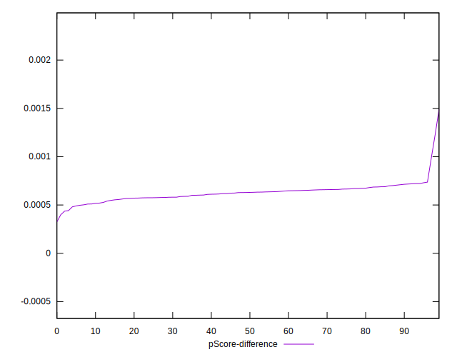
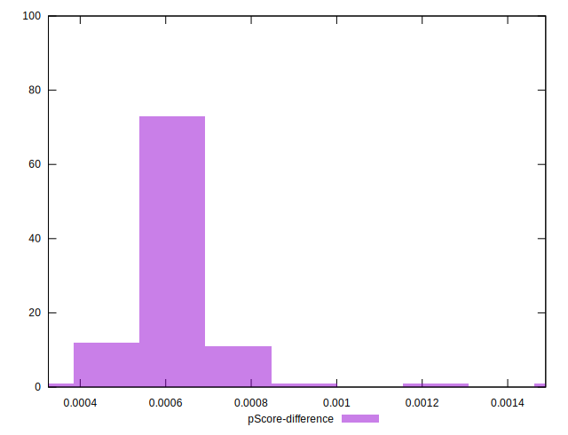

# //largest-contentful-paint/samples/pages+cached

[→ Parent](../..)


## Raw


```yaml
p90min: 12839.275
p90max: 13542.314
p90range: 703.0390000000007
p90mean: 13082.05764361702
p90median: 13053.875250000005
p90stdev: 143.2750696639726
p90skewness: 0.701279253688525
p90eccentricity: 1.0000000000000004
p90discretization: 1
outlandishness: 0.9987655298115963
confidence: 96.0408721876768
p90confidence: 57.92750030599571

```


## Score


```yaml
p90min: 0
p90max: 0
p90range: 0
p90mean: 0
p90median: 0
p90stdev: 0
p90skewness: .nan
p90eccentricity: .nan
p90discretization: 94
outlandishness: .nan
confidence: 0
p90confidence: 0

```


## Raw Estimate


## Score Estimate


## P Score


```yaml
p90min: 0.0004417385573813326
p90max: 0.000736697572366718
p90range: 0.00029495901498538535
p90mean: 0.0006202852726364353
p90median: 0.000629713289247491
p90stdev: 0.00006256814081623332
p90skewness: -0.42869952659220084
p90eccentricity: 0.9999999999999999
p90discretization: 1
outlandishness: 1.037209229696646
confidence: 0.00005233688993726414
p90confidence: 0.000025296906187366664

```


## Score Difference


```yaml
p90min: 0
p90max: 0
p90range: 0
p90mean: 0
p90median: 0
p90stdev: 0
p90skewness: .nan
p90eccentricity: .nan
p90discretization: 94
outlandishness: .nan
confidence: 0
p90confidence: 0

```


## P Score Difference


```yaml
p90min: 0.0004417385573813326
p90max: 0.000736697572366718
p90range: 0.00029495901498538535
p90mean: 0.0006202852726364353
p90median: 0.000629713289247491
p90stdev: 0.00006256814081623332
p90skewness: -0.42869952659220084
p90eccentricity: 0.9999999999999999
p90discretization: 1
outlandishness: 1.037209229696646
confidence: 0.00005233688993726414
p90confidence: 0.000025296906187366664

```

