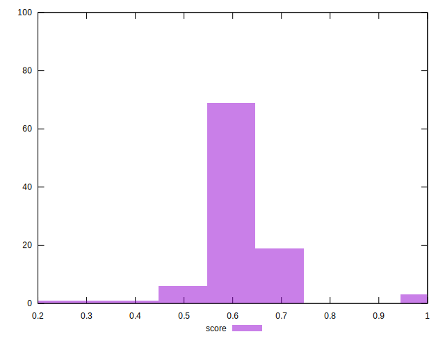

# //max-potential-fid/samples/pages+cached+noadtech

[→ Parent](../..)


## Raw


```yaml
p90min: 198
p90max: 261.9999999999998
p90range: 63.99999999999977
p90mean: 216.27659574468086
p90median: 215
p90stdev: 11.74045946337048
p90skewness: 1.383855899540504
p90eccentricity: 0.9999999999999999
p90discretization: 1.6206896551724137
outlandishness: 0.9845559138939421
confidence: 16.04270929379875
p90confidence: 4.746781633064094

```


## Score


```yaml
p90min: 0.46
p90max: 0.68
p90range: 0.22000000000000003
p90mean: 0.6130851063829789
p90median: 0.62
p90stdev: 0.040423992131929515
p90skewness: -1.287645090045163
p90eccentricity: 1.0000000000000002
p90discretization: 4.947368421052632
outlandishness: 1.004620977630217
confidence: 0.03848872256940044
p90confidence: 0.01634381209573922

```


## Raw Estimate


## Score Estimate


## P Score


```yaml
p90min: 0.46339604048793526
p90max: 0.6761675307336696
p90range: 0.21277149024573438
p90mean: 0.6123432629260767
p90median: 0.6162243471391701
p90stdev: 0.03979334657826491
p90skewness: -1.248494528113249
p90eccentricity: 0.9999999999999996
p90discretization: 1.6206896551724137
outlandishness: 1.004790609448443
confidence: 0.038394042031570375
p90confidence: 0.01608883598169119

```


## Score Difference


```yaml
p90min: 0
p90max: 0
p90range: 0
p90mean: 0
p90median: 0
p90stdev: 0
p90skewness: .nan
p90eccentricity: .nan
p90discretization: 94
outlandishness: .inf
confidence: 6.092792000602808e-18
p90confidence: 0

```


## P Score Difference


```yaml
p90min: -0.004800701338998903
p90max: 0.0048703506827229015
p90range: 0.009671052021721804
p90mean: -0.0007373593001743571
p90median: -0.0010906657645478601
p90stdev: 0.0026085919017221036
p90skewness: 0.4430309049434086
p90eccentricity: 0.9999999999999992
p90discretization: 1.6206896551724137
outlandishness: 0.8800928410224602
confidence: 0.0010991516390882303
p90confidence: 0.0010546790068895176

```

