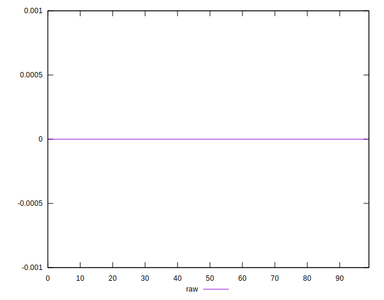
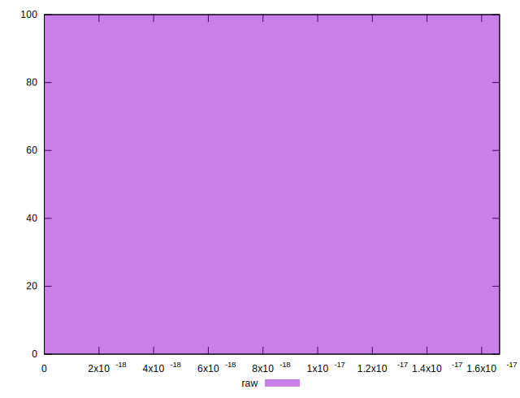

# //meta/score-difference/samples/pages+cached

[→ Parent](../..)


## Raw


```yaml
p90min: 0
p90max: 1.6653345369377347e-17
p90range: 1.6653345369377347e-17
p90mean: 2.8936663939698225e-18
p90median: 0
p90stdev: 5.767110488404171e-18
p90skewness: 1.5086837552672134
p90eccentricity: 1.0000000000000007
p90discretization: 31.333333333333332
outlandishness: 1.2379968346522283
confidence: 2.387258291184941e-18
p90confidence: 2.33169870630849e-18

```

