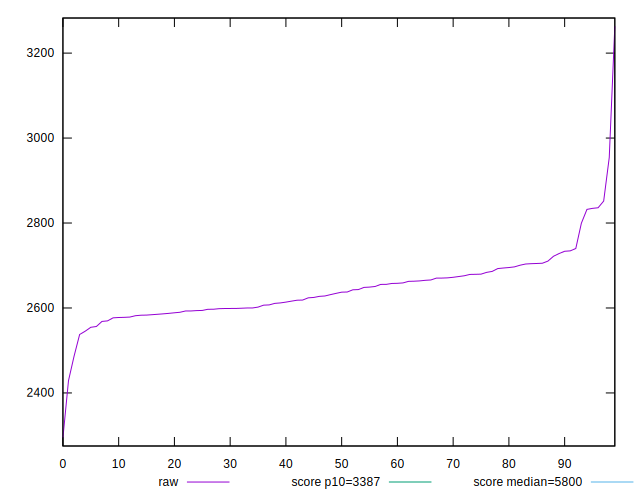
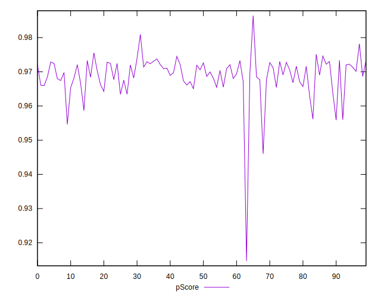
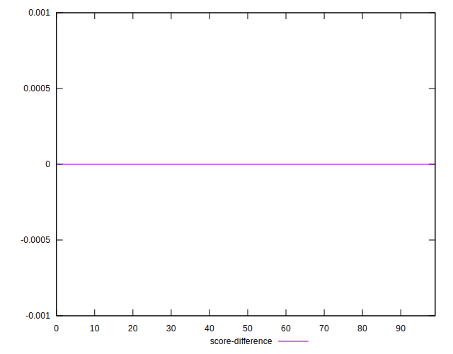

# //speed-index/samples/pages+cached+noadtech

[→ Parent](../..)


## Raw


```yaml
p90min: 2537.6774080632877
p90max: 2835.9589195295052
p90range: 298.2815114662176
p90mean: 2643.362024527387
p90median: 2635.838131333121
p90stdev: 61.45576442522408
p90skewness: 0.9976580611607618
p90eccentricity: 1.0000000000000002
p90discretization: 1
outlandishness: 1.0031719379472879
confidence: 40.54592791528437
p90confidence: 24.847161623419172

```


## Score


```yaml
p90min: 0.96
p90max: 0.98
p90range: 0.020000000000000018
p90mean: 0.9692553191489353
p90median: 0.97
p90stdev: 0.00333879889925005
p90skewness: -1.3205693389380595
p90eccentricity: 1.0000000000000009
p90discretization: 31.333333333333332
outlandishness: 0.9988544606206256
confidence: 0.003018853574821858
p90confidence: 0.0013499087783490297

```


## Raw Estimate


## Score Estimate


## P Score


```yaml
p90min: 0.9558645684787825
p90max: 0.9755438238231187
p90range: 0.019679255344336122
p90mean: 0.9692519237898728
p90median: 0.9698733027027953
p90stdev: 0.003994532345063737
p90skewness: -1.2653702260937292
p90eccentricity: 1.0000000000000002
p90discretization: 1
outlandishness: 0.9988731066421845
confidence: 0.002962922612664304
p90confidence: 0.001615028170523198

```


## Score Difference


```yaml
p90min: 0
p90max: 0
p90range: 0
p90mean: 0
p90median: 0
p90stdev: 0
p90skewness: .nan
p90eccentricity: .nan
p90discretization: 94
outlandishness: .inf
confidence: 6.092792000602807e-18
p90confidence: 0

```


## P Score Difference


```yaml
p90min: -0.004574463783591609
p90max: 0.004520470191626158
p90range: 0.009094933975217767
p90mean: 0.00001136903539102329
p90median: 0.00036588828117933847
p90stdev: 0.002675862713696631
p90skewness: -0.18161402402308743
p90eccentricity: 1
p90discretization: 1
outlandishness: 0.24680443742024571
confidence: 0.0011138170818778927
p90confidence: 0.0010818772486379138

```

