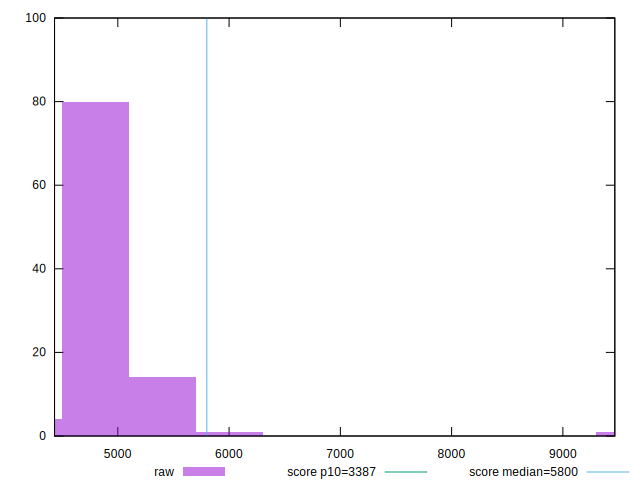
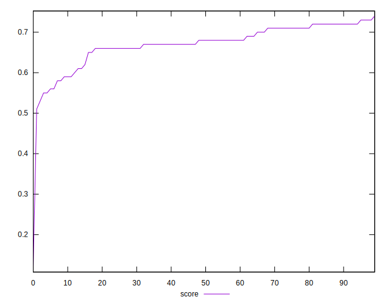
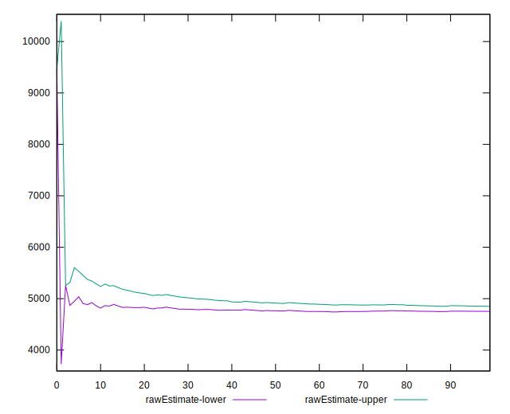
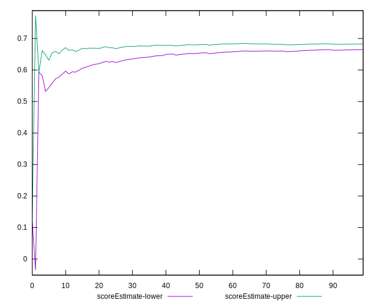
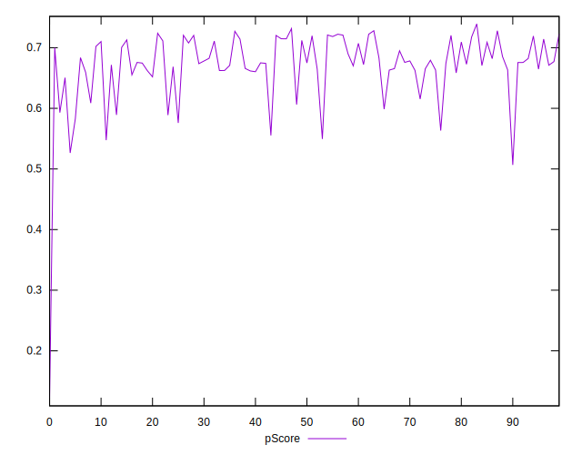
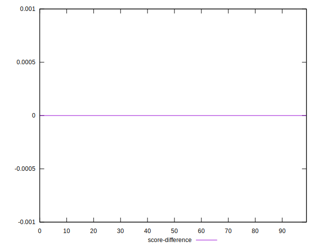
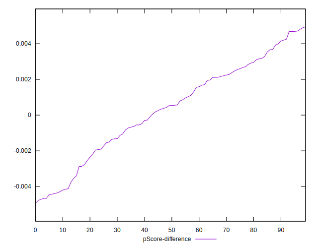
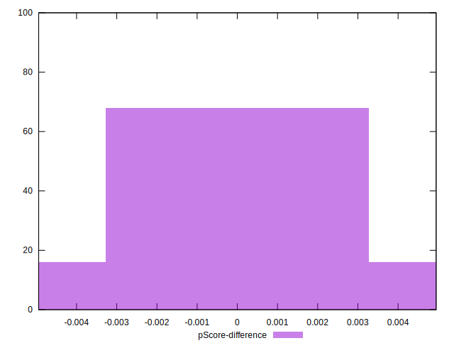

# //speed-index/samples/pages+cached

[→ Parent](../..)


## Raw


```yaml
p90min: 4495.7046578799345
p90max: 5516.88865321843
p90range: 1021.1839953384952
p90mean: 4800.45277673133
p90median: 4790.659914175295
p90stdev: 243.86793352178645
p90skewness: 1.2104301290528903
p90eccentricity: 0.9999999999999997
p90discretization: 1
outlandishness: 1.0229065102881396
confidence: 211.19436018949472
p90confidence: 98.5981708250955

```


## Score


```yaml
p90min: 0.55
p90max: 0.73
p90range: 0.17999999999999994
p90mean: 0.673510638297872
p90median: 0.68
p90stdev: 0.042818455128514094
p90skewness: -1.1827733084471184
p90eccentricity: 0.9999999999999997
p90discretization: 5.875
outlandishness: 0.9798779623478239
confidence: 0.02859696935285584
p90confidence: 0.01731191670942155

```


## Raw Estimate


## Score Estimate


## P Score


```yaml
p90min: 0.547452285674795
p90max: 0.7280396018350344
p90range: 0.18058731616023938
p90mean: 0.673906339220512
p90median: 0.6756251875618313
p90stdev: 0.043315345796218464
p90skewness: -1.1996693231981932
p90eccentricity: 0.9999999999999999
p90discretization: 1
outlandishness: 0.9796318503577672
confidence: 0.028724560301984753
p90confidence: 0.017512814425772332

```


## Score Difference


```yaml
p90min: 0
p90max: 1.1102230246251565e-16
p90range: 1.1102230246251565e-16
p90mean: 3.543264972207946e-18
p90median: 0
p90stdev: 1.9514781802162963e-17
p90skewness: 5.326002287485494
p90eccentricity: 1.0000000000000044
p90discretization: 47
outlandishness: 3.5344000000000007
confidence: 1.0335413782903705e-17
p90confidence: 7.89001555865578e-18

```


## P Score Difference


```yaml
p90min: -0.004666980141081134
p90max: 0.004705046368033261
p90range: 0.009372026509114395
p90mean: 0.0003254380470152605
p90median: 0.0005375465235881727
p90stdev: 0.0026638775946158477
p90skewness: -0.2640454778554835
p90eccentricity: 1
p90discretization: 1
outlandishness: 0.895232988236563
confidence: 0.0011146139556163226
p90confidence: 0.0010770315487485488

```

