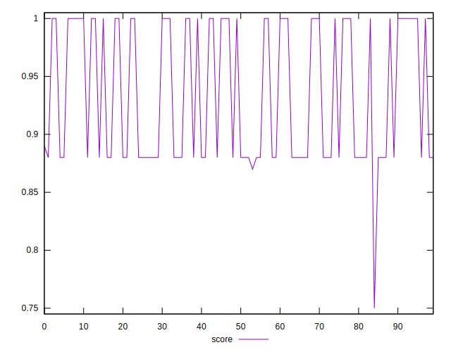

# //unminified-css/samples/pages+cached

[→ Parent](../..)


## Raw


```yaml
p90min: 0
p90max: 150
p90range: 150
p90mean: 79.57446808510639
p90median: 150
p90stdev: 74.67539532717764
p90skewness: -0.12586544484403953
p90eccentricity: 1.000000000000001
p90discretization: 31.333333333333332
outlandishness: 1.033592988790071
confidence: 30.439925470317135
p90confidence: 30.191986615750864

```


## Score


```yaml
p90min: 0.88
p90max: 1
p90range: 0.12
p90mean: 0.9362765957446806
p90median: 0.88
p90stdev: 0.05978657151143471
p90skewness: 0.12709059103857342
p90eccentricity: 1.0000000000000007
p90discretization: 31.333333333333332
outlandishness: 0.9974882284774088
confidence: 0.02448932450075418
p90confidence: 0.024172290738686222

```


## Raw Estimate


## Score Estimate


## P Score


```yaml
p90min: 0.875
p90max: 1
p90range: 0.125
p90mean: 0.9336879432624113
p90median: 0.875
p90stdev: 0.062229496105981316
p90skewness: 0.12586544484404022
p90eccentricity: 1.0000000000000016
p90discretization: 31.333333333333332
outlandishness: 0.997635277339716
confidence: 0.025366604558597614
p90confidence: 0.025159988846459033

```


## Score Difference


```yaml
p90min: 0
p90max: 0
p90range: 0
p90mean: 0
p90median: 0
p90stdev: 0
p90skewness: .nan
p90eccentricity: .nan
p90discretization: 94
outlandishness: .nan
confidence: 0
p90confidence: 0

```


## P Score Difference


```yaml
p90min: -0.0050000000000000044
p90max: 0
p90range: 0.0050000000000000044
p90mean: -0.002535460992907803
p90median: -0.004166666666666652
p90stdev: 0.002487898885231406
p90skewness: 0.031568989176464356
p90eccentricity: 0.9999999999999983
p90discretization: 31.333333333333332
outlandishness: 0.985229771626975
confidence: 0.0009843061502677129
p90confidence: 0.001005881649707325

```

