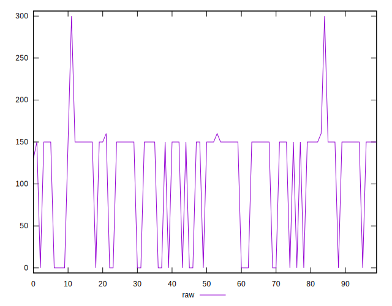
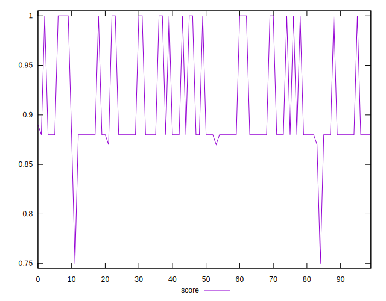
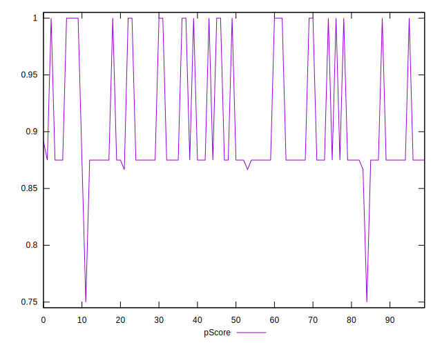
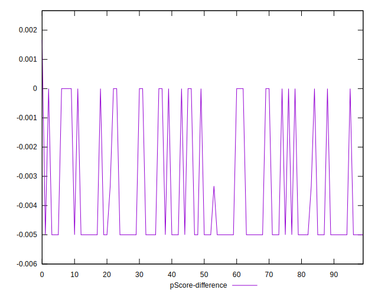
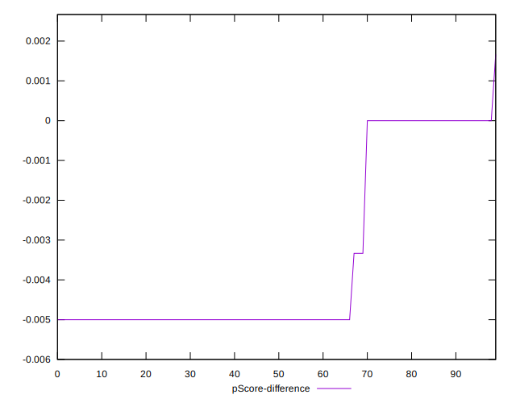
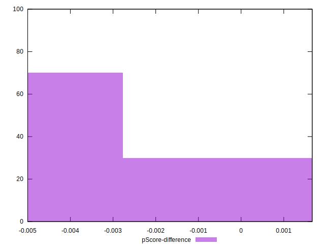

# //unused-css-rules/samples/pages+cached

[→ Parent](../..)


## Raw


```yaml
p90min: 0
p90max: 160
p90range: 160
p90mean: 111.70212765957447
p90median: 150
p90stdev: 65.45484553479368
p90skewness: -1.1173904593377042
p90eccentricity: 0.9999999999999992
p90discretization: 23.5
outlandishness: 1.016140801451247
confidence: 28.08496400335236
p90confidence: 26.46402890355106

```


## Score


```yaml
p90min: 0.87
p90max: 1
p90range: 0.13
p90mean: 0.9105319148936167
p90median: 0.88
p90stdev: 0.05241745326674577
p90skewness: 1.118245628068664
p90eccentricity: 1.000000000000003
p90discretization: 23.5
outlandishness: 0.9979540794158535
confidence: 0.02270122309585701
p90confidence: 0.02119288475846022

```


## Raw Estimate


## Score Estimate


## P Score


```yaml
p90min: 0.8666666666666667
p90max: 1
p90range: 0.1333333333333333
p90mean: 0.9069148936170213
p90median: 0.875
p90stdev: 0.05454570461232805
p90skewness: 1.1173904593377044
p90eccentricity: 1
p90discretization: 23.5
outlandishness: 0.9983506317894677
confidence: 0.023404136669460292
p90confidence: 0.02205335741962588

```


## Score Difference


```yaml
p90min: 0
p90max: 0
p90range: 0
p90mean: 0
p90median: 0
p90stdev: 0
p90skewness: .nan
p90eccentricity: .nan
p90discretization: 94
outlandishness: .nan
confidence: 0
p90confidence: 0

```


## P Score Difference


```yaml
p90min: -0.0050000000000000044
p90max: 0
p90range: 0.0050000000000000044
p90mean: -0.003510638297872342
p90median: -0.0050000000000000044
p90stdev: 0.0022475109046086283
p90skewness: 0.896570976229682
p90eccentricity: 1.0000000000000002
p90discretization: 31.333333333333332
outlandishness: 0.9564444852566071
confidence: 0.0009044194997638742
p90confidence: 0.0009086904575917493

```

