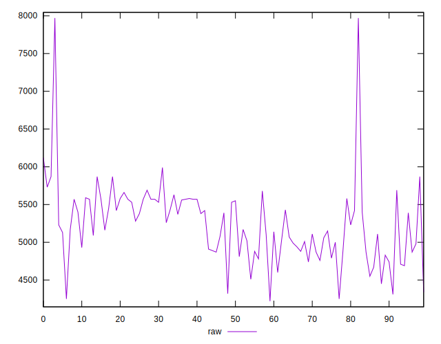
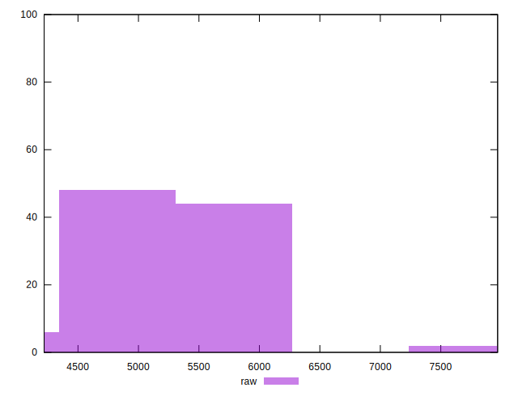
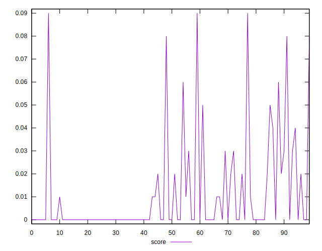
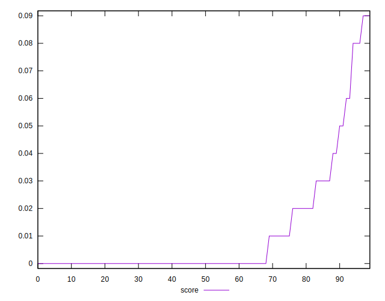
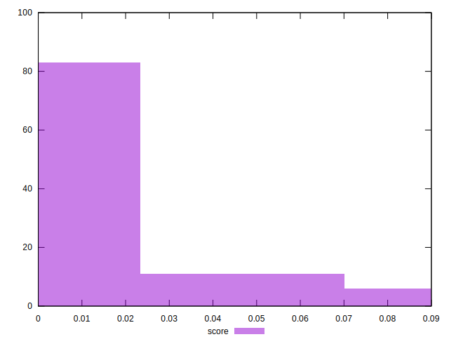
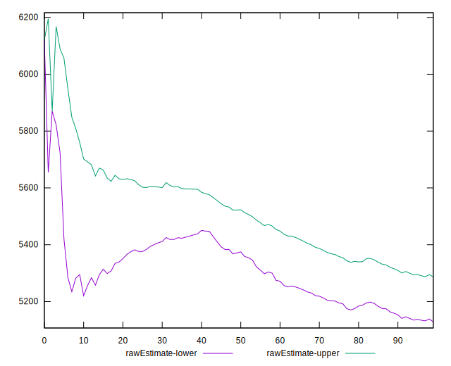
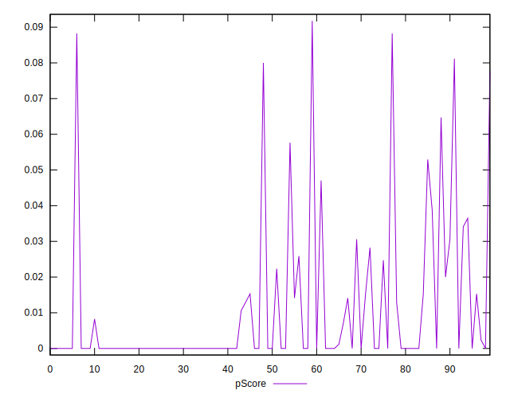
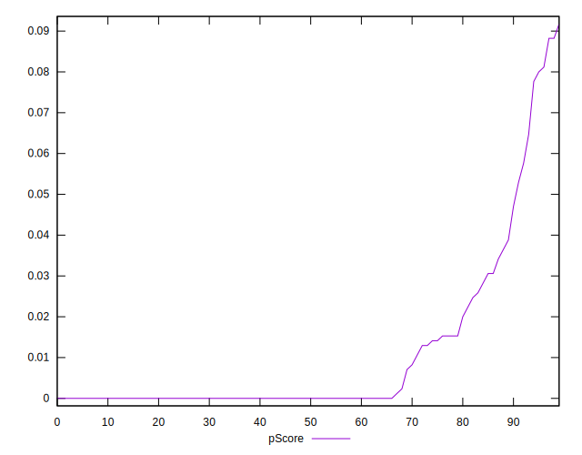
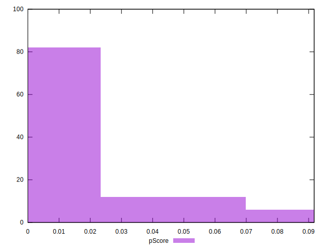
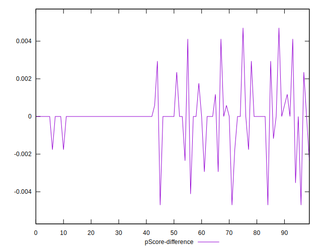

# //uses-http2/samples/pages

[→ Parent](../..)


## Raw


```yaml
p90min: 4310
p90max: 5990
p90range: 1680
p90mean: 5207.659574468085
p90median: 5200
p90stdev: 392.20171083614304
p90skewness: -0.26477653159541137
p90eccentricity: 1.0000000000000002
p90discretization: 1.540983606557377
outlandishness: 1.0136185322109212
confidence: 225.9915817483661
p90confidence: 158.57095569911013

```


## Score


```yaml
p90min: 0
p90max: 0.08
p90range: 0.08
p90mean: 0.009574468085106385
p90median: 0
p90stdev: 0.01901370690446714
p90skewness: 2.2988582324758795
p90eccentricity: 1.0000000000000009
p90discretization: 11.75
outlandishness: 1.4932840000000005
confidence: 0.009042297613061747
p90confidence: 0.00768742611753614

```


## Raw Estimate


## Score Estimate


## P Score


```yaml
p90min: 0
p90max: 0.0811764705882353
p90range: 0.0811764705882353
p90mean: 0.009549436795994987
p90median: 0
p90stdev: 0.018942720560651726
p90skewness: 2.3264523697800334
p90eccentricity: 0.9999999999999999
p90discretization: 3.76
outlandishness: 1.4905753683208827
confidence: 0.008998827018799964
p90confidence: 0.007658725650227117

```


## Score Difference


```yaml
p90min: 0
p90max: 0
p90range: 0
p90mean: 0
p90median: 0
p90stdev: 0
p90skewness: .nan
p90eccentricity: .nan
p90discretization: 94
outlandishness: .nan
confidence: 0
p90confidence: 0

```


## P Score Difference


```yaml
p90min: -0.004705882352941209
p90max: 0.004117647058823512
p90range: 0.008823529411764721
p90mean: -0.000037546933667088666
p90median: 0
p90stdev: 0.0013507042252589429
p90skewness: -0.20655804941326145
p90eccentricity: 1.0000000000000004
p90discretization: 4.086956521739131
outlandishness: 1.2026777777777862
confidence: 0.0006779757745494227
p90confidence: 0.0005461028189028463

```

