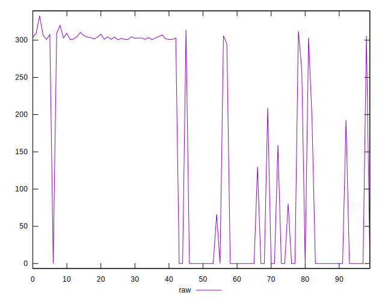
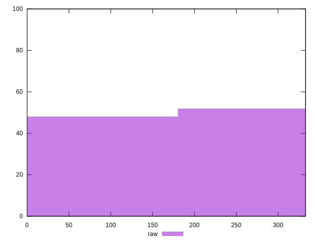
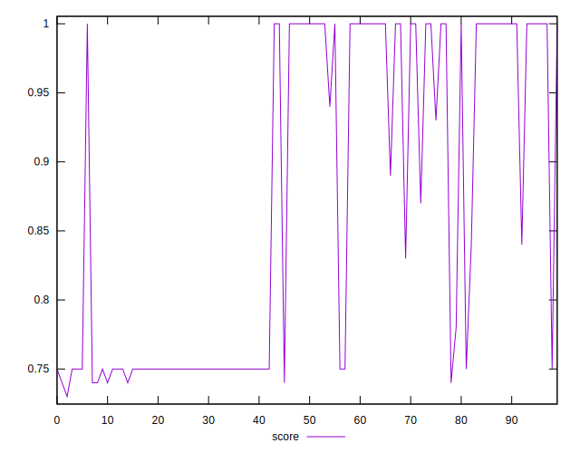
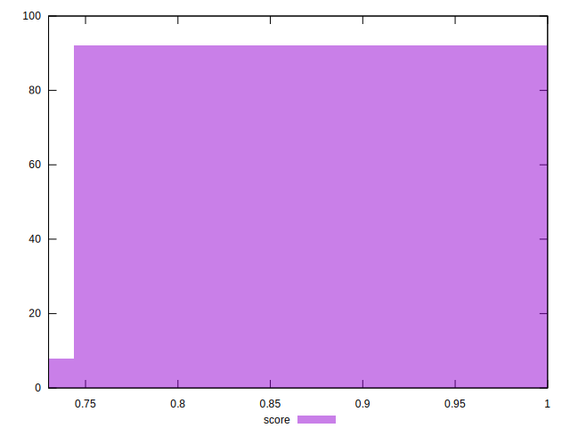
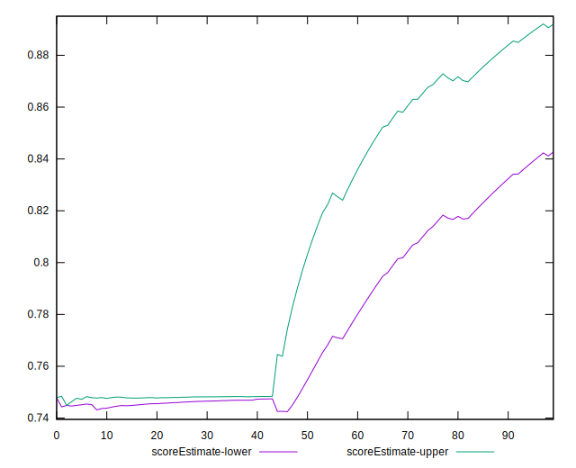
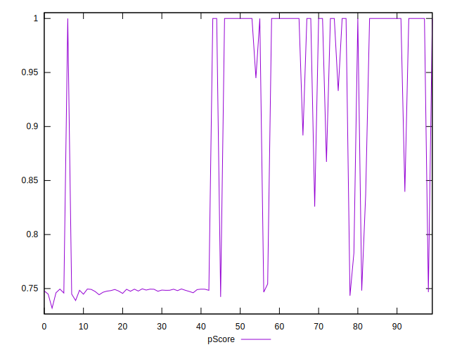
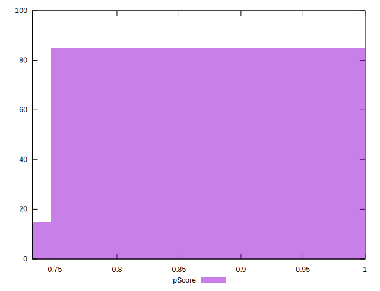
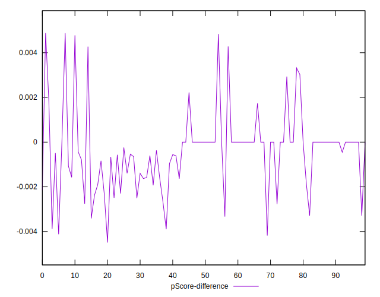
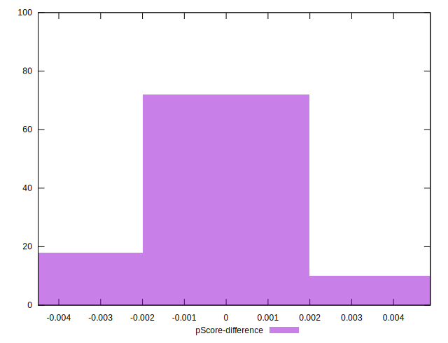

# //uses-rel-preconnect/samples/pages

[→ Parent](../..)


## Raw


```yaml
p90min: 0
p90max: 312.03
p90range: 312.03
p90mean: 159.2161595748409
p90median: 202.48100000619888
p90stdev: 146.29581231098143
p90skewness: -0.09936353652529567
p90eccentricity: 0.9999999999999991
p90discretization: 1.7407407407407407
outlandishness: 1.0014246140431626
confidence: 57.714398689058754
p90confidence: 59.148815856700615

```


## Score


```yaml
p90min: 0.74
p90max: 1
p90range: 0.26
p90mean: 0.8682978723404255
p90median: 0.835
p90stdev: 0.12088009091017342
p90skewness: 0.10062040385038812
p90eccentricity: 1.000000000000001
p90discretization: 9.4
outlandishness: 1.000004900765622
confidence: 0.04764947768655886
p90confidence: 0.04887299318444251

```


## Raw Estimate


## Score Estimate


## P Score


```yaml
p90min: 0.7433166666666667
p90max: 1
p90range: 0.25668333333333326
p90mean: 0.8678448729311312
p90median: 0.8312658333281676
p90stdev: 0.12138717444761252
p90skewness: 0.10071461321658763
p90eccentricity: 1.0000000000000002
p90discretization: 1.7407407407407407
outlandishness: 1.000136247273471
confidence: 0.04782264839860014
p90confidence: 0.04907801197688883

```


## Score Difference


```yaml
p90min: 0
p90max: 0
p90range: 0
p90mean: 0
p90median: 0
p90stdev: 0
p90skewness: .nan
p90eccentricity: .nan
p90discretization: 94
outlandishness: .inf
confidence: 6.092792000602807e-18
p90confidence: 0

```


## P Score Difference


```yaml
p90min: -0.0038966666666666594
p90max: 0.004778888888888888
p90range: 0.008675555555555547
p90mean: -0.0004404078015051007
p90median: 0
p90stdev: 0.0016180413305513306
p90skewness: 0.6337162029546974
p90eccentricity: 1.0000000000000004
p90discretization: 1.8431372549019607
outlandishness: 0.8085346631483815
confidence: 0.0007583711576520675
p90confidence: 0.0006541898035049057

```

