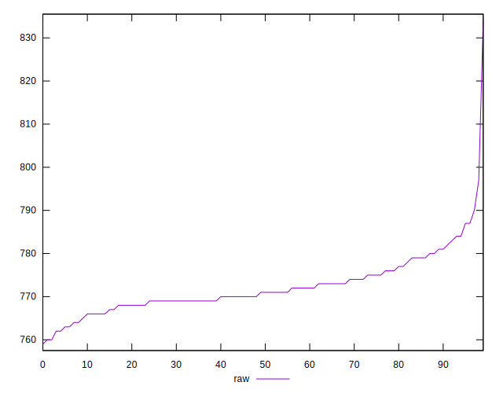
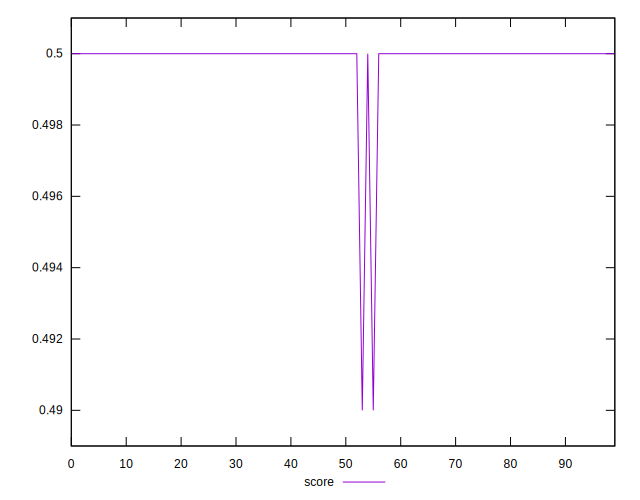
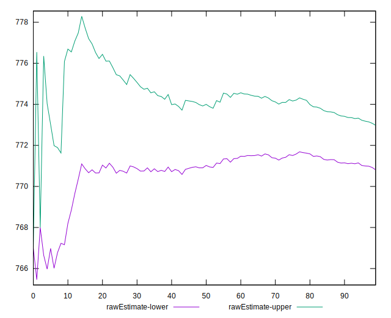
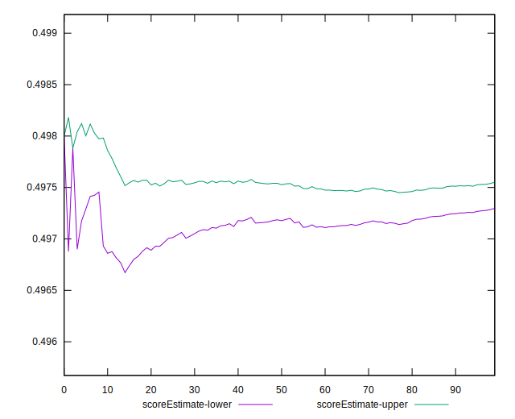
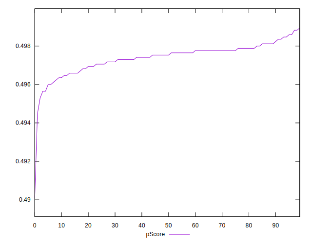
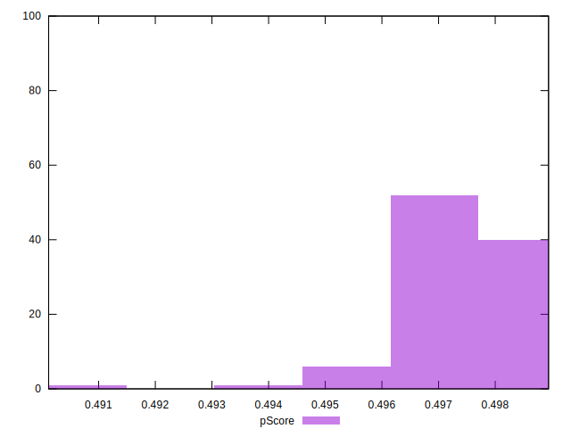
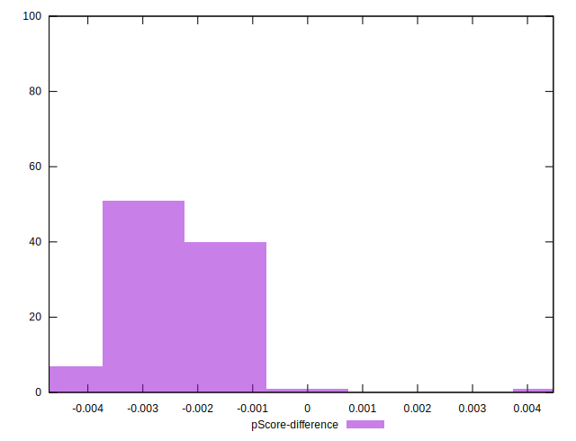

# //uses-rel-preload/samples/pages+cached+noadtech+nomedia+nocss

[→ Parent](../..)


## Raw


```yaml
p90min: 762
p90max: 787
p90range: 25
p90mean: 771.8936170212766
p90median: 771
p90stdev: 5.364318848128917
p90skewness: 0.7543270163844256
p90eccentricity: 0.9999999999999988
p90discretization: 3.9166666666666665
outlandishness: 1.001779230029113
confidence: 3.4890353797411877
p90confidence: 2.1688461394242426

```


## Score


```yaml
p90min: 0.5
p90max: 0.5
p90range: 0
p90mean: 0.5
p90median: 0.5
p90stdev: 0
p90skewness: .nan
p90eccentricity: .nan
p90discretization: 94
outlandishness: 0.9992001599999999
confidence: 0.0005487899156712152
p90confidence: 0

```


## Raw Estimate


## Score Estimate


## P Score


```yaml
p90min: 0.4956470588235294
p90max: 0.49858823529411767
p90range: 0.0029411764705882804
p90mean: 0.4974242803504382
p90median: 0.4975294117647059
p90stdev: 0.0006310963350739905
p90skewness: -0.7543270163858015
p90eccentricity: 0.9999999999999997
p90discretization: 3.9166666666666665
outlandishness: 0.9996753500487053
confidence: 0.0004104747505577865
p90confidence: 0.0002551583693440286

```


## Score Difference


```yaml
p90min: 0
p90max: 0
p90range: 0
p90mean: 0
p90median: 0
p90stdev: 0
p90skewness: .nan
p90eccentricity: .nan
p90discretization: 94
outlandishness: .nan
confidence: 0
p90confidence: 0

```


## P Score Difference


```yaml
p90min: -0.0040000000000000036
p90max: -0.0011764705882352788
p90range: 0.0028235294117647247
p90mean: -0.002508135168961204
p90median: -0.002352941176470613
p90stdev: 0.0006067700135619798
p90skewness: -0.38871723996392976
p90eccentricity: 1.0000000000000002
p90discretization: 3.9166666666666665
outlandishness: 0.9592267058696978
confidence: 0.0003991317759617237
p90confidence: 0.00024532300161302214

```

