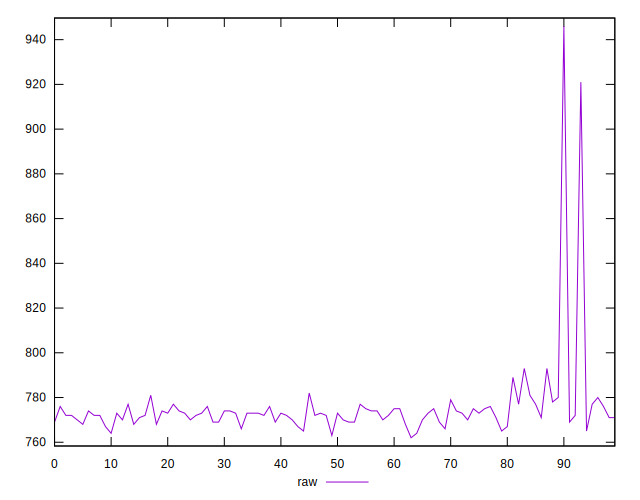
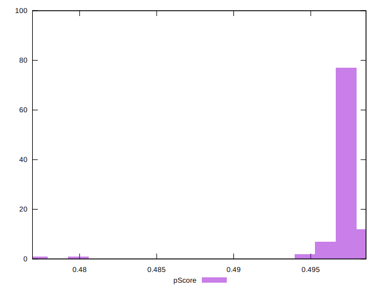

# //uses-rel-preload/samples/pages+cached+noadtech+nomedia

[→ Parent](../..)


## Raw


```yaml
p90min: 764
p90max: 793
p90range: 29
p90mean: 772.8085106382979
p90median: 773
p90stdev: 4.617903631737502
p90skewness: 1.266546698441273
p90eccentricity: 1.0000000000000033
p90discretization: 4.476190476190476
outlandishness: 1.0080946143844238
confidence: 9.0824409598773
p90confidence: 1.867063227872911

```


## Score


```yaml
p90min: 0.49
p90max: 0.5
p90range: 0.010000000000000009
p90mean: 0.4998936170212766
p90median: 0.5
p90stdev: 0.001025920293722657
p90skewness: -9.539955591519899
p90eccentricity: 0.9999999999999984
p90discretization: 47
outlandishness: 0.9980260867718227
confidence: 0.0012170729317751072
p90confidence: 0.00041478952526721545

```


## Raw Estimate


## Score Estimate


## P Score


```yaml
p90min: 0.4949411764705882
p90max: 0.4983529411764706
p90range: 0.003411764705882392
p90mean: 0.4973166458072591
p90median: 0.49729411764705883
p90stdev: 0.0005432827802044121
p90skewness: -1.2665466984402063
p90eccentricity: 1.0000000000000007
p90discretization: 4.476190476190476
outlandishness: 0.9985236832221801
confidence: 0.001068522465867916
p90confidence: 0.00021965449739681306

```


## Score Difference


```yaml
p90min: 0
p90max: 0
p90range: 0
p90mean: 0
p90median: 0
p90stdev: 0
p90skewness: .nan
p90eccentricity: .nan
p90discretization: 94
outlandishness: .nan
confidence: 0
p90confidence: 0

```


## P Score Difference


```yaml
p90min: -0.003647058823529392
p90max: -0.0014117647058823346
p90range: 0.0022352941176470575
p90mean: -0.0025832290362953736
p90median: -0.002588235294117669
p90stdev: 0.00045658608322284125
p90skewness: 0.22989851196622005
p90eccentricity: 1.000000000000001
p90discretization: 4.476190476190476
outlandishness: 0.8999427056103898
confidence: 0.0004698962443786927
p90confidence: 0.00018460218192624796

```

